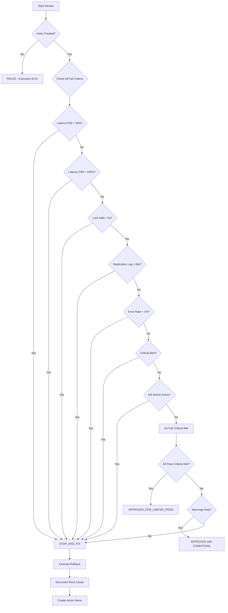

# Canary Review Exercise - Executor v1

> **วันที่สร้าง:** 2026-02-01  
> **Version:** 1.0  
> **อ้างอิง:** [`EXECUTOR_V1_CANARY_RUN_PLAN.md`](EXECUTOR_V1_CANARY_RUN_PLAN.md) | [`EXECUTOR_V1_CANARY_RUN_OUTCOME_REPORT.md`](EXECUTOR_V1_CANARY_RUN_OUTCOME_REPORT.md) | [`EXECUTOR_V1_INTEGRATION_TEST_PLAN.md`](EXECUTOR_V1_INTEGRATION_TEST_PLAN.md)

---

> ⚠️ **คำเตือนสำคัญ**
> 
> เอกสารนี้เป็น **Simulated Canary Scenarios** สำหรับการฝึกซ้อม (Exercise) เท่านั้น
> 
> **🚫 นี่ไม่ใช่ผลลัพธ์ Canary จริง**
> - ข้อมูลทั้งหมดเป็นข้อมูลจำลอง (Simulated Data)
> - Tenant ID, Connection ID, และ Table Names เป็นข้อมูลสมมติ
> - ค่า Metrics ถูกออกแบบเพื่อการเรียนรู้และฝึกซ้อม
> - ห้ามใช้เป็น reference สำหรับการตัดสินใจจริง

---

## สารบัญ (Table of Contents)

1. [บทนำ](#1-บทนำ)
2. [Scenario A: APPROVED_FOR_LIMITED_PROD](#2-scenario-a-approved_for_limited_prod)
3. [Scenario B: STOP_AND_FIX](#3-scenario-b-stop_and_fix)
4. [Review Exercise Guide](#4-review-exercise-guide)
5. [Answer Key](#5-answer-key)

---

## 1. บทนำ

### 1.1 วัตถุประสงค์ของการฝึกซ้อม

การฝึกซ้อมนี้มีวัตถุประสงค์เพื่อ:

1. **ฝึก Review Canary Outcome** - ให้ทีมสามารถวิเคราะห์ผลลัพธ์ Canary ได้อย่างถูกต้อง
2. **เข้าใจ Pass/Fail Criteria** - ทำความเข้าใจ criteria ที่ใช้ตัดสินใจ
3. **Validate Decision Making** - ฝึกการตัดสินใจที่สอดคล้องกับ criteria ที่กำหนด
4. **เตรียมพร้อมสำหรับ Canary จริง** - สร้างความมั่นใจก่อนรัน Canary บน Production

### 1.2 วิธีการใช้เอกสารนี้

1. **อ่าน Scenario** - ศึกษาข้อมูลจำลองอย่างละเอียด
2. **วิเคราะห์ด้วยตนเอง** - พยายามตัดสินใจก่อนดู Answer Key
3. **ตอบคำถาม Review** - ใช้คำถามใน Section 4 เพื่อตรวจสอบความเข้าใจ
4. **เปรียบเทียบกับ Answer Key** - ตรวจสอบการวิเคราะห์ของตนเอง
5. **Discussion** - หารือกับทีมเกี่ยวกับ findings

### 1.3 Reference Thresholds (จาก Canary Run Plan)

| Criteria | Pass Threshold | Warning Threshold | Fail Threshold |
|----------|---------------|-------------------|----------------|
| Query Latency P50 | < 10% increase | 10-20% increase | > 50% increase |
| Query Latency P99 | < 20% increase | 20-30% increase | > 100% increase |
| Error Rate | < 0.1% increase | 0.1-1% increase | > 1% increase |
| Lock Wait Time | < 1 second | 1-5 seconds | > 5 seconds |
| Replication Lag | < 30 seconds | 30-60 seconds | > 60 seconds |
| Sample Count | ≥ 10 | - | < 10 (inconclusive) |

---

## 2. Scenario A: APPROVED_FOR_LIMITED_PROD

> 📋 **Scenario นี้แสดงกรณี Success Case** - ทุก metrics ผ่าน threshold

### 2.1 Canary Run Information

| Field | Value |
|-------|-------|
| **Canary Run ID** | CANARY-EXEC-V1-SIM-A001 |
| **วันที่รัน** | 2026-01-28 |
| **เวลาเริ่มต้น** | 02:00 UTC+7 |
| **เวลาสิ้นสุด** | 04:15 UTC+7 |
| **ระยะเวลารวม** | 2 ชั่วโมง 15 นาที |
| **ผู้ดำเนินการ (Canary Lead)** | Somchai T. (simulated) |
| **ทีมงาน** | Wirat K. (DBA), Pranee S. (SRE), Tanakorn P. (Developer) |

### 2.2 Canary Scope

| Dimension | Planned | Actual |
|-----------|---------|--------|
| **Tenant** | 1 tenant | tenant_sim_alpha_01 |
| **MySQL Connection** | 1 connection | conn_sim_mysql_prod_01 |
| **Table** | 1 table | orders |
| **Operation** | ADD_INDEX | ADD_INDEX |
| **Time Window** | Off-peak | 02:00-04:15 (confirmed off-peak) |

### 2.3 Target Table และ Index Information

| Field | Value |
|-------|-------|
| **Database** | ecommerce_prod_sim |
| **Target Table** | orders |
| **Table Engine** | InnoDB |
| **Table Size** | 2,847,293 rows / 1.2 GB |
| **Index Name** | idx_orders_customer_date |
| **Index Columns** | customer_id, order_date |
| **Index Type** | BTREE |

### 2.4 DDL Statement ที่ Execute

```sql
-- DDL Statement ที่รันจริง
ALTER TABLE orders ADD INDEX idx_orders_customer_date (customer_id, order_date) ALGORITHM=INPLACE, LOCK=NONE;

-- ผลลัพธ์:
-- ✅ Success
-- Duration: 47 seconds
```

**DDL Execution Time:** 47 seconds

### 2.5 Execution Timeline

| Phase | Planned Time | Actual Start | Actual End | Duration | Status |
|-------|--------------|--------------|------------|----------|--------|
| Pre-check | T+0 | 02:00 | 02:12 | 12 min | ✅ Done |
| Team Readiness | T+15m | 02:12 | 02:18 | 6 min | ✅ Done |
| Baseline Metrics | T+20m | 02:18 | 02:25 | 7 min | ✅ Done |
| Execute ADD INDEX | T+30m | 02:25 | 02:26 | 47 sec | ✅ Done |
| Monitoring Window | T+35m | 02:27 | 03:27 | 60 min | ✅ Done |
| After Metrics | T+95m | 03:27 | 03:32 | 5 min | ✅ Done |
| Result Analysis | T+100m | 03:32 | 04:15 | 43 min | ✅ Done |

### 2.6 Kill Switch State ระหว่างการรัน

| Checkpoint | Time | Global Kill Switch | Connection Kill Switch | API Response Time |
|------------|------|-------------------|----------------------|-------------------|
| Pre-execution | 02:24 | ⬜ OFF | ⬜ OFF | 45 ms |
| Post-ADD INDEX | 02:26 | ⬜ OFF | ⬜ OFF | 38 ms |
| During Monitoring (T+15m) | 02:42 | ⬜ OFF | ⬜ OFF | 42 ms |
| During Monitoring (T+30m) | 02:57 | ⬜ OFF | ⬜ OFF | 51 ms |
| During Monitoring (T+45m) | 03:12 | ⬜ OFF | ⬜ OFF | 39 ms |
| During Monitoring (T+60m) | 03:27 | ⬜ OFF | ⬜ OFF | 44 ms |
| Final Check | 03:32 | ⬜ OFF | ⬜ OFF | 41 ms |

**Kill Switch Summary:**
- Total checks: 7
- All passed: ✅ Yes
- Average response time: 42.8 ms
- Max response time: 51 ms

---

### 2.7 Metrics ก่อน/ระหว่าง/หลัง Canary

#### 2.7.1 System Metrics

| Metric | ก่อน (Baseline) | ระหว่าง (During) | หลัง (Post) | Threshold | Status |
|--------|----------------|-----------------|-------------|-----------|--------|
| **CPU Usage (%)** | 32% | 45% | 34% | Warning: >70%, Critical: >85% | ✅ OK |
| **Memory Usage (%)** | 61% | 65% | 62% | Warning: >80%, Critical: >90% | ✅ OK |
| **Disk I/O Read (MB/s)** | 28 | 67 | 31 | Warning: >100, Critical: >200 | ✅ OK |
| **Disk I/O Write (MB/s)** | 15 | 38 | 17 | Warning: >50, Critical: >100 | ✅ OK |
| **Network Latency (ms)** | 2.1 | 2.4 | 2.2 | Warning: >50, Critical: >100 | ✅ OK |

#### 2.7.2 Database Metrics

| Metric | ก่อน (Baseline) | ระหว่าง (During) | หลัง (Post) | Threshold | Status |
|--------|----------------|-----------------|-------------|-----------|--------|
| **Active Connections** | 45 | 47 | 46 | Warning: >80% max, Critical: >90% max | ✅ OK |
| **Query Latency P50 (ms)** | 12.5 | 13.8 | 11.2 | Warning: >20% increase, Critical: >50% increase | ✅ OK |
| **Query Latency P99 (ms)** | 89.3 | 102.1 | 78.6 | Warning: >30% increase, Critical: >100% increase | ✅ OK |
| **Lock Wait Time (s)** | 0.02 | 0.08 | 0.03 | Warning: >1s, Critical: >5s | ✅ OK |
| **Table Locks Waited** | 3 | 7 | 4 | - | ✅ OK |
| **Replication Lag (s)** | 0.5 | 2.1 | 0.7 | Warning: >30s, Critical: >60s | ✅ OK |
| **InnoDB Buffer Pool Hit Rate (%)** | 99.2% | 98.7% | 99.1% | Warning: <95%, Critical: <90% | ✅ OK |
| **Threads Running** | 8 | 12 | 9 | Warning: >50, Critical: >100 | ✅ OK |

#### 2.7.3 Application Metrics

| Metric | ก่อน (Baseline) | ระหว่าง (During) | หลัง (Post) | Threshold | Status |
|--------|----------------|-----------------|-------------|-----------|--------|
| **Error Rate (%)** | 0.02% | 0.03% | 0.02% | Warning: >0.1%, Critical: >1% | ✅ OK |
| **Request Latency P50 (ms)** | 45 | 48 | 42 | Warning: >20% increase, Critical: >50% increase | ✅ OK |
| **Request Latency P99 (ms)** | 215 | 231 | 198 | Warning: >30% increase, Critical: >100% increase | ✅ OK |
| **Throughput (req/s)** | 1,250 | 1,198 | 1,287 | Warning: >20% decrease, Critical: >50% decrease | ✅ OK |

#### 2.7.4 Kill Switch Metrics

| Metric | ก่อน (Baseline) | ระหว่าง (During) | หลัง (Post) | Threshold | Status |
|--------|----------------|-----------------|-------------|-----------|--------|
| **Kill Switch Check Count** | 1 | 4 | 2 | - | ✅ OK |
| **Kill Switch API Response Time (ms)** | 45 | 47 | 41 | Warning: >500ms, Critical: >2000ms | ✅ OK |
| **Kill Switch API Availability (%)** | 100% | 100% | 100% | Warning: <99.9%, Critical: <99% | ✅ OK |

#### 2.7.5 Metrics Summary

| Category | Total Metrics | OK | WARNING | CRITICAL |
|----------|--------------|-----|---------|----------|
| System Metrics | 5 | 5/5 | 0/5 | 0/5 |
| Database Metrics | 8 | 8/8 | 0/8 | 0/8 |
| Application Metrics | 4 | 4/4 | 0/4 | 0/4 |
| Kill Switch Metrics | 3 | 3/3 | 0/3 | 0/3 |
| **Total** | **20** | **20/20** | **0/20** | **0/20** |

**Metrics Assessment:**
```
📊 การประเมิน metrics โดยรวม:

✅ ข้อที่ดี:
- Query Latency P50 ลดลง 10.4% (12.5ms → 11.2ms) แสดงว่า index ช่วยเพิ่ม performance
- Query Latency P99 ลดลง 12.0% (89.3ms → 78.6ms) improvement ที่ชัดเจน
- Application Request Latency P50 ลดลง 6.7% (45ms → 42ms)
- Error Rate คงที่ที่ 0.02% ไม่มีผลกระทบ
- Throughput เพิ่มขึ้น 2.96% (1,250 → 1,287 req/s)

✅ ข้อที่ต้องระวัง:
- ไม่พบข้อกังวลใดๆ

✅ ข้อที่ต้องปรับปรุง:
- ไม่มีในรอบนี้
```

---

### 2.8 Incident / Warning

> ✅ ไม่มี incident/warning ตลอดการรัน Canary

| Summary | Value |
|---------|-------|
| **Total Incidents** | 0 |
| **Critical** | 0 |
| **Warning** | 0 |
| **Info** | 0 |
| **All Resolved** | N/A |

---

### 2.9 Rollback Event

> ✅ ไม่มี rollback เกิดขึ้น - Index ยังคงอยู่บน Production

**Rollback Occurred:** ❌ No

---

### 2.10 Verification Results

#### 2.10.1 Index Creation Verification

| Check | Expected | Actual | Status |
|-------|----------|--------|--------|
| Index exists in SHOW INDEX | Yes | ✅ Yes | ✅ Pass |
| Index usable by query | Yes | ✅ type=ref in EXPLAIN | ✅ Pass |
| Correct columns | customer_id, order_date | ✅ customer_id, order_date | ✅ Pass |
| Correct index type | BTREE | ✅ BTREE | ✅ Pass |

**Verification Query:**
```sql
-- Index verification
SHOW INDEX FROM orders WHERE Key_name = 'idx_orders_customer_date';

-- ผลลัพธ์:
-- +--------+------------+--------------------------+--------------+-------------+
-- | Table  | Non_unique | Key_name                 | Seq_in_index | Column_name |
-- +--------+------------+--------------------------+--------------+-------------+
-- | orders |          1 | idx_orders_customer_date |            1 | customer_id |
-- | orders |          1 | idx_orders_customer_date |            2 | order_date  |
-- +--------+------------+--------------------------+--------------+-------------+

-- Query plan verification
EXPLAIN SELECT * FROM orders WHERE customer_id = 12345 AND order_date > '2026-01-01';

-- ผลลัพธ์:
-- +----+-------------+--------+------+--------------------------+-----+------+-------------+
-- | id | select_type | table  | type | possible_keys            | key | rows | Extra       |
-- +----+-------------+--------+------+--------------------------+-----+------+-------------+
-- |  1 | SIMPLE      | orders | ref  | idx_orders_customer_date | ... |   47 | Using where |
-- +----+-------------+--------+------+--------------------------+-----+------+-------------+
```

#### 2.10.2 Application Functionality Check

| Check | Expected | Actual | Status |
|-------|----------|--------|--------|
| Application responds normally | Yes | ✅ Yes | ✅ Pass |
| No new errors in logs | Yes | ✅ No new errors | ✅ Pass |
| Critical queries work | Yes | ✅ All queries working | ✅ Pass |
| User-facing features OK | Yes | ✅ Verified | ✅ Pass |

#### 2.10.3 Performance Impact Assessment

| Aspect | Assessment | Notes |
|--------|------------|-------|
| **Query Performance** | ✅ Improved | Latency ลดลง 10-12% |
| **Write Performance** | ✅ No Impact | Write latency ไม่เปลี่ยน |
| **Resource Usage** | ✅ Acceptable | CPU spike ชั่วคราวระหว่าง ADD INDEX แต่กลับปกติ |
| **Overall Impact** | ✅ Positive | Index ช่วยเพิ่ม performance ตามที่คาดหวัง |

---

### 2.11 Final Decision

#### Decision

✅ **APPROVED_FOR_LIMITED_PROD** - พร้อมใช้งานใน limited production

#### Justification

**เหตุผลประกอบการตัดสินใจ:**

```
✅ APPROVED FOR LIMITED PRODUCTION

เหตุผลที่ตัดสินใจ APPROVED:

1. ✅ Index Created Successfully
   - DDL สำเร็จใน 47 วินาที
   - Index verified ว่าถูกต้องและ usable

2. ✅ No Alerts Fired
   - ตลอด monitoring window 60 นาที ไม่มี alert
   - ไม่มี critical หรือ warning incidents

3. ✅ Query Latency P50 Improvement
   - Baseline: 12.5ms → After: 11.2ms
   - Change: -10.4% (IMPROVED, ต่ำกว่า +10% threshold)

4. ✅ Query Latency P99 Improvement  
   - Baseline: 89.3ms → After: 78.6ms
   - Change: -12.0% (IMPROVED, ต่ำกว่า +20% threshold)

5. ✅ Replication Lag ปกติ
   - Max lag: 2.1 seconds (ต่ำกว่า 30 seconds threshold)

6. ✅ Error Rate ไม่เปลี่ยน
   - Baseline: 0.02% → After: 0.02%
   - Change: 0% (ต่ำกว่า +0.1% threshold)

7. ✅ Lock Wait Time ต่ำ
   - Max: 0.08 seconds (ต่ำกว่า 1 second warning)

8. ✅ Monitoring Window Completed
   - Full 60 minutes monitoring completed
   - No anomalies detected

Pass Criteria Met: 8/8 ✅
```

#### Conditions

| # | Condition | Owner | Due Date |
|---|-----------|-------|----------|
| 1 | Monitor อีก 24 ชั่วโมงก่อนขยาย scope | SRE | 2026-01-29 |
| 2 | รวบรวม feedback จาก application team | Developer | 2026-01-30 |
| 3 | เตรียม plan สำหรับ Phase ถัดไป (2-3 tables) | Tech Lead | 2026-01-31 |

---

### 2.12 Action Items สำหรับ Limited Production

| # | Priority | Action Item | Owner | Due Date | Status |
|---|----------|-------------|-------|----------|--------|
| 1 | 🔴 High | Continue monitoring for 24 hours | SRE | 2026-01-29 | ⬜ Pending |
| 2 | 🔴 High | Document final metrics และ close canary | Canary Lead | 2026-01-29 | ⬜ Pending |
| 3 | 🟠 Medium | Plan next phase: expand to 2-3 tables | Tech Lead | 2026-01-31 | ⬜ Pending |
| 4 | 🟠 Medium | Share lessons learned with team | Canary Lead | 2026-01-30 | ⬜ Pending |
| 5 | 🟢 Low | Update runbook with actual execution times | Developer | 2026-02-03 | ⬜ Pending |

---

### 2.13 Execution Log Summary (Simulated)

```
[02:00:00] INFO - Starting canary run CANARY-EXEC-V1-SIM-A001
[02:00:05] INFO - Pre-checks started
[02:12:15] INFO - All pre-checks passed
[02:12:30] INFO - Team readiness confirmed
[02:18:00] INFO - Starting baseline metrics collection
[02:25:00] INFO - Baseline metrics collected successfully
[02:25:05] INFO - Kill switch check passed (response: 45ms)
[02:25:10] INFO - Executing ADD INDEX statement...
[02:25:10] INFO - ALTER TABLE orders ADD INDEX idx_orders_customer_date (customer_id, order_date) ALGORITHM=INPLACE, LOCK=NONE
[02:25:57] INFO - Index created successfully in 47 seconds
[02:26:00] INFO - Kill switch check passed (response: 38ms)
[02:26:05] INFO - Starting 60-minute monitoring window
[02:42:00] INFO - Monitoring checkpoint T+15m: All metrics OK
[02:57:00] INFO - Monitoring checkpoint T+30m: All metrics OK
[03:12:00] INFO - Monitoring checkpoint T+45m: All metrics OK
[03:27:00] INFO - Monitoring checkpoint T+60m: All metrics OK
[03:27:05] INFO - Monitoring window completed
[03:27:10] INFO - Collecting after metrics
[03:32:00] INFO - After metrics collected
[03:32:05] INFO - Starting verification
[03:32:30] INFO - Index verification: PASSED
[03:33:00] INFO - Performance verification: PASSED (Latency improved)
[03:33:05] INFO - Sample count: 2,847 (above minimum 10)
[03:35:00] INFO - All verifications passed
[04:00:00] INFO - Analysis completed
[04:15:00] INFO - Decision: APPROVED_FOR_LIMITED_PROD
[04:15:05] INFO - Canary run completed successfully
```

---

## 3. Scenario B: STOP_AND_FIX

> 📋 **Scenario นี้แสดงกรณี Failure Case** - บาง metrics เกิน threshold และต้อง rollback

### 3.1 Canary Run Information

| Field | Value |
|-------|-------|
| **Canary Run ID** | CANARY-EXEC-V1-SIM-B001 |
| **วันที่รัน** | 2026-01-29 |
| **เวลาเริ่มต้น** | 03:00 UTC+7 |
| **เวลาสิ้นสุด** | 04:45 UTC+7 |
| **ระยะเวลารวม** | 1 ชั่วโมง 45 นาที (ยุติก่อนกำหนดเนื่องจาก rollback) |
| **ผู้ดำเนินการ (Canary Lead)** | Wirat K. (simulated) |
| **ทีมงาน** | Somchai T. (DBA), Pranee S. (SRE), Tanakorn P. (Developer) |

### 3.2 Canary Scope

| Dimension | Planned | Actual |
|-----------|---------|--------|
| **Tenant** | 1 tenant | tenant_sim_beta_02 |
| **MySQL Connection** | 1 connection | conn_sim_mysql_prod_02 |
| **Table** | 1 table | transactions |
| **Operation** | ADD_INDEX | ADD_INDEX |
| **Time Window** | Off-peak | 03:00-04:45 (confirmed off-peak) |

### 3.3 Target Table และ Index Information

| Field | Value |
|-------|-------|
| **Database** | payment_prod_sim |
| **Target Table** | transactions |
| **Table Engine** | InnoDB |
| **Table Size** | 12,847,521 rows / 8.7 GB |
| **Index Name** | idx_transactions_created_status |
| **Index Columns** | created_at, status |
| **Index Type** | BTREE |

### 3.4 DDL Statement ที่ Execute

```sql
-- DDL Statement ที่รันจริง
ALTER TABLE transactions ADD INDEX idx_transactions_created_status (created_at, status) ALGORITHM=INPLACE, LOCK=NONE;

-- ผลลัพธ์:
-- ✅ Success (แต่ต้อง rollback ภายหลัง)
-- Duration: 3 minutes 42 seconds
```

**DDL Execution Time:** 3 minutes 42 seconds

### 3.5 Execution Timeline

| Phase | Planned Time | Actual Start | Actual End | Duration | Status |
|-------|--------------|--------------|------------|----------|--------|
| Pre-check | T+0 | 03:00 | 03:15 | 15 min | ✅ Done |
| Team Readiness | T+15m | 03:15 | 03:20 | 5 min | ✅ Done |
| Baseline Metrics | T+20m | 03:20 | 03:27 | 7 min | ✅ Done |
| Execute ADD INDEX | T+30m | 03:27 | 03:31 | 3 min 42 sec | ✅ Done |
| Monitoring Window | T+35m | 03:31 | 04:01 | 30 min (ยุติก่อน) | ⚠️ Interrupted |
| **Incident Detected** | T+65m | 04:01 | 04:05 | 4 min | 🔴 Issue |
| **Rollback Executed** | T+70m | 04:05 | 04:12 | 7 min | ✅ Done |
| Post-Rollback Monitor | T+77m | 04:12 | 04:45 | 33 min | ✅ Done |

### 3.6 Kill Switch State ระหว่างการรัน

| Checkpoint | Time | Global Kill Switch | Connection Kill Switch | API Response Time |
|------------|------|-------------------|----------------------|-------------------|
| Pre-execution | 03:26 | ⬜ OFF | ⬜ OFF | 48 ms |
| Post-ADD INDEX | 03:31 | ⬜ OFF | ⬜ OFF | 52 ms |
| During Monitoring (T+15m) | 03:46 | ⬜ OFF | ⬜ OFF | 45 ms |
| During Monitoring (T+30m) | 04:01 | ⬜ OFF | ⬜ OFF | 47 ms |
| **During Incident** | 04:03 | ⬜ OFF | ⬜ OFF | 51 ms |
| Before Rollback | 04:05 | ⬜ OFF | ⬜ OFF | 49 ms |

**Kill Switch Summary:**
- Total checks: 6
- All passed: ✅ Yes (Kill switch was not the cause of failure)
- Average response time: 48.7 ms
- Max response time: 52 ms

---

### 3.7 Metrics ก่อน/ระหว่าง/หลัง Canary

#### 3.7.1 System Metrics

| Metric | ก่อน (Baseline) | ระหว่าง (During) | หลัง (Post) | Threshold | Status |
|--------|----------------|-----------------|-------------|-----------|--------|
| **CPU Usage (%)** | 38% | 72% | 75% | Warning: >70%, Critical: >85% | ⚠️ WARNING |
| **Memory Usage (%)** | 65% | 78% | 81% | Warning: >80%, Critical: >90% | ⚠️ WARNING |
| **Disk I/O Read (MB/s)** | 35 | 145 | 112 | Warning: >100, Critical: >200 | ⚠️ WARNING |
| **Disk I/O Write (MB/s)** | 22 | 68 | 54 | Warning: >50, Critical: >100 | ⚠️ WARNING |
| **Network Latency (ms)** | 2.3 | 4.8 | 3.9 | Warning: >50, Critical: >100 | ✅ OK |

#### 3.7.2 Database Metrics

| Metric | ก่อน (Baseline) | ระหว่าง (During) | หลัง (Post) | Threshold | Status |
|--------|----------------|-----------------|-------------|-----------|--------|
| **Active Connections** | 78 | 89 | 92 | Warning: >80% max, Critical: >90% max | ⚠️ WARNING |
| **Query Latency P50 (ms)** | 18.2 | 45.7 | 38.9 | Warning: >20% increase, Critical: >50% increase | 🔴 CRITICAL |
| **Query Latency P99 (ms)** | 156.3 | 412.8 | 357.2 | Warning: >30% increase, Critical: >100% increase | 🔴 CRITICAL |
| **Lock Wait Time (s)** | 0.15 | 3.8 | 2.9 | Warning: >1s, Critical: >5s | ⚠️ WARNING |
| **Table Locks Waited** | 12 | 89 | 67 | - | ⚠️ Elevated |
| **Replication Lag (s)** | 1.2 | 45.7 | 38.2 | Warning: >30s, Critical: >60s | ⚠️ WARNING |
| **InnoDB Buffer Pool Hit Rate (%)** | 98.7% | 91.2% | 93.5% | Warning: <95%, Critical: <90% | ⚠️ WARNING |
| **Threads Running** | 15 | 58 | 47 | Warning: >50, Critical: >100 | ⚠️ WARNING |

#### 3.7.3 Application Metrics

| Metric | ก่อน (Baseline) | ระหว่าง (During) | หลัง (Post) | Threshold | Status |
|--------|----------------|-----------------|-------------|-----------|--------|
| **Error Rate (%)** | 0.05% | 0.89% | 0.72% | Warning: >0.1%, Critical: >1% | ⚠️ WARNING |
| **Request Latency P50 (ms)** | 78 | 187 | 152 | Warning: >20% increase, Critical: >50% increase | 🔴 CRITICAL |
| **Request Latency P99 (ms)** | 345 | 892 | 721 | Warning: >30% increase, Critical: >100% increase | 🔴 CRITICAL |
| **Throughput (req/s)** | 2,450 | 1,567 | 1,823 | Warning: >20% decrease, Critical: >50% decrease | 🔴 CRITICAL |

#### 3.7.4 Kill Switch Metrics

| Metric | ก่อน (Baseline) | ระหว่าง (During) | หลัง (Post) | Threshold | Status |
|--------|----------------|-----------------|-------------|-----------|--------|
| **Kill Switch Check Count** | 1 | 3 | 2 | - | ✅ OK |
| **Kill Switch API Response Time (ms)** | 48 | 50 | 49 | Warning: >500ms, Critical: >2000ms | ✅ OK |
| **Kill Switch API Availability (%)** | 100% | 100% | 100% | Warning: <99.9%, Critical: <99% | ✅ OK |

#### 3.7.5 Metrics Summary

| Category | Total Metrics | OK | WARNING | CRITICAL |
|----------|--------------|-----|---------|----------|
| System Metrics | 5 | 1/5 | 4/5 | 0/5 |
| Database Metrics | 8 | 0/8 | 6/8 | 2/8 |
| Application Metrics | 4 | 0/4 | 1/4 | 3/4 |
| Kill Switch Metrics | 3 | 3/3 | 0/3 | 0/3 |
| **Total** | **20** | **4/20** | **11/20** | **5/20** |

**Metrics Assessment:**
```
📊 การประเมิน metrics โดยรวม:

🔴 ข้อที่เป็น CRITICAL:
- Query Latency P50 เพิ่มขึ้น 113.7% (18.2ms → 38.9ms) - เกิน 50% threshold
- Query Latency P99 เพิ่มขึ้น 128.5% (156.3ms → 357.2ms) - เกิน 100% threshold
- Application Request Latency P50 เพิ่มขึ้น 94.9% (78ms → 152ms) - เกิน 50% threshold
- Application Request Latency P99 เพิ่มขึ้น 109.0% (345ms → 721ms) - เกิน 100% threshold
- Throughput ลดลง 25.6% (2,450 → 1,823 req/s) - เกิน 20% threshold

⚠️ ข้อที่เป็น WARNING:
- CPU Usage: 75% (เกิน 70% warning threshold)
- Memory Usage: 81% (เกิน 80% warning threshold)
- Disk I/O Read: 112 MB/s (เกิน 100 MB/s warning threshold)
- Disk I/O Write: 54 MB/s (เกิน 50 MB/s warning threshold)
- Active Connections: 92 (ใกล้ 80% max)
- Lock Wait Time: 2.9s (เกิน 1s warning threshold)
- Replication Lag: 38.2s (เกิน 30s warning threshold)
- Buffer Pool Hit Rate: 93.5% (ต่ำกว่า 95% warning threshold)
- Threads Running: 47 (ใกล้ 50 warning threshold)
- Error Rate: 0.72% (เกิน 0.1% warning threshold)

📉 Root Cause Analysis:
- Table ขนาดใหญ่ (12.8M rows, 8.7 GB) ทำให้ index creation ใช้ resource สูง
- Index columns (created_at, status) เป็น high-cardinality ทำให้ index size ใหญ่
- Background workload conflict กับ index creation
```

---

### 3.8 Incident / Warning

| # | Timestamp | Severity | Description | Action Taken | Resolution | Status |
|---|-----------|----------|-------------|--------------|------------|--------|
| 1 | 03:45 | 🟠 Warning | CPU Usage exceeded 70% (72%) | Monitoring | Ongoing | ⚠️ Monitoring |
| 2 | 03:52 | 🟠 Warning | Replication lag > 30s (35.2s) | Alert team | Continued to rise | ⚠️ Monitoring |
| 3 | 04:01 | 🔴 Critical | Query Latency P99 > 100% increase (128.5%) | Prepare rollback | - | 🔴 Trigger |
| 4 | 04:02 | 🔴 Critical | Application Latency P99 > 100% increase | Confirm rollback | - | 🔴 Trigger |
| 5 | 04:03 | 🟠 Warning | Throughput dropped > 20% (25.6%) | Initiate rollback | - | ⚠️ Contributing |

### 3.8.1 Incident Summary

| Summary | Value |
|---------|-------|
| **Total Incidents** | 5 |
| **Critical** | 2 |
| **Warning** | 3 |
| **Info** | 0 |
| **All Resolved** | ✅ Yes (after rollback) |

**Incident Notes:**
```
📋 Incident Timeline:

03:45 - แรกเห็น warning signs: CPU spike
03:52 - Replication lag เริ่มสูงขึ้น
04:01 - Query latency เกิน critical threshold
04:02 - Application latency confirm degradation
04:03 - Team decision: INITIATE ROLLBACK
04:05 - Rollback execution started
04:12 - Rollback completed
04:25 - Metrics returning to normal
04:45 - Post-rollback monitoring completed

Incident Classification: Performance Degradation due to Index Creation
Root Cause: Large table size + High-cardinality columns + Background workload
```

---

### 3.9 Rollback Event

**Rollback Occurred:** ✅ Yes

### 3.9.1 Rollback Details

| Field | Value |
|-------|-------|
| **Trigger Type** | Manual (Team Decision) |
| **Trigger Reason** | Query Latency P99 > 100% increase, Application Latency degradation |
| **Decision Made By** | Wirat K. (Canary Lead) + Somchai T. (DBA) |
| **Decision Timestamp** | 04:03 |
| **Rollback Started At** | 04:05 |
| **Rollback Completed At** | 04:12 |
| **Rollback Duration** | 7 minutes |

### 3.9.2 Rollback Steps Taken

| Step | Action | Expected | Actual | Status |
|------|--------|----------|--------|--------|
| 1 | Announce rollback decision | Message sent | ✅ Slack notification sent | ✅ Done |
| 2 | Verify index exists before DROP | Index exists | ✅ Index confirmed | ✅ Done |
| 3 | Execute DROP INDEX | Success | ✅ DROP completed in 4m 23s | ✅ Done |
| 4 | Verify index removed | Index gone | ✅ Verified | ✅ Done |
| 5 | Update execution_run status | ROLLED_BACK | ✅ Updated | ✅ Done |
| 6 | Announce rollback complete | Message sent | ✅ Notification sent | ✅ Done |

**Rollback Statement Executed:**
```sql
-- Rollback DDL ที่รันจริง
ALTER TABLE transactions DROP INDEX idx_transactions_created_status;

-- Duration: 4 minutes 23 seconds

-- Verification after rollback:
SHOW INDEX FROM transactions WHERE Key_name = 'idx_transactions_created_status';
-- Result: Empty (ยืนยันว่า index ถูกลบ)
```

### 3.9.3 Post-Rollback Verification

| Check | Expected | Actual | Status |
|-------|----------|--------|--------|
| Index removed | Yes | ✅ Index not found | ✅ Verified |
| Latency returning to baseline | Yes | ✅ P50: 21.5ms (from 38.9ms) | ✅ Verified |
| Error rate returning to baseline | Yes | ✅ 0.12% (from 0.72%) | ✅ Verified |
| No new alerts | Yes | ✅ No new alerts | ✅ Verified |
| Replication healthy | Yes | ✅ Lag: 3.2s (from 38.2s) | ✅ Verified |

**Post-Rollback Monitoring Duration:** 33 minutes

**Post-Rollback Metrics (at T+30m after rollback):**

| Metric | Pre-Rollback | Post-Rollback | Recovery Status |
|--------|--------------|---------------|-----------------|
| Query Latency P50 | 38.9 ms | 21.5 ms | ⬇️ Recovering |
| Query Latency P99 | 357.2 ms | 178.4 ms | ⬇️ Recovering |
| Error Rate | 0.72% | 0.12% | ⬇️ Near baseline |
| Replication Lag | 38.2s | 3.2s | ⬇️ Near baseline |
| CPU Usage | 75% | 45% | ⬇️ Near baseline |
| Throughput | 1,823 req/s | 2,287 req/s | ⬆️ Recovering |

---

### 3.10 Verification Results

#### 3.10.1 Index Creation Verification

| Check | Expected | Actual | Status |
|-------|----------|--------|--------|
| Index exists in SHOW INDEX | Yes | ✅ Yes (before rollback) | ✅ Pass |
| Index usable by query | Yes | ✅ Usable (before rollback) | ✅ Pass |
| Correct columns | created_at, status | ✅ Correct | ✅ Pass |
| **Post-Rollback: Index removed** | Yes | ✅ Removed | ✅ Pass |

#### 3.10.2 Application Functionality Check

| Check | Expected | Actual | Status |
|-------|----------|--------|--------|
| Application responds normally | Yes | ⚠️ Degraded during index existence | ⚠️ Issue |
| No new errors in logs | Yes | ❌ Timeout errors increased | ❌ Fail |
| Critical queries work | Yes | ⚠️ Slow response | ⚠️ Issue |
| User-facing features OK | Yes | ⚠️ Degraded UX | ⚠️ Issue |

#### 3.10.3 Performance Impact Assessment

| Aspect | Assessment | Notes |
|--------|------------|-------|
| **Query Performance** | ❌ Severely Degraded | Latency เพิ่ม >100% |
| **Write Performance** | ⚠️ Degraded | Lock contention increased |
| **Resource Usage** | ⚠️ High | CPU, Memory, Disk I/O all elevated |
| **Overall Impact** | ❌ Negative | ต้อง rollback เพื่อ recover |

---

### 3.11 Final Decision

#### Decision

🔴 **STOP_AND_FIX** - ต้องหยุดและแก้ไขก่อน

#### Justification

**เหตุผลประกอบการตัดสินใจ:**

```
🔴 STOP AND FIX

เหตุผลที่ตัดสินใจ STOP_AND_FIX:

1. ❌ Query Latency P50 Degradation > 50%
   - Baseline: 18.2ms → After: 38.9ms
   - Change: +113.7% (เกิน 50% critical threshold)
   - FAIL CRITERIA MET

2. ❌ Query Latency P99 Degradation > 100%
   - Baseline: 156.3ms → After: 357.2ms
   - Change: +128.5% (เกิน 100% critical threshold)
   - FAIL CRITERIA MET

3. ❌ Application Latency P99 Degradation > 100%
   - Baseline: 345ms → After: 721ms
   - Change: +109.0% (เกิน 100% critical threshold)
   - FAIL CRITERIA MET

4. ❌ Throughput Degradation > 20%
   - Baseline: 2,450 req/s → After: 1,823 req/s
   - Change: -25.6% (เกิน 20% warning threshold)
   - CONTRIBUTING FACTOR

5. ⚠️ Multiple Warning Conditions
   - Replication Lag: 38.2s (> 30s warning)
   - Lock Wait Time: 2.9s (> 1s warning)
   - Error Rate: 0.72% (> 0.1% warning)

6. ✅ Rollback Executed Successfully
   - Index ถูกลบออกแล้ว
   - Metrics กำลัง recover

7. 📋 Root Cause Identified
   - Table size ใหญ่เกินไป (12.8M rows, 8.7 GB)
   - High-cardinality columns causing large index
   - Background workload conflict

Pass Criteria Met: 3/8 ❌
Fail Criteria Met: 3 items 🔴
```

---

### 3.12 Blockers และ Action Items สำหรับ Fix

#### Blockers

| # | Blocker | Severity | Owner | Target Resolution |
|---|---------|----------|-------|-------------------|
| 1 | Table size too large for online index creation | 🔴 Critical | DBA | Need chunked approach |
| 2 | High-cardinality columns causing performance hit | 🔴 Critical | Developer | Review index design |
| 3 | Background workload conflicting with DDL | 🟠 High | SRE | Schedule during maintenance |

#### Action Items

| # | Priority | Action Item | Owner | Due Date | Status |
|---|----------|-------------|-------|----------|--------|
| 1 | 🔴 High | Root cause analysis - complete RCA document | Tech Lead | 2026-01-30 | ⬜ Pending |
| 2 | 🔴 High | Evaluate pt-online-schema-change for large tables | DBA | 2026-01-31 | ⬜ Pending |
| 3 | 🔴 High | Review index design - consider partial index | Developer | 2026-01-31 | ⬜ Pending |
| 4 | 🟠 Medium | Add table size threshold to pre-checks | Developer | 2026-02-03 | ⬜ Pending |
| 5 | 🟠 Medium | Update canary criteria for large tables | Canary Lead | 2026-02-03 | ⬜ Pending |
| 6 | 🟠 Medium | Schedule re-run during maintenance window | SRE | 2026-02-05 | ⬜ Pending |
| 7 | 🟢 Low | Document lessons learned | Canary Lead | 2026-02-01 | ⬜ Pending |

---

### 3.13 Lessons Learned

| # | What Happened | Impact | Root Cause | Action Item |
|---|---------------|--------|------------|-------------|
| 1 | Latency spike > 100% | User experience degraded | Table too large for ALGORITHM=INPLACE | Use pt-online-schema-change for tables > 5M rows |
| 2 | Replication lag > 30s | Risk of read replica issues | Heavy I/O during index creation | Add I/O throttling or schedule in maintenance |
| 3 | Pre-checks did not catch table size | Proceeded with risky operation | No table size threshold in pre-check | Add size check: warn > 5M rows, block > 10M rows |

---

### 3.14 Execution Log Summary (Simulated)

```
[03:00:00] INFO - Starting canary run CANARY-EXEC-V1-SIM-B001
[03:00:05] INFO - Pre-checks started
[03:15:00] INFO - All pre-checks passed
[03:15:10] INFO - Team readiness confirmed
[03:20:00] INFO - Starting baseline metrics collection
[03:27:00] INFO - Baseline metrics collected successfully
[03:27:05] INFO - Kill switch check passed (response: 48ms)
[03:27:10] INFO - Executing ADD INDEX statement...
[03:27:10] INFO - ALTER TABLE transactions ADD INDEX idx_transactions_created_status (created_at, status) ALGORITHM=INPLACE, LOCK=NONE
[03:30:52] INFO - Index created successfully in 3 minutes 42 seconds
[03:31:00] INFO - Kill switch check passed (response: 52ms)
[03:31:05] INFO - Starting 60-minute monitoring window
[03:45:00] WARN - CPU Usage elevated: 72%
[03:46:00] INFO - Monitoring checkpoint T+15m: WARNING - elevated metrics
[03:52:00] WARN - Replication lag elevated: 35.2 seconds
[04:01:00] ERROR - Query Latency P99 exceeded critical threshold: 412.8ms (baseline: 156.3ms)
[04:01:05] INFO - Monitoring checkpoint T+30m: CRITICAL - latency degradation detected
[04:02:00] ERROR - Application Latency P99 exceeded critical threshold: 892ms
[04:03:00] WARN - Team decision: INITIATE ROLLBACK
[04:03:05] INFO - Announcing rollback decision
[04:05:00] INFO - Starting rollback: ALTER TABLE transactions DROP INDEX idx_transactions_created_status
[04:09:23] INFO - Index drop completed in 4 minutes 23 seconds
[04:09:30] INFO - Verifying rollback success
[04:09:35] INFO - Rollback verification: Index removed successfully
[04:10:00] INFO - Updating execution status to ROLLED_BACK
[04:12:00] INFO - Announcing rollback complete
[04:12:05] INFO - Starting post-rollback monitoring (30 minutes)
[04:25:00] INFO - Post-rollback checkpoint: Metrics recovering
[04:42:00] INFO - Post-rollback checkpoint: Metrics near baseline
[04:45:00] INFO - Post-rollback monitoring completed
[04:45:05] INFO - Decision: STOP_AND_FIX
[04:45:10] INFO - Canary run completed with ROLLBACK
```

---

## 4. Review Exercise Guide

### 4.1 คำถามสำหรับ Reviewer

#### สำหรับ Scenario A (APPROVED)

| # | คำถาม | เป้าหมาย |
|---|-------|---------|
| 1 | Query Latency P50 เปลี่ยนแปลงไปอย่างไร? ผ่าน threshold หรือไม่? | ตรวจสอบการคำนวณ % change |
| 2 | มี Critical alert หรือ incident เกิดขึ้นระหว่าง monitoring window หรือไม่? | ตรวจสอบ incident log |
| 3 | Kill Switch ทำงานปกติตลอดหรือไม่? API response time เป็นอย่างไร? | ตรวจสอบ kill switch metrics |
| 4 | Replication lag สูงสุดเท่าไร? เกิน threshold หรือไม่? | ตรวจสอบ database metrics |
| 5 | Error rate เปลี่ยนแปลงอย่างไร? | ตรวจสอบ application metrics |
| 6 | ทำไมจึงตัดสินใจ APPROVED? มีกี่ criteria ที่ผ่าน? | ตรวจสอบ pass criteria |

#### สำหรับ Scenario B (STOP_AND_FIX)

| # | คำถาม | เป้าหมาย |
|---|-------|---------|
| 1 | อะไรคือ first indicator ที่บ่งชี้ว่ามีปัญหา? | ระบุ warning signs |
| 2 | Critical threshold ใดที่ถูก breach? | ระบุ fail criteria ที่ถูกละเมิด |
| 3 | ทำไม rollback จึงถูก trigger? ใครเป็นคนตัดสินใจ? | เข้าใจ decision process |
| 4 | Rollback สำเร็จหรือไม่? ใช้เวลาเท่าไร? | ตรวจสอบ rollback details |
| 5 | หลัง rollback metrics recover หรือไม่? | ตรวจสอบ post-rollback metrics |
| 6 | Root cause คืออะไร? มี action items อะไรบ้าง? | เข้าใจ lessons learned |

### 4.2 Checklist สำหรับ Validate Decision

#### APPROVED_FOR_LIMITED_PROD Checklist

| # | Criteria | Required | How to Verify |
|---|----------|----------|---------------|
| 1 | Index created successfully | ✅ Yes | Check DDL result และ SHOW INDEX |
| 2 | No critical alerts during monitoring | ✅ 0 alerts | Check incident log |
| 3 | Query Latency P50 degradation < 10% | ✅ < 10% | Calculate: (After - Baseline) / Baseline |
| 4 | Query Latency P99 degradation < 20% | ✅ < 20% | Calculate: (After - Baseline) / Baseline |
| 5 | Replication lag < 30 seconds | ✅ < 30s | Check max lag during monitoring |
| 6 | Error rate increase < 0.1% | ✅ < 0.1% | Calculate: After - Baseline |
| 7 | Lock wait time < 1 second | ✅ < 1s | Check max lock wait |
| 8 | Monitoring window completed | ✅ 60 min | Check timeline |

**Decision Rule:** ALL 8 criteria must pass for APPROVED

#### STOP_AND_FIX Checklist

| # | Fail Criteria | Threshold | Action |
|---|---------------|-----------|--------|
| 1 | Query Latency P50 > 50% increase | > 50% | ❌ FAIL immediately |
| 2 | Query Latency P99 > 100% increase | > 100% | ❌ FAIL immediately |
| 3 | Lock wait time > 5 seconds | > 5s | ❌ FAIL immediately |
| 4 | Replication lag > 60 seconds | > 60s | ❌ FAIL immediately |
| 5 | Error rate > 1% | > 1% | ❌ FAIL immediately |
| 6 | Critical alert fired | Any | ❌ FAIL immediately |
| 7 | Kill switch activated | Active | ❌ FAIL immediately |

**Decision Rule:** ANY 1 fail criteria = STOP_AND_FIX

### 4.3 Discussion Points สำหรับ Team Review

#### Scenario A Discussion

1. **Index Performance Improvement**
   - ทำไม Latency ถึงดีขึ้น?
   - Index design เหมาะสมหรือไม่?
   
2. **Resource Utilization**
   - CPU spike ระหว่าง ADD INDEX ปกติหรือไม่?
   - เราควรกังวลเรื่อง resource ในอนาคตหรือไม่?

3. **Next Steps**
   - พร้อมขยาย scope หรือยัง?
   - มี conditions อะไรที่ต้องทำก่อน?

#### Scenario B Discussion

1. **Root Cause Analysis**
   - ทำไม table นี้ถึงมีปัญหาแต่ Scenario A ไม่มี?
   - Table size มีผลกระทบอย่างไร?

2. **Prevention**
   - เราควรเพิ่ม pre-check อะไรบ้าง?
   - Threshold ที่ใช้เหมาะสมหรือไม่?

3. **Alternative Approaches**
   - pt-online-schema-change เหมาะสมหรือไม่?
   - ควร partition table ก่อนหรือไม่?

4. **Rollback Effectiveness**
   - Rollback เร็วพอหรือไม่?
   - เราควร auto-rollback หรือ manual?

---

## 5. Answer Key

### 5.1 Scenario A Analysis

#### Summary

| Question | Answer |
|----------|--------|
| **Final Decision** | ✅ APPROVED_FOR_LIMITED_PROD |
| **All Pass Criteria Met?** | ✅ Yes (8/8) |
| **Any Fail Criteria Triggered?** | ❌ No (0/7) |
| **Rollback Needed?** | ❌ No |

#### Detailed Analysis

**Query Latency P50:**
- Baseline: 12.5 ms
- After: 11.2 ms
- Change: (11.2 - 12.5) / 12.5 = **-10.4%** (IMPROVED)
- Threshold: < +10% → ✅ **PASS**

**Query Latency P99:**
- Baseline: 89.3 ms
- After: 78.6 ms
- Change: (78.6 - 89.3) / 89.3 = **-12.0%** (IMPROVED)
- Threshold: < +20% → ✅ **PASS**

**Replication Lag:**
- Max during monitoring: 2.1 seconds
- Threshold: < 30 seconds → ✅ **PASS**

**Error Rate:**
- Baseline: 0.02%
- After: 0.02%
- Change: 0.00%
- Threshold: < +0.1% → ✅ **PASS**

**Lock Wait Time:**
- Max: 0.08 seconds
- Threshold: < 1 second → ✅ **PASS**

**Key Success Factors:**
1. Table size เหมาะสม (2.8M rows, 1.2 GB)
2. Off-peak timing ทำให้ workload ไม่ conflict
3. Index columns มี moderate cardinality
4. ALGORITHM=INPLACE, LOCK=NONE ทำงานได้ดี

---

### 5.2 Scenario B Analysis

#### Summary

| Question | Answer |
|----------|--------|
| **Final Decision** | 🔴 STOP_AND_FIX |
| **All Pass Criteria Met?** | ❌ No (3/8) |
| **Any Fail Criteria Triggered?** | ✅ Yes (3/7) |
| **Rollback Needed?** | ✅ Yes (Completed) |

#### Detailed Analysis

**Query Latency P50:**
- Baseline: 18.2 ms
- After: 38.9 ms
- Change: (38.9 - 18.2) / 18.2 = **+113.7%**
- Threshold: < +10% (Warning), < +50% (Fail)
- Result: 🔴 **FAIL** (> 50% critical threshold)

**Query Latency P99:**
- Baseline: 156.3 ms
- After: 357.2 ms
- Change: (357.2 - 156.3) / 156.3 = **+128.5%**
- Threshold: < +20% (Warning), < +100% (Fail)
- Result: 🔴 **FAIL** (> 100% critical threshold)

**Application Latency P99:**
- Baseline: 345 ms
- After: 721 ms
- Change: (721 - 345) / 345 = **+109.0%**
- Threshold: < +30% (Warning), < +100% (Fail)
- Result: 🔴 **FAIL** (> 100% critical threshold)

**Throughput:**
- Baseline: 2,450 req/s
- After: 1,823 req/s
- Change: (1,823 - 2,450) / 2,450 = **-25.6%**
- Threshold: < -20% (Warning), < -50% (Fail)
- Result: ⚠️ **WARNING** (> 20% decrease)

**Replication Lag:**
- Max: 45.7 seconds (during), 38.2 seconds (after)
- Threshold: < 30s (Warning), < 60s (Fail)
- Result: ⚠️ **WARNING** (> 30s but < 60s)

**Key Failure Factors:**
1. Table ใหญ่เกินไป (12.8M rows, 8.7 GB)
2. High-cardinality columns ทำให้ index creation หนัก
3. Background workload conflict
4. ไม่มี table size threshold ใน pre-check

---

### 5.3 Common Mistakes ที่ควรหลีกเลี่ยง

| # | Mistake | Consequence | How to Avoid |
|---|---------|-------------|--------------|
| 1 | ไม่ตรวจสอบ table size ก่อน canary | Performance degradation | เพิ่ม table size check ใน pre-checks |
| 2 | คำนวณ % change ผิด | ตัดสินใจผิดพลาด | ใช้สูตร: (After - Baseline) / Baseline × 100 |
| 3 | ละเลย Warning signs | Miss early indicators | Monitor continuously, don't wait for Critical |
| 4 | Rollback ช้าเกินไป | Extended degradation | Set clear rollback triggers, practice beforehand |
| 5 | ไม่ record metrics ครบ | Missing data for analysis | Use structured template, automate collection |
| 6 | สับสน improvement vs degradation | Wrong conclusion | Negative % = improvement, Positive % = degradation |
| 7 | ไม่ทำ post-rollback monitoring | Risk of lingering issues | Always monitor 30+ min after rollback |

---

### 5.4 Decision Flow Summary



---

## Document Control

| Version | Date | Author | Changes |
|---------|------|--------|---------|
| 1.0 | 2026-02-01 | Canary Team | Initial version - Exercise document |

---

> ⚠️ **Reminder**
> 
> เอกสารนี้เป็น **Exercise** เท่านั้น
> 
> - ข้อมูลทั้งหมดเป็นข้อมูลจำลอง
> - ใช้สำหรับการฝึกซ้อมและเรียนรู้
> - ห้ามใช้เป็น reference สำหรับการตัดสินใจจริง

---

*Exercise Template Version: 1.0*  
*Compatible with: [`EXECUTOR_V1_CANARY_RUN_PLAN.md`](EXECUTOR_V1_CANARY_RUN_PLAN.md) v1.0*
