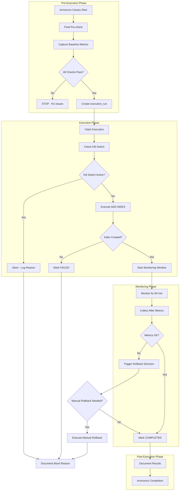
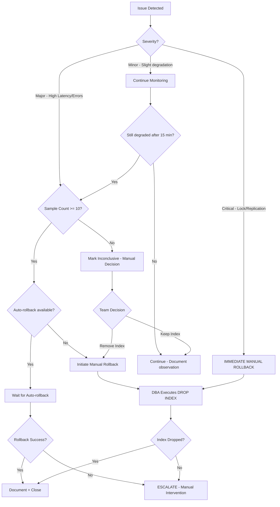

# Canary Run Plan - Executor v1 (Phase 5)

> **วันที่สร้าง:** 2026-02-01  
> **Version:** 1.0  
> **อ้างอิง:** [`EXECUTOR_V1_INTEGRATION_TEST_PLAN.md`](EXECUTOR_V1_INTEGRATION_TEST_PLAN.md) | [`EXECUTOR_V1_TEST_RESULT_LOG.md`](EXECUTOR_V1_TEST_RESULT_LOG.md) | [`plans/phase5-executor-scope.md`](plans/phase5-executor-scope.md)

---

## สารบัญ (Table of Contents)

1. [Executive Summary](#1-executive-summary)
2. [Canary Pre-check Checklist](#2-canary-pre-check-checklist)
3. [Canary Execution Steps](#3-canary-execution-steps)
4. [Monitoring Metrics และ Alert Thresholds](#4-monitoring-metrics-และ-alert-thresholds)
5. [Pass/Fail Criteria](#5-passfail-criteria)
6. [Rollback Decision Flow](#6-rollback-decision-flow)
7. [Communication และ Escalation](#7-communication-และ-escalation)
8. [Post-Canary Activities](#8-post-canary-activities)
9. [Appendices](#appendices)

---

## 1. Executive Summary

### 1.1 วัตถุประสงค์
เอกสารนี้เป็นแผนการรัน **Canary** สำหรับ Executor v1 บน Production โดยมีข้อจำกัดเข้มงวดตาม Phase 5 scope

### 1.2 Canary Scope (LOCKED)

| Dimension | Constraint | เหตุผล |
|-----------|------------|--------|
| **Tenant** | 1 tenant เท่านั้น | จำกัดผลกระทบ |
| **MySQL Connection** | 1 connection เท่านั้น | ป้องกัน cascading failures |
| **Table** | 1 table เท่านั้น | ลดความเสี่ยง |
| **Operation** | ADD_INDEX only | ตาม Phase 5 scope |
| **Time Window** | Off-peak เท่านั้น | ลดผลกระทบต่อ users |

### 1.3 ข้อจำกัดของ Canary Run

```
🚫 NOT ALLOWED:
├── DROP_INDEX (แม้ว่าจะเป็น rollback จาก executor ก็ตาม - ต้องใช้ manual rollback)
├── หลาย tenants พร้อมกัน
├── หลาย connections พร้อมกัน
├── หลาย tables พร้อมกัน
├── Peak hours (ต้องรันเฉพาะ off-peak)
└── ไม่มี Kill Switch หรือ Rollback Procedure พร้อม
```

### 1.4 Canary Timeline Overview

```mermaid
gantt
    title Canary Run Timeline
    dateFormat  HH:mm
    section Pre-Canary
    Pre-check Verification     :a1, 00:00, 30m
    Team Readiness Check       :a2, after a1, 15m
    section Canary Execution
    Execute ADD_INDEX          :b1, after a2, 15m
    Monitoring Window          :b2, after b1, 60m
    section Post-Canary
    Result Analysis            :c1, after b2, 30m
    Documentation              :c2, after c1, 15m
```



---

## 2. Canary Pre-check Checklist

### 2.1 Integration Test Results Verification

> ⚠️ **BLOCKER:** ต้องผ่านทุกข้อในส่วน P0 ก่อนเริ่ม Canary

#### 2.1.1 Critical Tests (P0) - Must Pass

| # | Test ID | Test Name | Required Status | Actual Status | Blocker? |
|---|---------|-----------|-----------------|---------------|----------|
| 1 | TC-02 | Kill Switch Before Start | ✅ PASS | ⬜ _(กรอก)_ | 🔴 YES |
| 2 | TC-03 | Kill Switch After ADD INDEX | ✅ PASS | ⬜ _(กรอก)_ | 🔴 YES |
| 3 | TC-09 | Kill Switch API Failure (Fail-Closed) | ✅ PASS | ⬜ _(กรอก)_ | 🔴 YES |

#### 2.1.2 High Priority Tests (P1) - Should Pass

| # | Test ID | Test Name | Required Status | Actual Status | Blocker? |
|---|---------|-----------|-----------------|---------------|----------|
| 1 | TC-01 | Worker Claim Conflict | ✅ PASS | ⬜ _(กรอก)_ | 🟠 CONDITIONAL |
| 2 | TC-06 | Verification Fail + Rollback OK | ✅ PASS | ⬜ _(กรอก)_ | 🟠 CONDITIONAL |

#### 2.1.3 Medium Priority Tests (P2) - Good to Have

| # | Test ID | Test Name | Status |
|---|---------|-----------|--------|
| 1 | TC-04 | LOCK=NONE Not Supported | ⬜ _(กรอก)_ |
| 2 | TC-05 | Index Already Exists | ⬜ _(กรอก)_ |
| 3 | TC-07 | Verification Fail + Rollback Fail | ⬜ _(กรอก)_ |
| 4 | TC-08 | Low Sample - Inconclusive | ⬜ _(กรอก)_ |
| 5 | TC-10 | Worker Crash + Lease Expiry | ⬜ _(กรอก)_ |

**Test Results Reference:** _(ระบุ link ไปยัง test result document)_

---

### 2.2 Environment Readiness Checklist

#### 2.2.1 Infrastructure Components

| # | Component | Check | Status | Verified By |
|---|-----------|-------|--------|-------------|
| 1 | SaaS API | Running and healthy | ⬜ Ready | _(ชื่อ)_ |
| 2 | Agent/Worker | Running and connectable | ⬜ Ready | _(ชื่อ)_ |
| 3 | MySQL Target | Accessible from agent | ⬜ Ready | _(ชื่อ)_ |
| 4 | Monitoring Stack | Prometheus/Grafana operational | ⬜ Ready | _(ชื่อ)_ |
| 5 | Alerting System | Configured and tested | ⬜ Ready | _(ชื่อ)_ |

#### 2.2.2 Database Verification

| # | Item | Expected | Verification Query | Status |
|---|------|----------|-------------------|--------|
| 1 | Target table exists | Yes | `SHOW TABLES LIKE 'target_table';` | ⬜ Verified |
| 2 | Target table row count | Acceptable for off-peak | `SELECT COUNT(*) FROM target_table;` | ⬜ Verified |
| 3 | Index does not exist | Empty result | `SHOW INDEX FROM target_table WHERE Key_name = 'idx_name';` | ⬜ Verified |
| 4 | InnoDB engine | InnoDB | `SHOW TABLE STATUS WHERE Name = 'target_table';` | ⬜ Verified |
| 5 | No pending DDL | Empty | `SHOW PROCESSLIST;` | ⬜ Verified |

### 2.3 Table Size Check
| Row Count | Status | Action |
|-----------|--------|--------|
| ≤ 5M rows | ✅ PASS | ดำเนินการได้ |
| > 5M rows และ ≤ 10M rows | ⚠️ WARNING | ต้องได้รับ approval จาก DBA ก่อน และเพิ่ม monitoring |
| > 10M rows | 🛑 BLOCK | ห้ามดำเนินการในขอบเขต Phase 5 - ต้องรอ Phase 6+ |

**Query ตรวจสอบ:**
```sql
SELECT 
  TABLE_NAME,
  TABLE_ROWS,
  ROUND(DATA_LENGTH/1024/1024, 2) AS data_mb,
  ROUND(INDEX_LENGTH/1024/1024, 2) AS index_mb
FROM information_schema.TABLES 
WHERE TABLE_SCHEMA = 'your_database' 
AND TABLE_NAME = 'target_table';
```

**เมื่อถูก BLOCK:**
- บันทึกเหตุผลใน execution log
- แจ้ง Canary Lead และ DBA
- ไม่ execute DDL statement
- ยกเลิก Canary Run สำหรับ table นี้

---

### 2.3 Kill Switch Verification

#### 2.3.1 Kill Switch Functionality Test

| # | Test | Action | Expected | Actual | Status |
|---|------|--------|----------|--------|--------|
| 1 | Global kill switch OFF | `GET /api/kill-switch/status` | `{"global_active": false}` | _(กรอก)_ | ⬜ |
| 2 | Connection kill switch OFF | `GET /api/kill-switch/connection/{id}` | `{"is_active": false}` | _(กรอก)_ | ⬜ |
| 3 | Can activate global | `PUT /api/kill-switch/global {"is_active": true}` | 200 OK | _(กรอก)_ | ⬜ |
| 4 | Can deactivate global | `PUT /api/kill-switch/global {"is_active": false}` | 200 OK | _(กรอก)_ | ⬜ |
| 5 | API response time | `GET /api/kill-switch/status` | < 500ms | _(กรอก)_ | ⬜ |

#### 2.3.2 Kill Switch Pre-Canary Reset

```bash
# Reset kill switches ก่อน canary
curl -X PUT http://localhost:3000/api/kill-switch/global \
  -H "Content-Type: application/json" \
  -d '{"is_active": false}'

curl -X PUT http://localhost:3000/api/kill-switch/connection/{CONNECTION_ID} \
  -H "Content-Type: application/json" \
  -d '{"is_active": false}'
```

**Reset Completed:** ⬜ Yes / ⬜ No  
**Reset By:** _(ชื่อ)_  
**Reset Timestamp:** _(วันที่/เวลา)_

---

### 2.4 Rollback Procedure Verification

#### 2.4.1 Manual Rollback Test

| # | Step | Action | Expected | Status |
|---|------|--------|----------|--------|
| 1 | Create test index | `ALTER TABLE test_table ADD INDEX idx_test (col);` | Success | ⬜ |
| 2 | Verify index exists | `SHOW INDEX FROM test_table WHERE Key_name = 'idx_test';` | 1 row | ⬜ |
| 3 | Drop test index | `ALTER TABLE test_table DROP INDEX idx_test;` | Success | ⬜ |
| 4 | Verify index removed | `SHOW INDEX FROM test_table WHERE Key_name = 'idx_test';` | 0 rows | ⬜ |

#### 2.4.2 Rollback Statement Prepared

```sql
-- ⚠️ PREPARED ROLLBACK STATEMENT (DO NOT RUN UNLESS NEEDED)
-- Copy นี้ไว้ใน clipboard ของ DBA ที่ standby

ALTER TABLE {TARGET_TABLE} DROP INDEX {INDEX_NAME};

-- Verification after rollback:
SHOW INDEX FROM {TARGET_TABLE} WHERE Key_name = '{INDEX_NAME}';
```

**Rollback Statement Prepared:** ⬜ Yes  
**DBA Confirmed:** ⬜ Yes  
**DBA Name:** _(ชื่อ)_

---

### 2.5 Team Readiness Checklist

#### 2.5.1 Required Personnel

| Role | Name | Contact | Status | Backup |
|------|------|---------|--------|--------|
| **Canary Lead** | _(ชื่อ)_ | _(phone/slack)_ | ⬜ Available | _(ชื่อ backup)_ |
| **DBA** | _(ชื่อ)_ | _(phone/slack)_ | ⬜ Available | _(ชื่อ backup)_ |
| **SRE/Ops** | _(ชื่อ)_ | _(phone/slack)_ | ⬜ Available | _(ชื่อ backup)_ |
| **Developer** | _(ชื่อ)_ | _(phone/slack)_ | ⬜ Available | _(ชื่อ backup)_ |

#### 2.5.2 Communication Channels

| Channel | Purpose | Link/Details | Verified |
|---------|---------|--------------|----------|
| Slack Channel | Primary communication | #canary-executor-v1 | ⬜ |
| War Room | Escalation | _(link หรือ location)_ | ⬜ |
| PagerDuty | Alert escalation | _(integration details)_ | ⬜ |

#### 2.5.3 Schedule Verification

| Item | Expected | Actual | Status |
|------|----------|--------|--------|
| Start Time | _(HH:MM UTC+7)_ | _(HH:MM)_ | ⬜ Confirmed |
| Off-peak Window | 22:00 - 06:00 UTC+7 | _(verify)_ | ⬜ Confirmed |
| Expected Duration | 2 hours | _(estimate)_ | ⬜ Confirmed |
| Team Availability | All required personnel | _(verify)_ | ⬜ Confirmed |

---

### 2.6 Pre-check Sign-off

| Role | Name | Date | Signature |
|------|------|------|-----------|
| Canary Lead | _(ชื่อ)_ | _(วันที่)_ | ⬜ Approved |
| DBA | _(ชื่อ)_ | _(วันที่)_ | ⬜ Approved |
| SRE | _(ชื่อ)_ | _(วันที่)_ | ⬜ Approved |

**Pre-check Status:** ⬜ ALL PASSED / ⬜ BLOCKED

**Blocking Issues (if any):**
```
(ระบุ issues ที่ต้องแก้ก่อนเริ่ม canary)
```

---

## 3. Canary Execution Steps

### 3.1 Execution Flow Overview



---

### 3.2 Step-by-Step Execution Guide

#### Step 0: Announce Canary Start
| Field | Value |
|-------|-------|
| **Time** | T-5 minutes |
| **Owner** | Canary Lead |
| **Action** | Post ใน Slack channel |

**Announcement Template:**
```
🚀 [CANARY START] Executor v1 Canary Run
━━━━━━━━━━━━━━━━━━━━━━━━━━━━━
📋 Scope: ADD_INDEX on {TABLE_NAME}
🎯 Tenant: {TENANT_ID}
🔗 Connection: {CONNECTION_ID}
⏰ Expected Duration: ~2 hours
👤 Lead: {CANARY_LEAD}

📊 Monitoring Dashboard: {LINK}
📞 War Room: {LINK}

All team members please confirm availability in thread.
```

**Confirmation Required:** ⬜ DBA / ⬜ SRE / ⬜ Developer

---

#### Step 1: Final Pre-check
| Field | Value |
|-------|-------|
| **Time** | T+0 |
| **Owner** | Canary Lead |
| **Duration** | 5 minutes |
| **Checkpoint** | All pre-checks must pass |

**Actions:**
```bash
# 1. Verify SaaS API health
curl -s http://localhost:3000/health | jq '.'

# 2. Verify kill switch is OFF
curl -s http://localhost:3000/api/kill-switch/status | jq '.'

# 3. Verify no running executions
curl -s http://localhost:3000/api/executions?status=running | jq '.'

# 4. Verify target table
mysql -e "SHOW INDEX FROM {TARGET_TABLE} WHERE Key_name = '{INDEX_NAME}';"
```

**Go/No-Go Decision:** ⬜ GO / ⬜ NO-GO

---

#### Step 2: Capture Baseline Metrics
| Field | Value |
|-------|-------|
| **Time** | T+5 minutes |
| **Owner** | SRE |
| **Duration** | 5 minutes |
| **Checkpoint** | Baseline metrics recorded |

**Metrics to Capture:**

| Metric | Query/Command | Baseline Value | Timestamp |
|--------|---------------|----------------|-----------|
| Query Latency P50 | Prometheus query | _(ms)_ | _(HH:MM)_ |
| Query Latency P99 | Prometheus query | _(ms)_ | _(HH:MM)_ |
| Active Connections | `SHOW STATUS LIKE 'Threads_connected';` | _(count)_ | _(HH:MM)_ |
| Table Locks | `SHOW STATUS LIKE 'Table_locks_waited';` | _(count)_ | _(HH:MM)_ |
| Replication Lag | `SHOW SLAVE STATUS\G` | _(seconds)_ | _(HH:MM)_ |
| CPU Usage | Prometheus query | _(%)_ | _(HH:MM)_ |
| Disk I/O | Prometheus query | _(MB/s)_ | _(HH:MM)_ |

---

#### Step 3: Create execution_run
| Field | Value |
|-------|-------|
| **Time** | T+10 minutes |
| **Owner** | Developer |
| **Duration** | 2 minutes |
| **Checkpoint** | execution_run created with status 'scheduled' |

**API Call:**
```bash
curl -X POST http://localhost:3000/api/executions \
  -H "Content-Type: application/json" \
  -d '{
    "tenant_id": "{TENANT_ID}",
    "connection_id": "{CONNECTION_ID}",
    "action": "ADD_INDEX",
    "table_name": "{TARGET_TABLE}",
    "index_name": "{INDEX_NAME}",
    "columns": ["{COLUMN_NAME}"],
    "scheduled_at": "{ISO_DATETIME}"
  }'
```

**Expected Response:**
```json
{
  "id": "{EXECUTION_RUN_ID}",
  "status": "scheduled"
}
```

**Record execution_run_id:** _(กรอก ID ที่ได้)_

---

#### Step 4: Execute ADD_INDEX
| Field | Value |
|-------|-------|
| **Time** | T+12 minutes |
| **Owner** | Developer |
| **Duration** | 5-15 minutes (depends on table size) |
| **Checkpoint** | Index created OR error logged |

**Trigger Execution:**
```bash
# Option 1: Manual trigger via API
curl -X POST http://localhost:3000/api/executions/{EXECUTION_RUN_ID}/execute

# Option 2: Worker picks up automatically
# Monitor worker logs
```

**Expected Logs:**
```
[INFO] Attempting to claim execution {EXECUTION_RUN_ID}
[INFO] Claim successful
[INFO] Kill switch check passed
[INFO] Executing ADD INDEX statement: ALTER TABLE {TABLE} ADD INDEX {INDEX} ({COLUMNS}) ALGORITHM=INPLACE, LOCK=NONE
[INFO] Successfully added index {INDEX_NAME}
```

**Wait Time Before Next Step:** 2 minutes (cooldown)

**Verification:**
```sql
-- ตรวจสอบว่า index ถูกสร้าง
SHOW INDEX FROM {TARGET_TABLE} WHERE Key_name = '{INDEX_NAME}';
```

**Index Created:** ⬜ Yes / ⬜ No

---

#### Step 5: Monitoring Window
| Field | Value |
|-------|-------|
| **Time** | T+15 minutes to T+75 minutes |
| **Owner** | SRE + DBA |
| **Duration** | 60 minutes |
| **Checkpoint** | No degradation observed |

**Monitoring Checkpoints:**

| Checkpoint | Time | Metrics OK? | Notes |
|------------|------|-------------|-------|
| T+15 min | _(HH:MM)_ | ⬜ Yes / ⬜ No | _(observations)_ |
| T+30 min | _(HH:MM)_ | ⬜ Yes / ⬜ No | _(observations)_ |
| T+45 min | _(HH:MM)_ | ⬜ Yes / ⬜ No | _(observations)_ |
| T+60 min | _(HH:MM)_ | ⬜ Yes / ⬜ No | _(observations)_ |
| T+75 min (Final) | _(HH:MM)_ | ⬜ Yes / ⬜ No | _(observations)_ |

---

#### Step 6: Collect After Metrics
| Field | Value |
|-------|-------|
| **Time** | T+75 minutes |
| **Owner** | SRE |
| **Duration** | 5 minutes |
| **Checkpoint** | After metrics recorded |

**Metrics to Capture:**

| Metric | Baseline | After | Delta | Status |
|--------|----------|-------|-------|--------|
| Query Latency P50 | _(ms)_ | _(ms)_ | _(%)_ | ⬜ OK / ⬜ DEGRADED |
| Query Latency P99 | _(ms)_ | _(ms)_ | _(%)_ | ⬜ OK / ⬜ DEGRADED |
| Active Connections | _(count)_ | _(count)_ | _(%)_ | ⬜ OK / ⬜ DEGRADED |
| Table Locks | _(count)_ | _(count)_ | _(%)_ | ⬜ OK / ⬜ DEGRADED |
| Replication Lag | _(sec)_ | _(sec)_ | _(%)_ | ⬜ OK / ⬜ DEGRADED |
| CPU Usage | _(%)_ | _(%)_ | _(%)_ | ⬜ OK / ⬜ DEGRADED |
| Disk I/O | _(MB/s)_ | _(MB/s)_ | _(%)_ | ⬜ OK / ⬜ DEGRADED |

---

#### Step 7: Final Decision
| Field | Value |
|-------|-------|
| **Time** | T+80 minutes |
| **Owner** | Canary Lead |
| **Duration** | 5 minutes |
| **Checkpoint** | Pass/Fail decision made |

**Decision Matrix:**

| Condition | Decision | Action |
|-----------|----------|--------|
| All metrics OK | ✅ PASS | Mark as COMPLETED |
| Minor degradation (< 10%) | ⚠️ WARNING | Document and continue monitoring |
| Major degradation (> 10%) | ❌ FAIL | Initiate rollback decision |
| Any alert fired | ❌ FAIL | Initiate rollback decision |

**Final Decision:** ⬜ PASS / ⬜ WARNING / ⬜ FAIL

---

#### Step 8: Post-Execution Update
| Field | Value |
|-------|-------|
| **Time** | T+85 minutes |
| **Owner** | Developer |
| **Duration** | 5 minutes |

**Update execution_run Status:**
```bash
curl -X PATCH http://localhost:3000/api/executions/{EXECUTION_RUN_ID}/status \
  -H "Content-Type: application/json" \
  -d '{
    "status": "completed",
    "message": "Canary run successful"
  }'
```

---

#### Step 9: Announce Completion
| Field | Value |
|-------|-------|
| **Time** | T+90 minutes |
| **Owner** | Canary Lead |

**Completion Announcement Template:**
```
✅ [CANARY COMPLETE] Executor v1 Canary Run
━━━━━━━━━━━━━━━━━━━━━━━━━━━━━
📋 Result: {PASS/FAIL}
🎯 Index Created: {INDEX_NAME} on {TABLE_NAME}
⏱️ Duration: {ACTUAL_DURATION}

📊 Metrics Summary:
- Latency P50: {BASELINE} → {AFTER} ({DELTA}%)
- Latency P99: {BASELINE} → {AFTER} ({DELTA}%)
- No alerts fired: ✅/❌

📝 Full report: {LINK_TO_REPORT}

Thanks to the team: {PARTICIPANTS}
```

---

## 4. Monitoring Metrics และ Alert Thresholds

### 4.1 System Metrics

| Metric | Collection Method | Warning Threshold | Critical Threshold | Action |
|--------|------------------|-------------------|-------------------|--------|
| **CPU Usage** | Prometheus | > 70% | > 85% | Investigate |
| **Memory Usage** | Prometheus | > 80% | > 90% | Investigate |
| **Disk I/O (read)** | Prometheus | > 100 MB/s | > 200 MB/s | Prepare rollback |
| **Disk I/O (write)** | Prometheus | > 50 MB/s | > 100 MB/s | Prepare rollback |
| **Network Latency** | Prometheus | > 50ms | > 100ms | Investigate |

### 4.2 Database Metrics

| Metric | Collection Method | Warning Threshold | Critical Threshold | Action |
|--------|------------------|-------------------|-------------------|--------|
| **Active Connections** | MySQL SHOW STATUS | > 80% max | > 90% max | Prepare rollback |
| **Query Latency P50** | Performance Schema | > 20% increase | > 50% increase | Rollback |
| **Query Latency P99** | Performance Schema | > 30% increase | > 100% increase | Rollback |
| **Lock Wait Time** | Performance Schema | > 1 second | > 5 seconds | Immediate rollback |
| **Replication Lag** | SHOW SLAVE STATUS | > 30 seconds | > 60 seconds | Immediate rollback |
| **InnoDB Buffer Pool Hit Rate** | MySQL SHOW STATUS | < 95% | < 90% | Investigate |
| **Threads Running** | MySQL SHOW STATUS | > 50 | > 100 | Investigate |

### 4.3 Application Metrics

| Metric | Collection Method | Warning Threshold | Critical Threshold | Action |
|--------|------------------|-------------------|-------------------|--------|
| **Error Rate** | Application logs | > 0.1% | > 1% | Investigate |
| **Request Latency P50** | APM | > 20% increase | > 50% increase | Rollback |
| **Request Latency P99** | APM | > 30% increase | > 100% increase | Rollback |
| **Throughput** | APM | > 20% decrease | > 50% decrease | Rollback |

### 4.4 Kill Switch Metrics

| Metric | Collection Method | Warning Threshold | Critical Threshold | Action |
|--------|------------------|-------------------|-------------------|--------|
| **Kill Switch API Response Time** | API monitoring | > 500ms | > 2000ms | Abort if pre-execution |
| **Kill Switch API Availability** | Health check | < 99.9% | < 99% | Abort and investigate |

### 4.5 Monitoring Dashboard Checklist

| Dashboard | URL | Owner | Verified |
|-----------|-----|-------|----------|
| MySQL Overview | _(link)_ | DBA | ⬜ |
| Application APM | _(link)_ | Developer | ⬜ |
| Infrastructure | _(link)_ | SRE | ⬜ |
| Executor Specific | _(link)_ | Developer | ⬜ |

---

## 5. Pass/Fail Criteria

### 5.1 Success Criteria (Must Meet ALL)

| # | Criteria | Threshold | Weight | Status |
|---|----------|-----------|--------|--------|
| 1 | Index created successfully | Yes | Critical | ⬜ |
| 2 | No alerts fired during monitoring | 0 alerts | Critical | ⬜ |
| 3 | Query latency P50 degradation | < 10% | Critical | ⬜ |
| 4 | Query latency P99 degradation | < 20% | Critical | ⬜ |
| 5 | Replication lag | < 30 seconds | Critical | ⬜ |
| 6 | Error rate increase | < 0.1% | Critical | ⬜ |
| 7 | Lock wait time | < 1 second | Critical | ⬜ |
| 8 | Monitoring window completed | 60 minutes | Required | ⬜ |

### 5.2 Warning Conditions (Escalate but Continue)

| # | Condition | Action |
|---|-----------|--------|
| 1 | Latency P50 increase 5-10% | Log, continue monitoring |
| 2 | Latency P99 increase 10-20% | Alert team, extend monitoring |
| 3 | CPU usage 70-85% | Monitor closely |
| 4 | Single query timeout | Investigate, continue if isolated |
| 5 | Minor replication lag (10-30s) | Monitor closely |

### 5.3 Failure Conditions (Stop Immediately)

| # | Condition | Immediate Action |
|---|-----------|------------------|
| 1 | Kill switch activated | Stop, document reason |
| 2 | Latency P50 increase > 50% | Initiate rollback decision |
| 3 | Latency P99 increase > 100% | Initiate rollback decision |
| 4 | Lock wait time > 5 seconds | Immediate rollback |
| 5 | Replication lag > 60 seconds | Immediate rollback |
| 6 | Error rate > 1% | Immediate rollback |
| 7 | Critical alert fired | Follow alert runbook |
| 8 | Table locked/unavailable | Immediate rollback |

### 5.4 Time-based Criteria

| Phase | Minimum Duration | Notes |
|-------|-----------------|-------|
| Pre-execution checks | 15 minutes | All checks must pass |
| Monitoring window | 60 minutes | Cannot be shortened |
| Post-rollback observation | 30 minutes | If rollback performed |
| Post-success observation | 15 minutes | Before declaring success |

### 5.5 Final Decision Matrix

| All Success Met | Warnings | Failures | Decision | Next Step |
|-----------------|----------|----------|----------|-----------|
| ✅ Yes | None | None | ✅ **PASS** | Document and close |
| ✅ Yes | Some | None | ⚠️ **PASS with WARNING** | Document warnings, plan follow-up |
| ✅ Yes | Any | Any | ❌ **FAIL** | Execute rollback decision flow |
| ❌ No | Any | Any | ❌ **FAIL** | Execute rollback decision flow |

---

## Decision Rules (Clarifications)

### 1. Warning Zone Behavior (10-20% change)
| Metric | Change Range | Action Required |
|--------|--------------|-----------------|
| Query Latency P50 | +10% to +20% | ⚠️ Log warning, notify on-call, continue with increased monitoring |
| Query Latency P99 | +10% to +50% | ⚠️ Log warning, notify on-call, consider extending observation period |
| Throughput | -10% to -20% | ⚠️ Log warning, verify no downstream impact |

**Warning Zone Actions:**
1. บันทึก warning ใน execution log พร้อม timestamp และค่าที่วัดได้
2. แจ้ง on-call engineer ผ่าน alerting channel
3. ขยาย observation period เป็น 2x (เช่น จาก 30 นาที เป็น 60 นาที)
4. ถ้า metric ไม่ลดลงหลัง observation period → escalate เป็น fail

### 2. Boundary Case Rules (Exact Threshold)
| Condition | Rule | Example |
|-----------|------|---------|
| Value = threshold exactly | **INCLUSIVE (ถือว่า hit threshold)** | P550 +10.0% exact → ถือว่าเข้า Warning zone |
| Value < threshold | PASS | P50 +9.9% → PASS |
| Value > threshold | ตาม threshold level | P50 +10.1% → Warning zone |

**หมายเหตุ:** ใช้ "greater than or equal" (≥) สำหรับทุก threshold

### 3. Multiple Warnings Rule
| จำนวน Warnings พร้อมกัน | Action |
|------------------------|--------|
| 1-2 warnings | ดำเนินการตาม Warning Zone Actions, ขยาย observation |
| 3-4 warnings | Escalate ให้ Tech Lead review ทันที, พิจารณา pause |
| ≥ 5 warnings | **AUTO-PAUSE** - หยุดรอ review จาก Tech Lead ก่อนดำเนินการต่อ |

**Multiple Warning Escalation Flow:**
1. Count จำนวน concurrent warnings
2. ถ้า ≥ 5 → trigger AUTO-PAUSE
3. แจ้ง Tech Lead และ DBA ทันที
4. รอ explicit approval ก่อน resume หรือ rollback

---

## 6. Rollback Decision Flow

### 6.1 Rollback Decision Flowchart



### 6.2 Automatic Rollback Triggers

> ⚠️ **Note:** สำหรับ Canary Run นี้ auto-rollback จะเป็น **logging only** - ต้องใช้ manual rollback

| Trigger | Condition | Expected Behavior |
|---------|-----------|-------------------|
| Verification Failure | Latency degraded > threshold | Log rollback decision, notify team |
| Kill Switch Activated | is_active = true | Stop execution, log, notify team |
| Kill Switch API Failure | API returns error/timeout | Fail-closed, abort execution |

### 6.3 Manual Rollback Criteria

| # | Condition | Who Decides | Required Approvals |
|---|-----------|-------------|-------------------|
| 1 | Latency degradation > 50% sustained 5+ min | Canary Lead | DBA + SRE |
| 2 | Lock wait time > 5 seconds | DBA | Canary Lead |
| 3 | Replication lag > 60 seconds | DBA | Canary Lead + SRE |
| 4 | Error rate spike > 1% | SRE | Canary Lead + Developer |
| 5 | Team consensus | All | Canary Lead |

### 6.4 Manual Rollback Steps

#### Step R1: Decision and Announcement
```
🔴 [ROLLBACK INITIATED] Executor v1 Canary
━━━━━━━━━━━━━━━━━━━━━━━━━━━━━
⚠️ Reason: {REASON}
📊 Metrics at decision time:
- Latency P50: {VALUE}
- Latency P99: {VALUE}
- Error rate: {VALUE}

🎯 Action: Manual DROP INDEX
👤 DBA: {DBA_NAME}
⏰ ETA: {ESTIMATED_TIME}

All team standby.
```

#### Step R2: Execute DROP INDEX
```sql
-- ⚠️ EXECUTE ONLY WHEN APPROVED

-- 1. Verify current state
SHOW INDEX FROM {TARGET_TABLE} WHERE Key_name = '{INDEX_NAME}';

-- 2. Execute DROP INDEX
ALTER TABLE {TARGET_TABLE} DROP INDEX {INDEX_NAME};

-- 3. Verify rollback
SHOW INDEX FROM {TARGET_TABLE} WHERE Key_name = '{INDEX_NAME}';
-- Expected: Empty result
```

| Checkpoint | Status | Timestamp | Executed By |
|------------|--------|-----------|-------------|
| Pre-rollback index exists | ⬜ Verified | _(HH:MM)_ | _(name)_ |
| DROP INDEX executed | ⬜ Done | _(HH:MM)_ | _(name)_ |
| Post-rollback index gone | ⬜ Verified | _(HH:MM)_ | _(name)_ |

#### Step R3: Update execution_run Status
```bash
curl -X PATCH http://localhost:3000/api/executions/{EXECUTION_RUN_ID}/status \
  -H "Content-Type: application/json" \
  -d '{
    "status": "rolled_back",
    "fail_reason": "manual_rollback",
    "message": "{ROLLBACK_REASON}"
  }'
```

#### Step R4: Post-Rollback Verification
| Check | Expected | Actual | Status |
|-------|----------|--------|--------|
| Index removed | Yes | _(verify)_ | ⬜ |
| Latency returning to baseline | Yes | _(verify)_ | ⬜ |
| Error rate returning to baseline | Yes | _(verify)_ | ⬜ |
| No new alerts | Yes | _(verify)_ | ⬜ |

**Post-Rollback Monitoring Duration:** 30 minutes

#### Step R5: Rollback Announcement
```
✅ [ROLLBACK COMPLETE] Executor v1 Canary
━━━━━━━━━━━━━━━━━━━━━━━━━━━━━
📋 Index {INDEX_NAME} has been dropped
⏱️ Rollback Duration: {DURATION}

📊 Post-Rollback Metrics:
- Latency P50: {VALUE} (baseline: {BASELINE})
- Latency P99: {VALUE} (baseline: {BASELINE})
- Error rate: {VALUE}

📝 Root Cause Analysis will follow.
📅 Next Steps: {NEXT_STEPS}
```

### 6.5 Rollback Record Template

```sql
-- Record rollback in rollback_records table
INSERT INTO rollback_records (
    execution_run_id,
    tenant_id,
    connection_profile_id,
    rollback_status,
    rollback_type,
    rollback_started_at,
    rollback_completed_at,
    rollback_details
) VALUES (
    '{EXECUTION_RUN_ID}',
    '{TENANT_ID}',
    '{CONNECTION_ID}',
    'completed',
    'full',
    '{START_TIMESTAMP}',
    '{END_TIMESTAMP}',
    '{
        "reason": "{ROLLBACK_REASON}",
        "triggered_by": "{PERSON}",
        "index_name": "{INDEX_NAME}",
        "table_name": "{TABLE_NAME}",
        "metrics_at_decision": {
            "latency_p50": {VALUE},
            "latency_p99": {VALUE},
            "error_rate": {VALUE}
        }
    }'
);
```

---

## 7. Communication และ Escalation

### 7.1 Communication Protocol

| Event | Channel | Notify | Template |
|-------|---------|--------|----------|
| Canary Start | Slack #canary-executor-v1 | @channel | See Step 0 |
| Checkpoint (every 15 min) | Slack thread | Team | Quick status update |
| Warning Detected | Slack + Thread | @canary-team | Warning template |
| Rollback Initiated | Slack + PagerDuty | @channel + On-call | Rollback template |
| Canary Complete | Slack | @channel | Completion template |

### 7.2 Escalation Matrix

| Level | Condition | Who to Contact | Response Time |
|-------|-----------|----------------|---------------|
| L1 | Minor warnings | Canary Lead | 5 minutes |
| L2 | Major degradation | Canary Lead + DBA | 2 minutes |
| L3 | Critical - Rollback needed | All team + On-call manager | Immediate |
| L4 | Rollback failed | On-call manager + Director | Immediate |

### 7.3 Contact Information

| Role | Primary | Phone | Slack | Backup |
|------|---------|-------|-------|--------|
| Canary Lead | _(name)_ | _(phone)_ | @_(handle)_ | _(backup)_ |
| DBA | _(name)_ | _(phone)_ | @_(handle)_ | _(backup)_ |
| SRE | _(name)_ | _(phone)_ | @_(handle)_ | _(backup)_ |
| On-call Manager | _(name)_ | _(phone)_ | @_(handle)_ | _(backup)_ |

### 7.4 Communication Templates

#### Warning Template
```
⚠️ [WARNING] Executor v1 Canary
━━━━━━━━━━━━━━━━━━━━━━━━━━━━━
📊 Observation: {WHAT_WAS_OBSERVED}
📈 Current Metrics:
- {METRIC}: {VALUE} (threshold: {THRESHOLD})

🎯 Action: {CONTINUE_MONITORING/PREPARE_ROLLBACK}
👤 Monitoring: {PERSON}

Next update in 5 minutes.
```

#### Critical Alert Template
```
🚨 [CRITICAL] Executor v1 Canary - Immediate Action Required
━━━━━━━━━━━━━━━━━━━━━━━━━━━━━
📊 Issue: {ISSUE_DESCRIPTION}
📈 Current Metrics:
- {METRIC}: {VALUE} (threshold: {THRESHOLD})

🎯 Action Required: {ROLLBACK/INVESTIGATE}
👤 DBA: @{DBA_HANDLE} - please confirm
👤 Canary Lead: @{LEAD_HANDLE} - decision needed

⏰ Response needed within 2 minutes.
```

---

## 8. Post-Canary Activities

### 8.1 Post-Canary Checklist

| # | Task | Owner | Status |
|---|------|-------|--------|
| 1 | Document final metrics | SRE | ⬜ |
| 2 | Update execution_run status | Developer | ⬜ |
| 3 | Create rollback record (if applicable) | Developer | ⬜ |
| 4 | Archive logs | SRE | ⬜ |
| 5 | Complete this document | Canary Lead | ⬜ |
| 6 | Schedule post-mortem (if failed) | Canary Lead | ⬜ |
| 7 | Send summary to stakeholders | Canary Lead | ⬜ |

### 8.2 Post-Canary Report Template

```markdown
# Canary Run Report - Executor v1

## Summary
| Field | Value |
|-------|-------|
| Date | {DATE} |
| Result | {PASS/FAIL} |
| Duration | {DURATION} |
| Index Created | {INDEX_NAME} |
| Rolled Back | {YES/NO} |

## Metrics Comparison
| Metric | Baseline | After | Delta |
|--------|----------|-------|-------|
| Latency P50 | {ms} | {ms} |  |
| Error Rate |  | {%} |

## Issues Encountered
{LIST_OF_ISSUES}

## Recommendations
{RECOMMENDATIONS}

## Next Steps
{NEXT_STEPS}
```

### 8.3 Lessons Learned Template

| # | What Happened | Impact | Root Cause | Action Item |
|---|---------------|--------|------------|-------------|
| 1 | _(description)_ | _(impact)_ | _(cause)_ | _(action)_ |

---

## Appendices

### Appendix A: Quick Reference Commands

#### Kill Switch Commands
```bash
# Check status
curl -s http://localhost:3000/api/kill-switch/status | jq '.'

# Activate global kill switch
curl -X PUT http://localhost:3000/api/kill-switch/global \
  -H "Content-Type: application/json" \
  -d '{"is_active": true}'

# Deactivate global kill switch
curl -X PUT http://localhost:3000/api/kill-switch/global \
  -H "Content-Type: application/json" \
  -d '{"is_active": false}'
```

#### MySQL Verification Commands
```sql
-- Check index exists
SHOW INDEX FROM {TABLE} WHERE Key_name = '{INDEX_NAME}';

-- Check table locks
SHOW STATUS LIKE 'Table_locks%';

-- Check replication lag
SHOW SLAVE STATUS\G

-- Check running queries
SHOW FULL PROCESSLIST;

-- Kill long-running query (if needed)
KILL {PROCESS_ID};
```

### Appendix B: Monitoring Queries

#### Prometheus Queries
```promql
# MySQL Query Latency P50
histogram_quantile(0.5, rate(mysql_query_duration_seconds_bucket[5m]))

# MySQL Query Latency P99
histogram_quantile(0.99, rate(mysql_query_duration_seconds_bucket[5m]))

# Error Rate
rate(http_requests_total{status=~"5.."}[5m]) / rate(http_requests_total[5m])

# CPU Usage
100 - (avg(irate(node_cpu_seconds_total{mode="idle"}[5m])) * 100)
```

### Appendix C: Emergency Contacts

| Situation | Contact | Method |
|-----------|---------|--------|
| Database emergency | DBA On-call | PagerDuty |
| Infrastructure down | SRE On-call | PagerDuty |
| Security incident | Security Team | Security hotline |
| Executive escalation | On-call Manager | Phone |

### Appendix D: Glossary

| Term | Definition |
|------|------------|
| Canary Run | Limited production test with strict constraints |
| Kill Switch | Emergency stop mechanism for all executions |
| Rollback | Reverting changes (DROP INDEX in this context) |
| Fail-closed | Default to safe state when error occurs |
| Off-peak | Low traffic period (typically 22:00-06:00) |

---

## Document Control

| Version | Date | Author | Changes |
|---------|------|--------|---------|
| 1.0 | 2026-02-01 | _(author)_ | Initial version |

**Review Status:** ⬜ Draft / ⬜ Under Review / ⬜ Approved

**Approvals:**

| Role | Name | Date | Signature |
|------|------|------|-----------|
| Tech Lead | _(name)_ | _(date)_ | ⬜ |
| DBA Lead | _(name)_ | _(date)_ | ⬜ |
| SRE Lead | _(name)_ | _(date)_ | ⬜ |

---

*Document Template Version: 1.0*  
*Compatible with: [`EXECUTOR_V1_INTEGRATION_TEST_PLAN.md`](EXECUTOR_V1_INTEGRATION_TEST_PLAN.md) v1.0*
