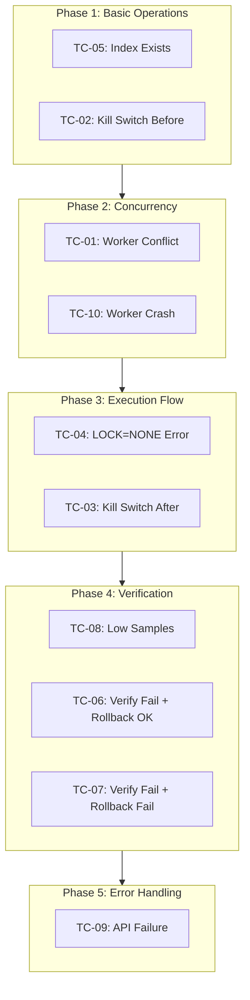
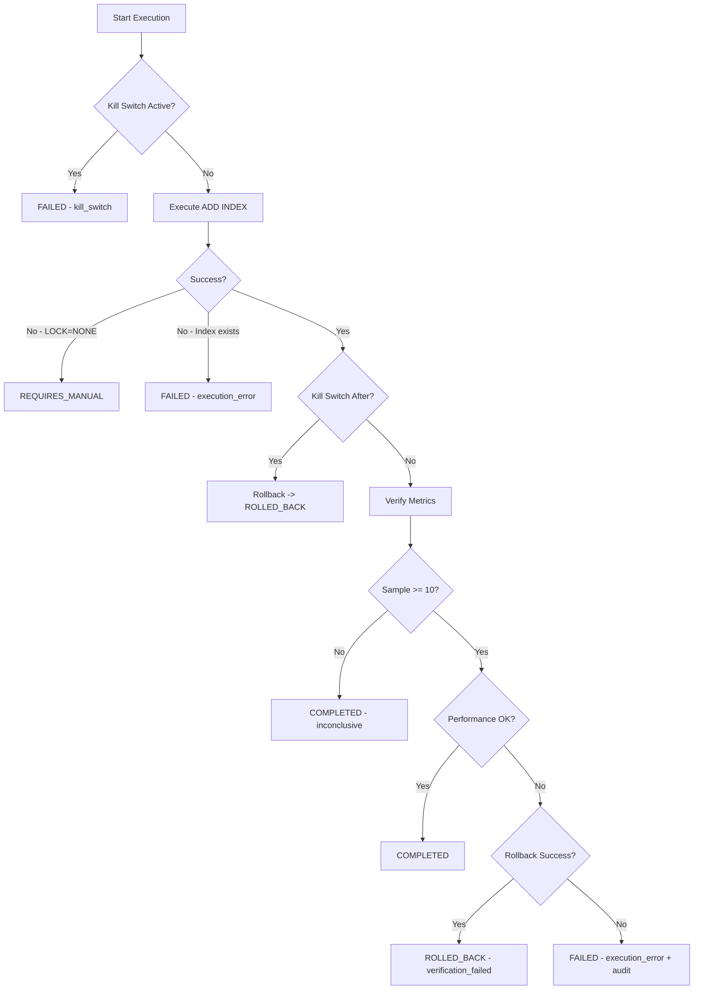

# Integration Test Execution Plan สำหรับ Executor v1

> **วันที่สร้าง:** 2026-02-01  
> **Version:** 1.0  
> **อ้างอิง:** [`EXECUTOR_V1_INTEGRATION_TEST_CHECKLIST.md`](EXECUTOR_V1_INTEGRATION_TEST_CHECKLIST.md)

---

## สารบัญ (Table of Contents)

1. [Executive Summary](#1-executive-summary)
2. [Test Environment Prerequisites](#2-test-environment-prerequisites)
3. [Test Execution Order และ Dependencies](#3-test-execution-order-และ-dependencies)
4. [Detailed Test Case Execution Plans](#4-detailed-test-case-execution-plans)
   - [TC-01: Worker Claim Conflict](#tc-01-worker-claim-conflict)
   - [TC-02: Kill Switch Before Start](#tc-02-kill-switch-before-start)
   - [TC-03: Kill Switch After ADD INDEX](#tc-03-kill-switch-after-add-index)
   - [TC-04: LOCK=NONE Not Supported](#tc-04-locknone-not-supported)
   - [TC-05: Index Already Exists](#tc-05-index-already-exists)
   - [TC-06: Verification Fail with Rollback Success](#tc-06-verification-fail-with-rollback-success)
   - [TC-07: Verification Fail with Rollback Fail](#tc-07-verification-fail-with-rollback-fail)
   - [TC-08: Low Sample Count - Inconclusive](#tc-08-low-sample-count---inconclusive)
   - [TC-09: Kill Switch API Failure](#tc-09-kill-switch-api-failure)
   - [TC-10: Worker Crash and Lease Expiry](#tc-10-worker-crash-and-lease-expiry)
5. [Quick Reference](#5-quick-reference)
6. [Rollback Procedures](#6-rollback-procedures)
7. [Test Result Documentation Template](#7-test-result-documentation-template)

---

## 1. Executive Summary

### วัตถุประสงค์
เอกสารนี้เป็นแผนการรัน Integration Tests สำหรับ Executor v1 ของระบบ MySQL Production Optimizer โดยครอบคลุม 10 test cases ที่ทดสอบสถานการณ์สำคัญต่างๆ ของ executor

### ขอบเขตการทดสอบ
| Component | รายละเอียด |
|-----------|------------|
| [`Executor`](agent/src/executor/executor.ts) | Main execution orchestrator |
| [`KillSwitchChecker`](agent/src/executor/kill-switch-checker.ts) | Kill switch validation |
| [`IndexExecutor`](agent/src/executor/index-executor.ts) | ADD INDEX execution |
| [`VerificationService`](agent/src/executor/verification-service.ts) | Performance verification และ rollback |
| SaaS API | Claim, status update, kill switch APIs |

### สรุปจำนวน Test Cases

| Category | Test IDs | จำนวน |
|----------|----------|-------|
| Concurrency Control | TC-01, TC-10 | 2 |
| Kill Switch Behavior | TC-02, TC-03, TC-09 | 3 |
| Execution Errors | TC-04, TC-05 | 2 |
| Verification Logic | TC-06, TC-07, TC-08 | 3 |
| **รวมทั้งหมด** | TC-01 ถึง TC-10 | **10** |

---

## 2. Test Environment Prerequisites

### 2.1 Infrastructure Requirements

```
┌─────────────────────────────────────────────────────────────────────┐
│                     Test Environment                                 │
├─────────────────────────────────────────────────────────────────────┤
│                                                                      │
│   ┌──────────────┐    ┌──────────────┐    ┌──────────────┐         │
│   │   Worker 1   │    │   Worker 2   │    │   SaaS API   │         │
│   │   (Agent)    │    │   (Agent)    │    │   Server     │         │
│   └──────┬───────┘    └──────┬───────┘    └──────┬───────┘         │
│          │                   │                   │                  │
│          └───────────────────┼───────────────────┘                  │
│                              │                                      │
│                    ┌─────────▼─────────┐                           │
│                    │  MySQL Database   │                           │
│                    │  (Test Instance)  │                           │
│                    └───────────────────┘                           │
│                                                                      │
└─────────────────────────────────────────────────────────────────────┘
```

### 2.2 Required Components

| Component | Version | Purpose |
|-----------|---------|---------|
| MySQL Server | 5.7+ หรือ 8.0+ | Target database สำหรับ ADD INDEX |
| Node.js | 18+ | Runtime สำหรับ Agent และ SaaS API |
| SaaS API | Running | API endpoints สำหรับ claim, status, kill-switch |

### 2.3 Database Test Data

สร้าง test database และ tables ก่อนเริ่มทดสอบ:

```sql
-- สร้าง test database
CREATE DATABASE IF NOT EXISTS executor_test;
USE executor_test;

-- สร้าง test table สำหรับ ADD INDEX tests
CREATE TABLE IF NOT EXISTS test_orders (
    id INT AUTO_INCREMENT PRIMARY KEY,
    customer_id INT NOT NULL,
    order_date DATETIME NOT NULL,
    status VARCHAR(50) NOT NULL,
    total_amount DECIMAL(10,2),
    created_at TIMESTAMP DEFAULT CURRENT_TIMESTAMP
);

-- เพิ่ม sample data (อย่างน้อย 10,000 records สำหรับ realistic metrics)
INSERT INTO test_orders (customer_id, order_date, status, total_amount)
SELECT 
    FLOOR(RAND() * 1000) + 1,
    DATE_ADD('2025-01-01', INTERVAL FLOOR(RAND() * 365) DAY),
    ELT(FLOOR(RAND() * 4) + 1, 'pending', 'processing', 'completed', 'cancelled'),
    ROUND(RAND() * 1000, 2)
FROM 
    (SELECT 1 UNION SELECT 2 UNION SELECT 3 UNION SELECT 4 UNION SELECT 5) t1,
    (SELECT 1 UNION SELECT 2 UNION SELECT 3 UNION SELECT 4 UNION SELECT 5) t2,
    (SELECT 1 UNION SELECT 2 UNION SELECT 3 UNION SELECT 4 UNION SELECT 5) t3,
    (SELECT 1 UNION SELECT 2 UNION SELECT 3 UNION SELECT 4 UNION SELECT 5) t4;
```

### 2.4 Environment Variables

```bash
# .env สำหรับ Agent
MYSQL_HOST=localhost
MYSQL_PORT=3306
MYSQL_USER=test_user
MYSQL_PASSWORD=test_password
MYSQL_DATABASE=executor_test

SAAS_API_URL=http://localhost:3000
LOG_LEVEL=debug
```

---

## 3. Test Execution Order และ Dependencies

### 3.1 Recommended Execution Order



### 3.2 Execution Order Rationale

| ลำดับ | Test ID | เหตุผลที่ต้องรันในลำดับนี้ |
|-------|---------|---------------------------|
| 1 | **TC-05** | ทดสอบ basic validation ก่อน - ตรวจจับ index ที่มีอยู่แล้ว |
| 2 | **TC-02** | ทดสอบ kill switch check ก่อนเริ่ม execution |
| 3 | **TC-01** | ทดสอบ concurrency control ระหว่าง workers |
| 4 | **TC-10** | ทดสอบ lease expiry และ recovery |
| 5 | **TC-04** | ทดสอบ MySQL compatibility errors |
| 6 | **TC-03** | ทดสอบ kill switch ระหว่าง execution |
| 7 | **TC-08** | ทดสอบ verification เมื่อ sample ไม่เพียงพอ |
| 8 | **TC-06** | ทดสอบ verification failure และ successful rollback |
| 9 | **TC-07** | ทดสอบ verification failure และ failed rollback |
| 10 | **TC-09** | ทดสอบ API failure scenarios (ทำลุดท้ายเพราะต้อง mock) |

### 3.3 Dependencies Matrix

| Test ID | ต้องการ | ไม่สามารถรันพร้อมกับ |
|---------|---------|---------------------|
| TC-01 | Worker 2 instances | - |
| TC-02 | Kill switch API | - |
| TC-03 | Successful ADD INDEX first | TC-05 |
| TC-04 | MySQL 5.6 หรือ storage engine ที่ไม่รองรับ | - |
| TC-05 | Pre-existing index | - |
| TC-06 | Successful ADD INDEX, Mock slow metrics | TC-05, TC-07 |
| TC-07 | Successful ADD INDEX, Permission issues | TC-05, TC-06 |
| TC-08 | Low traffic period | - |
| TC-09 | API mock/shutdown | - |
| TC-10 | Worker process control | TC-01 |

---

## 4. Detailed Test Case Execution Plans

---

### TC-01: Worker Claim Conflict

**วัตถุประสงค์:** ทดสอบว่าเมื่อมี 2 workers พยายาม claim execution_run เดียวกัน จะมีเพียง 1 worker ที่ได้รับอนุญาต

#### Pre-conditions
- [ ] SaaS API running และ accessible
- [ ] มี execution_run ที่ status = `scheduled`
- [ ] Worker 2 instances พร้อมรัน

#### Setup Steps

1. **สร้าง execution_run ใน database:**
   ```sql
   INSERT INTO execution_runs (id, connection_id, action, table_name, index_name, columns, status)
   VALUES (
       'test-tc01-001',
       'conn-001',
       'ADD_INDEX',
       'test_orders',
       'idx_tc01_customer',
       '["customer_id"]',
       'scheduled'
   );
   ```

2. **Configure Worker 1 และ Worker 2:**
   - ตั้งค่า `SAAS_API_URL` ให้ชี้ไปที่ SaaS API เดียวกัน
   - ตั้งค่า execution_run_id = `test-tc01-001`

#### Execution Steps

| Step | Action | Expected Log/Response |
|------|--------|----------------------|
| 1 | Start Worker 1 | `[INFO] Attempting to claim execution test-tc01-001` |
| 2 | Start Worker 2 ทันทีหลังจาก Worker 1 | `[INFO] Attempting to claim execution test-tc01-001` |
| 3 | Worker 1 calls claim API | HTTP 200 OK |
| 4 | Worker 2 calls claim API | HTTP 409 Conflict |
| 5 | Worker 1 continues execution | `[INFO] Claim successful, starting execution` |
| 6 | Worker 2 stops | `[WARN] Execution already claimed by another executor` |

#### Observation Methods

**Log Messages ที่ต้องตรวจสอบ:**
```
Worker 1:
[INFO] Attempting to claim execution test-tc01-001
[INFO] Claim successful, starting execution
[INFO] Execution completed

Worker 2:
[INFO] Attempting to claim execution test-tc01-001
[WARN] Execution already claimed by another executor
[INFO] Aborting - claim failed
```

**API Response ที่ต้องตรวจสอบ:**
- Worker 1: `POST /api/executions/test-tc01-001/claim` → 200 OK
- Worker 2: `POST /api/executions/test-tc01-001/claim` → 409 Conflict

**Database Query สำหรับ Verify:**
```sql
-- ตรวจสอบว่า execution_run ถูก claim โดย worker เดียว
SELECT id, status, claimed_by, claimed_at
FROM execution_runs
WHERE id = 'test-tc01-001';
```

#### Pass/Fail Criteria

| Criteria | Pass | Fail |
|----------|------|------|
| Worker 1 claim สำเร็จ | ✅ HTTP 200 | ❌ HTTP != 200 |
| Worker 2 ได้รับ conflict | ✅ HTTP 409 | ❌ HTTP 200 (ทั้งคู่ได้ claim) |
| เหลือ execution เดียว | ✅ 1 record, status=COMPLETED | ❌ Duplicate executions |
| Final status | ✅ COMPLETED | ❌ อื่นๆ |

#### Cleanup
```sql
-- ลบ test data
DELETE FROM execution_runs WHERE id = 'test-tc01-001';
DROP INDEX idx_tc01_customer ON test_orders;
```

---

### TC-02: Kill Switch Before Start

**วัตถุประสงค์:** ทดสอบว่าเมื่อ kill switch active ก่อนเริ่ม execution → abort ทันที

#### Pre-conditions
- [ ] SaaS API running
- [ ] Kill switch API endpoint พร้อมใช้งาน
- [ ] มี execution_run ที่ status = `scheduled`

#### Setup Steps

1. **เปิด Kill Switch:**
   ```bash
   curl -X POST http://localhost:3000/api/kill-switch \
     -H "Content-Type: application/json" \
     -d '{"connection_id": "conn-002", "active": true, "reason": "TC-02 Test"}'
   ```

2. **สร้าง execution_run:**
   ```sql
   INSERT INTO execution_runs (id, connection_id, action, table_name, index_name, columns, status)
   VALUES (
       'test-tc02-001',
       'conn-002',
       'ADD_INDEX',
       'test_orders',
       'idx_tc02_status',
       '["status"]',
       'scheduled'
   );
   ```

#### Execution Steps

| Step | Action | Expected Log/Response |
|------|--------|----------------------|
| 1 | Worker starts execution | `[INFO] Attempting to claim execution test-tc02-001` |
| 2 | Worker claims successfully | HTTP 200 |
| 3 | Worker checks kill switch | `[INFO] Checking kill switch for connection conn-002` |
| 4 | Kill switch returns active | `[WARN] Kill switch is active` |
| 5 | Worker aborts | `[ERROR] Execution aborted due to kill switch` |

#### Observation Methods

**Log Messages:**
```
[INFO] Attempting to claim execution test-tc02-001
[INFO] Claim successful
[INFO] Checking kill switch for connection conn-002
[WARN] Kill switch is active for connection conn-002
[ERROR] Kill switch is active, execution cancelled
```

**API Calls ที่เกิดขึ้น:**
- `POST /api/executions/test-tc02-001/claim` → 200
- `GET /api/kill-switch?connection_id=conn-002` → `{"global_active": false, "connection_active": true}`
- `PATCH /api/executions/test-tc02-001/status` → `{"status": "failed", "fail_reason": "kill_switch"}`

**Database Verification:**
```sql
SELECT id, status, fail_reason
FROM execution_runs
WHERE id = 'test-tc02-001';
-- Expected: status='failed', fail_reason='kill_switch'
```

#### Pass/Fail Criteria

| Criteria | Pass | Fail |
|----------|------|------|
| Kill switch ถูกตรวจสอบ | ✅ Log แสดง checking | ❌ ไม่มี log |
| Execution ถูก abort | ✅ ไม่มี ADD INDEX executed | ❌ Index ถูกสร้าง |
| Status = FAILED | ✅ | ❌ |
| fail_reason = kill_switch | ✅ | ❌ |

#### Cleanup
```bash
# ปิด Kill Switch
curl -X POST http://localhost:3000/api/kill-switch \
  -H "Content-Type: application/json" \
  -d '{"connection_id": "conn-002", "active": false}'
```

```sql
DELETE FROM execution_runs WHERE id = 'test-tc02-001';
```

---

### TC-03: Kill Switch After ADD INDEX

**วัตถุประสงค์:** ทดสอบว่าเมื่อ kill switch ถูกเปิดหลังจาก ADD INDEX สำเร็จแต่ก่อน verification → rollback

#### Pre-conditions
- [ ] SaaS API running
- [ ] Kill switch API endpoint พร้อมใช้งาน
- [ ] มี execution_run ที่ status = `scheduled`
- [ ] ไม่มี index ชื่อ `idx_tc03_date` อยู่ในตาราง

#### Setup Steps

1. **ตรวจสอบว่าไม่มี index อยู่:**
   ```sql
   SHOW INDEX FROM test_orders WHERE Key_name = 'idx_tc03_date';
   -- ควรได้ผลลัพธ์ว่าง
   ```

2. **สร้าง execution_run:**
   ```sql
   INSERT INTO execution_runs (id, connection_id, action, table_name, index_name, columns, status)
   VALUES (
       'test-tc03-001',
       'conn-003',
       'ADD_INDEX',
       'test_orders',
       'idx_tc03_date',
       '["order_date"]',
       'scheduled'
   );
   ```

3. **เตรียม script สำหรับเปิด kill switch ระหว่าง execution:**
   ```bash
   # รอ 2 วินาที แล้วเปิด kill switch
   sleep 2 && curl -X POST http://localhost:3000/api/kill-switch \
     -H "Content-Type: application/json" \
     -d '{"connection_id": "conn-003", "active": true, "reason": "TC-03 Mid-execution test"}'
   ```

#### Execution Steps

| Step | Action | Expected Log/Response |
|------|--------|----------------------|
| 1 | Start Worker | `[INFO] Starting execution test-tc03-001` |
| 2 | Worker claims | HTTP 200 |
| 3 | Kill switch check #1 | `[INFO] Kill switch inactive, proceeding` |
| 4 | Collect baseline metrics | `[INFO] Baseline metrics collected` |
| 5 | Execute ADD INDEX | `[INFO] Executing ADD INDEX` |
| 6 | **เปิด Kill switch** ขณะนี้ | (via separate script) |
| 7 | Kill switch check #2 (หลัง ADD INDEX) | `[WARN] Kill switch is active` |
| 8 | Trigger rollback | `[INFO] Rolling back index idx_tc03_date` |
| 9 | DROP INDEX executed | `[INFO] Rollback completed` |

#### Observation Methods

**Log Messages:**
```
[INFO] Starting execution test-tc03-001
[INFO] Kill switch check passed (pre-execution)
[INFO] Collecting baseline metrics for table test_orders
[INFO] Baseline metrics collected
[INFO] Executing ADD INDEX statement: ALTER TABLE test_orders ADD INDEX idx_tc03_date (order_date)
[INFO] Successfully added index idx_tc03_date
[WARN] Kill switch is active for connection conn-003
[INFO] Rolling back: ALTER TABLE test_orders DROP INDEX idx_tc03_date
[INFO] Successfully rolled back index idx_tc03_date
```

**Database Verification:**
```sql
-- ตรวจสอบว่า index ถูกลบออกแล้ว
SHOW INDEX FROM test_orders WHERE Key_name = 'idx_tc03_date';
-- Expected: Empty result

-- ตรวจสอบ execution status
SELECT id, status, fail_reason
FROM execution_runs
WHERE id = 'test-tc03-001';
-- Expected: status='rolled_back', fail_reason='kill_switch'

-- ตรวจสอบ rollback record
SELECT * FROM rollbacks
WHERE execution_run_id = 'test-tc03-001';
-- Expected: มี record ที่ status='completed'
```

#### Pass/Fail Criteria

| Criteria | Pass | Fail |
|----------|------|------|
| ADD INDEX สำเร็จก่อน kill switch | ✅ Log แสดง success | ❌ ADD INDEX fail |
| Kill switch detected หลัง ADD | ✅ | ❌ ไม่ตรวจจับ |
| Rollback executed | ✅ Index ถูกลบ | ❌ Index ยังอยู่ |
| Status = ROLLED_BACK | ✅ | ❌ |
| fail_reason = kill_switch | ✅ | ❌ |

#### Warning Conditions
- ⚠️ ถ้า ADD INDEX ใช้เวลานานกว่า script ที่เปิด kill switch → kill switch อาจถูกตรวจจับก่อน ADD INDEX

#### Cleanup
```bash
curl -X POST http://localhost:3000/api/kill-switch \
  -H "Content-Type: application/json" \
  -d '{"connection_id": "conn-003", "active": false}'
```

```sql
DELETE FROM execution_runs WHERE id = 'test-tc03-001';
DELETE FROM rollbacks WHERE execution_run_id = 'test-tc03-001';
```

---

### TC-04: LOCK=NONE Not Supported

**วัตถุประสงค์:** ทดสอบว่าเมื่อ MySQL ไม่รองรับ LOCK=NONE → mark เป็น REQUIRES_MANUAL

#### Pre-conditions
- [ ] MySQL version หรือ storage engine ที่ไม่รองรับ LOCK=NONE (เช่น MyISAM หรือ FULLTEXT index)
- [ ] หรือ Mock ให้ MySQL return error 1846

#### Setup Steps

1. **สร้าง table ที่ใช้ MyISAM (ไม่รองรับ online DDL):**
   ```sql
   CREATE TABLE test_myisam_table (
       id INT AUTO_INCREMENT PRIMARY KEY,
       content TEXT
   ) ENGINE=MyISAM;
   
   INSERT INTO test_myisam_table (content) VALUES ('test data');
   ```

2. **สร้าง execution_run:**
   ```sql
   INSERT INTO execution_runs (id, connection_id, action, table_name, index_name, columns, status)
   VALUES (
       'test-tc04-001',
       'conn-004',
       'ADD_INDEX',
       'test_myisam_table',
       'idx_tc04_content',
       '["content(100)"]',
       'scheduled'
   );
   ```

#### Execution Steps

| Step | Action | Expected Log/Response |
|------|--------|----------------------|
| 1 | Worker starts | `[INFO] Starting execution test-tc04-001` |
| 2 | Execute ADD INDEX with LOCK=NONE | `[ERROR] MySQL error 1846` |
| 3 | Detect unsupported operation | `[WARN] LOCK=NONE not supported` |
| 4 | Mark as REQUIRES_MANUAL | `[INFO] Marking as REQUIRES_MANUAL` |

#### Observation Methods

**Log Messages:**
```
[INFO] Executing ADD INDEX statement: ALTER TABLE test_myisam_table ADD INDEX idx_tc04_content (content(100)) ALGORITHM=INPLACE, LOCK=NONE
[ERROR] Error executing ADD INDEX: ER_ALTER_OPERATION_NOT_SUPPORTED_REASON
[WARN] ALGORITHM=INPLACE is not supported. Reason: LOCK=NONE is not supported
[INFO] Marking execution as REQUIRES_MANUAL
```

**MySQL Error ที่คาดหวัง:**
```
ERROR 1846 (0A000): ALGORITHM=INPLACE is not supported. Reason: LOCK=NONE is not supported
```

**Database Verification:**
```sql
SELECT id, status, fail_reason, error_message
FROM execution_runs
WHERE id = 'test-tc04-001';
-- Expected: status='requires_manual', fail_reason='execution_error'
```

#### Pass/Fail Criteria

| Criteria | Pass | Fail |
|----------|------|------|
| MySQL error detected | ✅ Error 1846 หรือ similar | ❌ No error |
| No index created | ✅ | ❌ Index created anyway |
| Status = REQUIRES_MANUAL | ✅ | ❌ |
| Error message recorded | ✅ | ❌ |

#### Cleanup
```sql
DROP TABLE IF EXISTS test_myisam_table;
DELETE FROM execution_runs WHERE id = 'test-tc04-001';
```

---

### TC-05: Index Already Exists

**วัตถุประสงค์:** ทดสอบว่าเมื่อ index ที่จะสร้างมีอยู่แล้ว → abort

#### Pre-conditions
- [ ] มี index ชื่อ `idx_tc05_existing` อยู่ในตาราง test_orders แล้ว

#### Setup Steps

1. **สร้าง index ที่มีอยู่แล้ว:**
   ```sql
   CREATE INDEX idx_tc05_existing ON test_orders(customer_id);
   ```

2. **สร้าง execution_run ที่พยายามสร้าง index ซ้ำ:**
   ```sql
   INSERT INTO execution_runs (id, connection_id, action, table_name, index_name, columns, status)
   VALUES (
       'test-tc05-001',
       'conn-005',
       'ADD_INDEX',
       'test_orders',
       'idx_tc05_existing',
       '["customer_id"]',
       'scheduled'
   );
   ```

#### Execution Steps

| Step | Action | Expected Log/Response |
|------|--------|----------------------|
| 1 | Worker starts | `[INFO] Starting execution test-tc05-001` |
| 2 | Execute ADD INDEX | `[ERROR] Duplicate key name` |
| 3 | Abort execution | `[ERROR] Index already exists, aborting` |

#### Observation Methods

**Log Messages:**
```
[INFO] Executing ADD INDEX statement: ALTER TABLE test_orders ADD INDEX idx_tc05_existing (customer_id)
[ERROR] Error executing ADD INDEX: Duplicate key name 'idx_tc05_existing'
[ERROR] Index idx_tc05_existing already exists on table test_orders
```

**MySQL Error ที่คาดหวัง:**
```
ERROR 1061 (42000): Duplicate key name 'idx_tc05_existing'
```

**Database Verification:**
```sql
SELECT id, status, fail_reason
FROM execution_runs
WHERE id = 'test-tc05-001';
-- Expected: status='failed', fail_reason='execution_error'
```

#### Pass/Fail Criteria

| Criteria | Pass | Fail |
|----------|------|------|
| Duplicate key error detected | ✅ Error 1061 | ❌ No error |
| Execution aborted | ✅ | ❌ Continues |
| Status = FAILED | ✅ | ❌ |
| fail_reason = execution_error | ✅ | ❌ |

#### Cleanup
```sql
DROP INDEX idx_tc05_existing ON test_orders;
DELETE FROM execution_runs WHERE id = 'test-tc05-001';
```

---

### TC-06: Verification Fail with Rollback Success

**วัตถุประสงค์:** ทดสอบว่าเมื่อ verification fail (latency degraded) → rollback สำเร็จ

#### Pre-conditions
- [ ] ไม่มี index ชื่อ `idx_tc06_perf` อยู่
- [ ] สามารถ mock metrics ให้ after > baseline ได้ (หรือใช้ table ขนาดเล็กมากที่ metrics ไม่ดีขึ้น)

#### Setup Steps

1. **สร้าง execution_run:**
   ```sql
   INSERT INTO execution_runs (id, connection_id, action, table_name, index_name, columns, query_digests, status)
   VALUES (
       'test-tc06-001',
       'conn-006',
       'ADD_INDEX',
       'test_orders',
       'idx_tc06_perf',
       '["total_amount"]',
       '["abc123def456"]',
       'scheduled'
   );
   ```

2. **Mock metrics (ถ้าจำเป็น):**
   - Baseline latency: 100ms
   - After latency: 120ms (20% degradation > 10% threshold)

#### Execution Steps

| Step | Action | Expected Log/Response |
|------|--------|----------------------|
| 1 | Worker executes ADD INDEX | `[INFO] Successfully added index` |
| 2 | Collect after metrics | `[INFO] After metrics collected` |
| 3 | Verify metrics | `[WARN] Latency degraded by 20%` |
| 4 | Trigger rollback | `[INFO] Verification failed, rolling back` |
| 5 | DROP INDEX | `[INFO] Rollback completed` |

#### Observation Methods

**Log Messages:**
```
[INFO] Successfully added index idx_tc06_perf to table test_orders
[INFO] Waiting 5 minutes for metrics collection window...
[INFO] After metrics collected
[INFO] Verifying execution results
[WARN] Latency degraded by 20.0% which exceeds threshold of 10%
[INFO] Verification failed: Latency degraded by 20.0%
[INFO] Rolling back: ALTER TABLE test_orders DROP INDEX idx_tc06_perf
[INFO] Successfully rolled back index idx_tc06_perf
```

**Database Verification:**
```sql
-- ตรวจสอบว่า index ถูกลบ
SHOW INDEX FROM test_orders WHERE Key_name = 'idx_tc06_perf';
-- Expected: Empty

-- ตรวจสอบ execution status
SELECT id, status, fail_reason
FROM execution_runs
WHERE id = 'test-tc06-001';
-- Expected: status='rolled_back', fail_reason='verification_failed'

-- ตรวจสอบ rollback record
SELECT * FROM rollbacks
WHERE execution_run_id = 'test-tc06-001';
-- Expected: status='completed', trigger_reason contains 'Latency degraded'
```

#### Pass/Fail Criteria

| Criteria | Pass | Fail |
|----------|------|------|
| Verification detects degradation | ✅ | ❌ |
| Rollback executed | ✅ Index ถูกลบ | ❌ Index ยังอยู่ |
| Status = ROLLED_BACK | ✅ | ❌ |
| fail_reason = verification_failed | ✅ | ❌ |
| Rollback record created | ✅ status=completed | ❌ |

#### Cleanup
```sql
DELETE FROM execution_runs WHERE id = 'test-tc06-001';
DELETE FROM rollbacks WHERE execution_run_id = 'test-tc06-001';
```

---

### TC-07: Verification Fail with Rollback Fail

**วัตถุประสงค์:** ทดสอบว่าเมื่อ verification fail และ rollback ก็ fail → mark + audit

#### Pre-conditions
- [ ] ไม่มี index ชื่อ `idx_tc07_fail` อยู่
- [ ] Mock ให้ DROP INDEX ล้มเหลว (เช่น revoke DROP privilege)

#### Setup Steps

1. **สร้าง user ที่มี limited permissions:**
   ```sql
   CREATE USER 'limited_user'@'localhost' IDENTIFIED BY 'password';
   GRANT SELECT, INSERT, CREATE ON executor_test.* TO 'limited_user'@'localhost';
   -- ไม่ให้ DROP privilege
   ```

2. **Configure worker ให้ใช้ limited_user สำหรับ test นี้**

3. **สร้าง execution_run:**
   ```sql
   INSERT INTO execution_runs (id, connection_id, action, table_name, index_name, columns, status)
   VALUES (
       'test-tc07-001',
       'conn-007',
       'ADD_INDEX',
       'test_orders',
       'idx_tc07_fail',
       '["created_at"]',
       'scheduled'
   );
   ```

#### Execution Steps

| Step | Action | Expected Log/Response |
|------|--------|----------------------|
| 1 | Worker executes ADD INDEX | `[INFO] Successfully added index` |
| 2 | Verify metrics (fails) | `[WARN] Verification failed` |
| 3 | Attempt rollback | `[INFO] Rolling back...` |
| 4 | Rollback fails | `[ERROR] Rollback failed: Access denied` |
| 5 | Mark status และ audit | `[CRITICAL] Rollback failed, manual intervention required` |

#### Observation Methods

**Log Messages:**
```
[INFO] Successfully added index idx_tc07_fail to table test_orders
[WARN] Verification failed: Latency degraded by 15%
[INFO] Rolling back: ALTER TABLE test_orders DROP INDEX idx_tc07_fail
[ERROR] Error during rollback: Access denied for user 'limited_user'@'localhost'
[CRITICAL] Rollback failed - index idx_tc07_fail still exists on table test_orders
[INFO] Recording failed rollback in audit log
```

**Database Verification:**
```sql
-- ตรวจสอบว่า index ยังอยู่ (rollback fail)
SHOW INDEX FROM test_orders WHERE Key_name = 'idx_tc07_fail';
-- Expected: มี index อยู่

-- ตรวจสอบ execution status
SELECT id, status, fail_reason
FROM execution_runs
WHERE id = 'test-tc07-001';
-- Expected: status='failed', fail_reason='execution_error'

-- ตรวจสอบ rollback record (failed)
SELECT * FROM rollbacks
WHERE execution_run_id = 'test-tc07-001';
-- Expected: status='failed'

-- ตรวจสอบ audit log
SELECT * FROM audit_logs
WHERE resource_id = 'test-tc07-001'
AND action = 'rollback_failed';
-- Expected: มี record
```

#### Pass/Fail Criteria

| Criteria | Pass | Fail |
|----------|------|------|
| Rollback attempted | ✅ Log shows attempt | ❌ |
| Rollback failure detected | ✅ Error logged | ❌ |
| Index still exists | ✅ (expected for this test) | ❌ Index deleted |
| Status = FAILED | ✅ | ❌ |
| Failed rollback recorded | ✅ | ❌ |
| Audit log entry created | ✅ | ❌ |

#### Cleanup
```sql
-- ใช้ admin user ลบ index
DROP INDEX idx_tc07_fail ON test_orders;
DROP USER 'limited_user'@'localhost';
DELETE FROM execution_runs WHERE id = 'test-tc07-001';
DELETE FROM rollbacks WHERE execution_run_id = 'test-tc07-001';
DELETE FROM audit_logs WHERE resource_id = 'test-tc07-001';
```

---

### TC-08: Low Sample Count - Inconclusive

**วัตถุประสงค์:** ทดสอบว่าเมื่อ sample count < 10 → inconclusive และห้าม auto-rollback

#### Pre-conditions
- [ ] ไม่มี index ชื่อ `idx_tc08_low` อยู่
- [ ] Low traffic period (หรือ mock metrics ให้ sample_count < 10)

#### Setup Steps

1. **สร้าง execution_run:**
   ```sql
   INSERT INTO execution_runs (id, connection_id, action, table_name, index_name, columns, query_digests, status)
   VALUES (
       'test-tc08-001',
       'conn-008',
       'ADD_INDEX',
       'test_orders',
       'idx_tc08_low',
       '["status"]',
       '["lowtraffic123"]',
       'scheduled'
   );
   ```

2. **Mock metrics ให้มี low sample count:**
   - Sample count: 5 (< 10 threshold)

#### Execution Steps

| Step | Action | Expected Log/Response |
|------|--------|----------------------|
| 1 | Worker executes ADD INDEX | `[INFO] Successfully added index` |
| 2 | Collect after metrics | `[INFO] After metrics collected (5 samples)` |
| 3 | Verify detects low samples | `[WARN] Insufficient samples: 5 < 10` |
| 4 | Mark as COMPLETED with message | `[INFO] Marking as completed (inconclusive)` |
| 5 | NO rollback performed | - |

#### Observation Methods

**Log Messages:**
```
[INFO] Successfully added index idx_tc08_low to table test_orders
[INFO] After metrics collected
[WARN] Verification inconclusive - no auto-rollback will be performed
[INFO] Insufficient samples: 5 < 10. Cannot determine impact.
[INFO] Marking execution as completed with inconclusive message
```

**Database Verification:**
```sql
-- ตรวจสอบว่า index ยังอยู่ (ไม่ถูก rollback)
SHOW INDEX FROM test_orders WHERE Key_name = 'idx_tc08_low';
-- Expected: มี index อยู่

-- ตรวจสอบ execution status
SELECT id, status, fail_reason, message
FROM execution_runs
WHERE id = 'test-tc08-001';
-- Expected: status='completed', fail_reason=NULL, message contains 'inconclusive'
```

#### Pass/Fail Criteria

| Criteria | Pass | Fail |
|----------|------|------|
| Low sample detected | ✅ Log shows < 10 samples | ❌ |
| NO rollback performed | ✅ Index still exists | ❌ Index deleted |
| Status = COMPLETED | ✅ | ❌ ROLLED_BACK |
| Message mentions inconclusive | ✅ | ❌ |
| fail_reason = NULL | ✅ | ❌ |

#### Cleanup
```sql
DROP INDEX idx_tc08_low ON test_orders;
DELETE FROM execution_runs WHERE id = 'test-tc08-001';
```

---

### TC-09: Kill Switch API Failure

**วัตถุประสงค์:** ทดสอบ fail-closed behavior เมื่อ kill switch API ล่ม → abort

#### Pre-conditions
- [ ] สามารถปิด Kill Switch API endpoint ได้
- [ ] หรือ mock ให้ API return error/timeout

#### Setup Steps

1. **ปิด Kill Switch API หรือ configure ให้ return error:**
   ```bash
   # Option 1: Stop API server
   # Option 2: Configure mock to return 500
   # Option 3: Block network to API endpoint
   ```

2. **สร้าง execution_run:**
   ```sql
   INSERT INTO execution_runs (id, connection_id, action, table_name, index_name, columns, status)
   VALUES (
       'test-tc09-001',
       'conn-009',
       'ADD_INDEX',
       'test_orders',
       'idx_tc09_api',
       '["customer_id", "order_date"]',
       'scheduled'
   );
   ```

#### Execution Steps

| Step | Action | Expected Log/Response |
|------|--------|----------------------|
| 1 | Worker starts | `[INFO] Starting execution` |
| 2 | Worker calls kill switch API | `[ERROR] Kill switch API returned status 500` |
| 3 | Fail-closed triggers | `[WARN] API error - assuming kill switch is active` |
| 4 | Execution aborted | `[ERROR] Aborting due to kill switch API failure` |

#### Observation Methods

**Log Messages:**
```
[INFO] Starting execution test-tc09-001
[INFO] Checking kill switch for connection conn-009
[ERROR] Kill switch API returned status 500
[WARN] FAIL-CLOSED: Assuming kill switch is active due to API error
[ERROR] Kill switch is active, execution cancelled
```

**Database Verification:**
```sql
-- ตรวจสอบว่า index ไม่ถูกสร้าง
SHOW INDEX FROM test_orders WHERE Key_name = 'idx_tc09_api';
-- Expected: Empty

-- ตรวจสอบ execution status
SELECT id, status, fail_reason
FROM execution_runs
WHERE id = 'test-tc09-001';
-- Expected: status='failed', fail_reason='kill_switch'
```

#### Pass/Fail Criteria

| Criteria | Pass | Fail |
|----------|------|------|
| API error detected | ✅ Error logged | ❌ |
| Fail-closed behavior | ✅ Assumes active | ❌ Continues execution |
| No index created | ✅ | ❌ Index created |
| Status = FAILED | ✅ | ❌ |
| fail_reason = kill_switch | ✅ | ❌ |

#### ⚠️ Stop Conditions
- **หยุดทดสอบทันทีถ้า:** API failure ไม่ trigger fail-closed (security risk)

#### Cleanup
```bash
# Restore Kill Switch API
```

```sql
DELETE FROM execution_runs WHERE id = 'test-tc09-001';
```

---

### TC-10: Worker Crash and Lease Expiry

**วัตถุประสงค์:** ทดสอบว่าเมื่อ worker crash กลางทาง → lease หมดอายุ → worker ใหม่รับต่อได้

#### Pre-conditions
- [ ] SaaS API running with lease expiry mechanism
- [ ] สามารถ simulate worker crash ได้ (kill process)
- [ ] Lease timeout configured (เช่น 60 seconds)

#### Setup Steps

1. **Configure lease timeout:**
   ```bash
   # .env
   EXECUTION_LEASE_TIMEOUT_SECONDS=60
   ```

2. **สร้าง execution_run:**
   ```sql
   INSERT INTO execution_runs (id, connection_id, action, table_name, index_name, columns, status)
   VALUES (
       'test-tc10-001',
       'conn-010',
       'ADD_INDEX',
       'test_orders',
       'idx_tc10_crash',
       '["total_amount"]',
       'scheduled'
   );
   ```

#### Execution Steps

| Step | Action | Expected Log/Response |
|------|--------|----------------------|
| 1 | Worker 1 claims execution | `[INFO] Claim successful` |
| 2 | Worker 1 starts ADD INDEX | `[INFO] Executing ADD INDEX...` |
| 3 | **Kill Worker 1 process** | (manually kill) |
| 4 | Wait for lease expiry | (wait 60+ seconds) |
| 5 | Start Worker 2 | `[INFO] Attempting to claim` |
| 6 | Worker 2 claims successfully | `[INFO] Claim successful (lease expired)` |
| 7 | Worker 2 completes execution | `[INFO] Execution completed` |

#### Observation Methods

**Worker 1 Logs (before crash):**
```
[INFO] Attempting to claim execution test-tc10-001
[INFO] Claim successful
[INFO] Executing ADD INDEX statement...
-- (process killed here)
```

**Worker 2 Logs (after lease expiry):**
```
[INFO] Attempting to claim execution test-tc10-001
[INFO] Previous lease expired, claiming execution
[INFO] Claim successful
[INFO] Checking current state of execution...
[INFO] Index idx_tc10_crash already exists, verifying...
-- OR --
[INFO] Index not found, executing ADD INDEX...
```

**Database Verification:**
```sql
-- ตรวจสอบ execution status
SELECT id, status, claimed_by, claimed_at, lease_expires_at
FROM execution_runs
WHERE id = 'test-tc10-001';

-- ตรวจสอบว่า lease ถูก update โดย Worker 2
SELECT * FROM execution_claims
WHERE execution_run_id = 'test-tc10-001'
ORDER BY created_at DESC;
```

#### Pass/Fail Criteria

| Criteria | Pass | Fail |
|----------|------|------|
| Worker 1 crashes mid-execution | ✅ Process terminated | ❌ |
| Lease expires | ✅ After timeout | ❌ Lease stuck |
| Worker 2 can claim | ✅ HTTP 200 | ❌ HTTP 409 (still locked) |
| Final status = COMPLETED | ✅ | ❌ Stuck in running |

#### Warning Conditions
- ⚠️ ถ้า Worker 1 crash หลังจาก ADD INDEX สำเร็จ → Worker 2 ต้อง detect และ skip ADD INDEX

#### Cleanup
```sql
DROP INDEX IF EXISTS idx_tc10_crash ON test_orders;
DELETE FROM execution_runs WHERE id = 'test-tc10-001';
DELETE FROM execution_claims WHERE execution_run_id = 'test-tc10-001';
```

---

## 5. Quick Reference

### 5.1 Test Execution Summary

| Test ID | Category | Kill Switch | Expected Status | Index Created |
|---------|----------|-------------|-----------------|---------------|
| TC-01 | Concurrency | - | COMPLETED | ✅ |
| TC-02 | Kill Switch | ON (before) | FAILED | ❌ |
| TC-03 | Kill Switch | ON (during) | ROLLED_BACK | ❌ |
| TC-04 | Error | - | REQUIRES_MANUAL | ❌ |
| TC-05 | Error | - | FAILED | ❌ (exists) |
| TC-06 | Verification | - | ROLLED_BACK | ❌ |
| TC-07 | Verification | - | FAILED | ✅ (stuck) |
| TC-08 | Verification | - | COMPLETED | ✅ |
| TC-09 | Error | API down | FAILED | ❌ |
| TC-10 | Concurrency | - | COMPLETED | ✅ |

### 5.2 Status Decision Tree



### 5.3 API Endpoints Reference

| Endpoint | Method | Purpose |
|----------|--------|---------|
| `/api/executions/{id}/claim` | POST | Claim execution |
| `/api/executions/{id}/status` | PATCH | Update status |
| `/api/kill-switch` | GET | Check kill switch |
| `/api/kill-switch` | POST | Set kill switch |
| `/api/rollbacks` | POST | Record rollback |

### 5.4 Environment Variables Quick Setup

```bash
# Required
MYSQL_HOST=localhost
MYSQL_PORT=3306
MYSQL_USER=test_user
MYSQL_PASSWORD=test_password
MYSQL_DATABASE=executor_test
SAAS_API_URL=http://localhost:3050

# Optional
LOG_LEVEL=debug
EXECUTION_LEASE_TIMEOUT_SECONDS=60
METRICS_WINDOW_MINUTES=5
MIN_SAMPLE_COUNT=10
LATENCY_DEGRADATION_THRESHOLD=0.10
```

---

## 6. Rollback Procedures

### 6.1 Manual Rollback Procedure

หากต้องทำ manual rollback (เช่น จาก TC-07):

```sql
-- 1. ตรวจสอบ index ที่ต้องลบ
SHOW INDEX FROM test_orders;

-- 2. ลบ index
ALTER TABLE test_orders DROP INDEX idx_name;

-- 3. Update execution status
UPDATE execution_runs
SET status = 'rolled_back',
    fail_reason = 'manual_rollback',
    updated_at = NOW()
WHERE id = 'execution_id';

-- 4. บันทึก audit log
INSERT INTO audit_logs (tenant_id, action, resource_type, resource_id, details)
VALUES ('tenant_id', 'manual_rollback', 'execution_run', 'execution_id', 
        '{"reason": "Manual rollback after automated rollback failure"}');
```

### 6.2 Test Environment Reset

```sql
-- Reset ทุก test data
USE executor_test;

-- Drop all test indexes
DROP INDEX IF EXISTS idx_tc01_customer ON test_orders;
DROP INDEX IF EXISTS idx_tc02_status ON test_orders;
DROP INDEX IF EXISTS idx_tc03_date ON test_orders;
DROP INDEX IF EXISTS idx_tc05_existing ON test_orders;
DROP INDEX IF EXISTS idx_tc06_perf ON test_orders;
DROP INDEX IF EXISTS idx_tc07_fail ON test_orders;
DROP INDEX IF EXISTS idx_tc08_low ON test_orders;
DROP INDEX IF EXISTS idx_tc09_api ON test_orders;
DROP INDEX IF EXISTS idx_tc10_crash ON test_orders;

-- Clear execution records
DELETE FROM execution_runs WHERE id LIKE 'test-tc%';
DELETE FROM rollbacks WHERE execution_run_id LIKE 'test-tc%';
DELETE FROM audit_logs WHERE resource_id LIKE 'test-tc%';

-- Reset kill switches
DELETE FROM kill_switches WHERE connection_id LIKE 'conn-0%';
```

---

## 7. Test Result Documentation Template

### Test Execution Record

```markdown
## Test Run: [Date]

### Environment
- MySQL Version: 
- Node.js Version:
- SaaS API Version:
- Test Database:

### Results Summary

| Test ID | Result | Duration | Notes |
|---------|--------|----------|-------|
| TC-01 | ✅ PASS / ❌ FAIL | 30s | |
| TC-02 | ✅ PASS / ❌ FAIL | 10s | |
| TC-03 | ✅ PASS / ❌ FAIL | 45s | |
| TC-04 | ✅ PASS / ❌ FAIL | 15s | |
| TC-05 | ✅ PASS / ❌ FAIL | 10s | |
| TC-06 | ✅ PASS / ❌ FAIL | 6min | |
| TC-07 | ✅ PASS / ❌ FAIL | 6min | |
| TC-08 | ✅ PASS / ❌ FAIL | 6min | |
| TC-09 | ✅ PASS / ❌ FAIL | 15s | |
| TC-10 | ✅ PASS / ❌ FAIL | 90s | |

### Failed Tests Detail
(รายละเอียดสำหรับ tests ที่ fail)

### Issues Found
(ปัญหาที่พบระหว่างทดสอบ)

### Action Items
(สิ่งที่ต้องแก้ไข)
```

---

## Appendix A: Troubleshooting

### Common Issues

| Issue | Possible Cause | Solution |
|-------|----------------|----------|
| Claim always returns 409 | Previous execution not cleaned | Reset execution status |
| Kill switch not detected | API URL incorrect | Check SAAS_API_URL |
| LOCK=NONE always works | Using InnoDB with MySQL 5.6+ | Use MyISAM table for TC-04 |
| Metrics collection fails | performance_schema disabled | Enable performance_schema |
| Lease never expires | Timeout too long | Reduce EXECUTION_LEASE_TIMEOUT_SECONDS |

### Log Level Recommendations

| Phase | Recommended Log Level |
|-------|----------------------|
| Initial Testing | DEBUG |
| Regression Testing | INFO |
| Production | WARN |

---

*Document generated for Executor v1 Integration Testing*
*Last updated: 2026-02-01*
