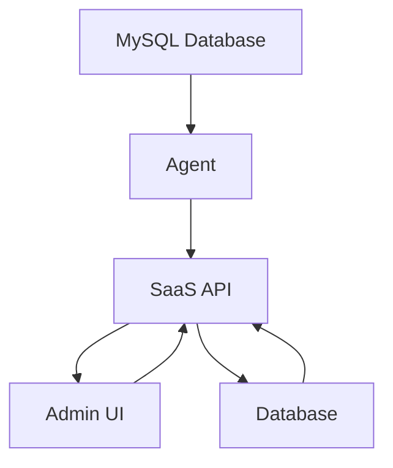

# MySQL Production Optimizer

ระบบช่วยวิเคราะห์และปรับปรุงประสิทธิภาพของฐานข้อมูล MySQL อย่างปลอดภัย

## โครงสร้างระบบ

```
mysql-optimizer/
├── agent/                 # Agent สำหรับสแกนฐานข้อมูล
│   ├── src/
│   ├── package.json
│   └── Dockerfile
├── saas-api/              # SaaS API ควบคุมระบบ
│   ├── src/
│   └── package.json
├── admin-ui/              # Admin Dashboard UI
│   └── package.json
└── database_schema.sql    # Schema ฐานข้อมูล
```

## คุณสมบัติหลัก

- **ปลอดภัย**: ใช้ read-only connection ไม่มีการเปลี่ยนแปลงข้อมูล
- **Multi-tenant**: รองรับระบบหลาย tenant
- **Audit Trail**: บันทึกการดำเนินการทุกอย่าง
- **Recommendation Engine**: วิเคราะห์และแนะนำการปรับปรุง
- **Approval Workflow**: ระบบอนุมัติคำแนะนำ
- **Docker Friendly**: สามารถ deploy ได้ใน container

## ขั้นตอนการใช้งาน

1. ติดตั้ง agent ในระบบลูกค้า
2. ตั้งค่า connection profile
3. รัน scan ฐานข้อมูล
4. ตรวจสอบคำแนะนำใน dashboard
5. อนุมัติและดำเนินการปรับปรุง

## Quick Start Guide

### ติดตั้งและรันระบบ

```bash
# 1. ติดตั้ง dependencies
git clone <repository-url>
cd mysql-production-optimizer

# 2. ตั้งค่า environment variables
cp .env.example .env
# ปรับค่าใน .env ตามความต้องการ

# 3. รันระบบด้วย Docker Compose
docker-compose up -d

# 4. ตรวจสอบการรัน
docker-compose ps
```

### รายละเอียดเพิ่มเติม

- [Production Deployment Guide](DEPLOYMENT.md)
- [Operations and Maintenance Guide](OPERATIONS.md)
- [SaaS API Documentation](saas-api/README.md)
- [Admin UI Documentation](admin-ui/README.md)

## Architecture Overview



## Contributing Guidelines

ระบบนี้มีโครงสร้างที่สามารถปรับปรุงได้ตามความต้องการ สำหรับการมีส่วนร่วมในการพัฒนา:

1. สร้าง branch ใหม่สำหรับฟีเจอร์ใหม่
2. ทำ changes และ commit
3. ส่ง pull request ไปยัง branch main
4. รอการ review และ merge

## License

ระบบนี้ใช้สัญญาอนุญาต MIT
