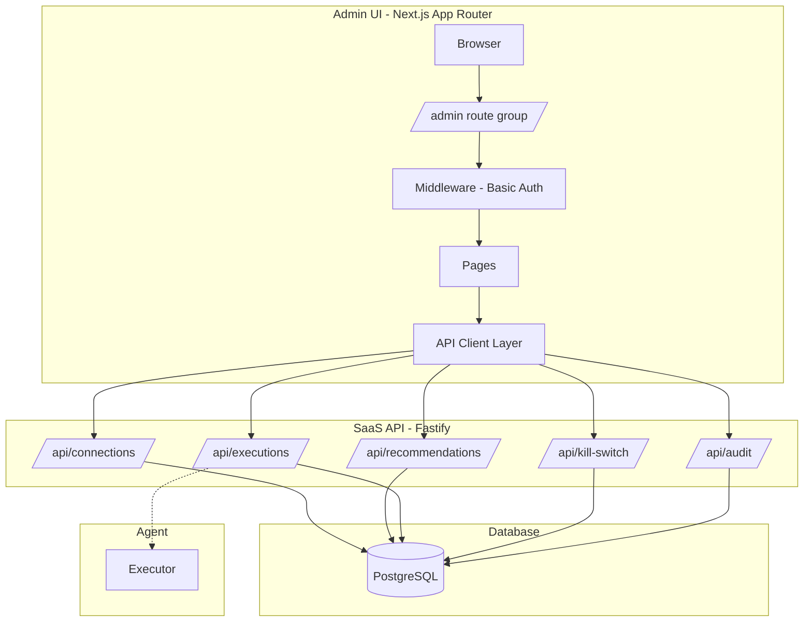
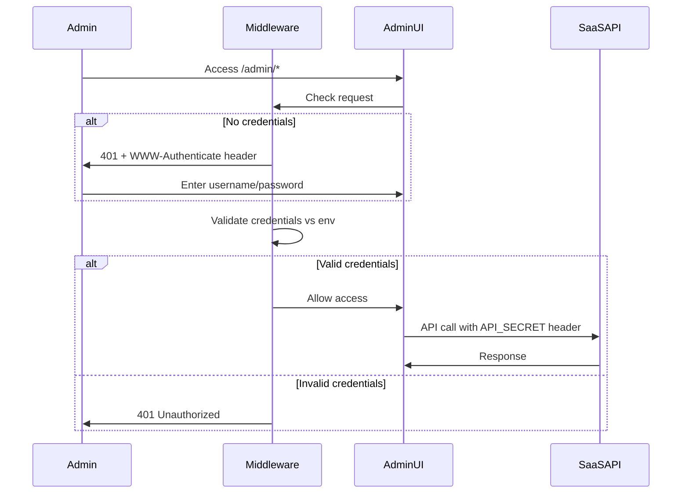
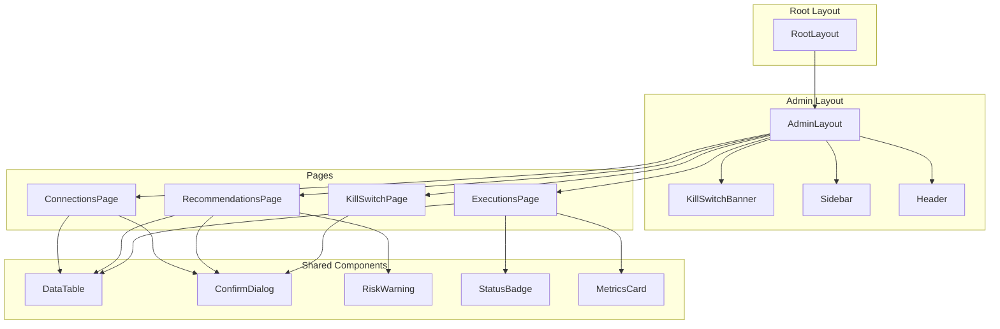

# PHASE 6 - Internal Admin Web UI Architecture (MVP)

## 1. Overview

Internal Admin Web UI สำหรับ MySQL Production Optimizer เป็น Control Panel สำหรับ Internal Admins เท่านั้น ออกแบบตามหลัก **safety-first** และ **transparency**

### 1.1 Design Principles

| หลักการ | รายละเอียด |
|---------|------------|
| Read-only by Default | ทุกหน้าแสดงข้อมูลอย่างเดียว write ต้อง explicit trigger |
| Confirmation Required | ทุก write action ต้องผ่าน confirmation modal |
| Audit Everything | ทุก action ต้อง log audit trail |
| Kill Switch Visible | ถ้า kill switch active ต้องแสดง blocking banner |
| Scope Enforcement | UI รองรับเฉพาะ ADD_INDEX เท่านั้น |

### 1.2 Architecture Diagram



---

## 2. Folder Structure

```
admin-ui/
├── .env.local                    # Local env vars
├── .env.example                  # Env template
├── next.config.ts                # Next.js config
├── tailwind.config.ts            # Tailwind config
├── tsconfig.json                 # TypeScript config
├── package.json
├── components.json               # shadcn/ui config
│
├── public/
│   └── favicon.ico
│
├── src/
│   ├── app/
│   │   ├── layout.tsx            # Root layout
│   │   ├── globals.css           # Global styles + Tailwind
│   │   │
│   │   └── admin/                # Admin route group
│   │       ├── layout.tsx        # Admin layout with sidebar + kill-switch banner
│   │       ├── page.tsx          # Dashboard home
│   │       │
│   │       ├── connections/
│   │       │   ├── page.tsx      # Connection list
│   │       │   └── [id]/
│   │       │       └── page.tsx  # Connection detail
│   │       │
│   │       ├── recommendations/
│   │       │   ├── page.tsx      # Recommendation list
│   │       │   └── [id]/
│   │       │       └── page.tsx  # Recommendation detail + approve/schedule
│   │       │
│   │       ├── executions/
│   │       │   ├── page.tsx      # Execution list
│   │       │   └── [id]/
│   │       │       └── page.tsx  # Execution detail + metrics + timeline
│   │       │
│   │       └── kill-switch/
│   │           └── page.tsx      # Kill switch management
│   │
│   ├── components/
│   │   ├── ui/                   # shadcn/ui components
│   │   │   ├── button.tsx
│   │   │   ├── card.tsx
│   │   │   ├── table.tsx
│   │   │   ├── dialog.tsx
│   │   │   ├── alert.tsx
│   │   │   ├── badge.tsx
│   │   │   ├── input.tsx
│   │   │   ├── label.tsx
│   │   │   ├── select.tsx
│   │   │   ├── textarea.tsx
│   │   │   ├── toast.tsx
│   │   │   └── skeleton.tsx
│   │   │
│   │   ├── layout/
│   │   │   ├── sidebar.tsx       # Navigation sidebar
│   │   │   ├── header.tsx        # Top header
│   │   │   └── kill-switch-banner.tsx  # Global blocking banner
│   │   │
│   │   ├── connections/
│   │   │   ├── connection-table.tsx
│   │   │   ├── connection-status-badge.tsx
│   │   │   └── disable-connection-dialog.tsx
│   │   │
│   │   ├── recommendations/
│   │   │   ├── recommendation-table.tsx
│   │   │   ├── recommendation-detail-card.tsx
│   │   │   ├── approve-dialog.tsx
│   │   │   ├── schedule-dialog.tsx
│   │   │   └── risk-warning.tsx
│   │   │
│   │   ├── executions/
│   │   │   ├── execution-table.tsx
│   │   │   ├── execution-timeline.tsx
│   │   │   ├── metrics-comparison.tsx
│   │   │   ├── verification-result.tsx
│   │   │   └── rollback-history.tsx
│   │   │
│   │   └── kill-switch/
│   │       ├── global-toggle.tsx
│   │       ├── connection-toggles.tsx
│   │       ├── reason-input.tsx
│   │       └── audit-trail-table.tsx
│   │
│   ├── lib/
│   │   ├── api/
│   │   │   ├── client.ts         # Base API client with auth
│   │   │   ├── connections.ts    # Connection API functions
│   │   │   ├── recommendations.ts
│   │   │   ├── executions.ts
│   │   │   ├── kill-switch.ts
│   │   │   └── audit.ts
│   │   │
│   │   ├── hooks/
│   │   │   ├── use-connections.ts
│   │   │   ├── use-recommendations.ts
│   │   │   ├── use-executions.ts
│   │   │   ├── use-kill-switch.ts
│   │   │   └── use-audit.ts
│   │   │
│   │   ├── utils/
│   │   │   ├── format.ts         # Date/number formatters
│   │   │   └── cn.ts             # Tailwind merge helper
│   │   │
│   │   └── types/
│   │       ├── connection.ts
│   │       ├── recommendation.ts
│   │       ├── execution.ts
│   │       ├── kill-switch.ts
│   │       └── audit.ts
│   │
│   └── middleware.ts             # Basic Auth middleware
│
└── tests/
    └── ...                       # Test files
```

---

## 3. API Client Design

### 3.1 Base Client

```typescript
// src/lib/api/client.ts

const API_BASE_URL = process.env.NEXT_PUBLIC_API_BASE_URL;

interface ApiClientOptions {
  method?: string;
  body?: unknown;
  headers?: Record<string, string>;
}

export async function apiClient<T>(
  endpoint: string,
  options: ApiClientOptions = {}
): Promise<T> {
  const { method = 'GET', body, headers = {} } = options;

  const response = await fetch(`${API_BASE_URL}${endpoint}`, {
    method,
    headers: {
      'Content-Type': 'application/json',
      ...headers,
    },
    body: body ? JSON.stringify(body) : undefined,
    credentials: 'include',
  });

  if (!response.ok) {
    const error = await response.json().catch(() => ({}));
    throw new ApiError(response.status, error.message || 'API Error');
  }

  return response.json();
}

export class ApiError extends Error {
  constructor(public status: number, message: string) {
    super(message);
    this.name = 'ApiError';
  }
}
```

### 3.2 API Endpoints Required

#### Connections API (ใช้ endpoint เดิม)
| Method | Endpoint | Description |
|--------|----------|-------------|
| GET | /api/connections | List all connections |
| GET | /api/connections/:id | Get connection detail |
| PATCH | /api/connections/:id | Update connection (disable) |

#### Recommendations API (ใช้ endpoint เดิม)
| Method | Endpoint | Description |
|--------|----------|-------------|
| GET | /api/recommendations | List recommendations with filters |
| GET | /api/recommendations/:id | Get recommendation detail |
| POST | /api/recommendations/:id/approve | Approve recommendation |
| POST | /api/recommendations/:id/schedule | Schedule execution |

#### Executions API (ต้องเพิ่ม)
| Method | Endpoint | Description | Status |
|--------|----------|-------------|--------|
| GET | /api/executions | List executions with filters | **NEW** |
| GET | /api/executions/:id | Get execution detail with metrics | **NEW** |
| POST | /api/executions/:id/claim | Claim execution (existing) | Existing |
| PATCH | /api/executions/:id/status | Update status (existing) | Existing |

#### Kill Switch API (ใช้ endpoint เดิม + เพิ่ม)
| Method | Endpoint | Description | Status |
|--------|----------|-------------|--------|
| GET | /api/kill-switch | Get kill switch status | Existing |
| POST | /api/kill-switch/global | Toggle global kill switch | **NEW** |
| POST | /api/kill-switch/connection/:id | Toggle per-connection | **NEW** |

#### Audit API (ใช้ endpoint เดิม)
| Method | Endpoint | Description |
|--------|----------|-------------|
| GET | /api/audit | List audit logs with filters |
| GET | /api/audit/:id | Get audit log detail |

---

## 4. Authentication Flow

### 4.1 Basic Auth with Shared Secret

เลือกใช้ Basic Auth + Shared Secret เนื่องจากเป็น Internal Admin UI ที่ไม่มี public access



### 4.2 Middleware Implementation

```typescript
// src/middleware.ts
import { NextResponse } from 'next/server';
import type { NextRequest } from 'next/server';

const ADMIN_USERNAME = process.env.ADMIN_USERNAME;
const ADMIN_PASSWORD = process.env.ADMIN_PASSWORD;

export function middleware(request: NextRequest) {
  // Only protect /admin routes
  if (!request.nextUrl.pathname.startsWith('/admin')) {
    return NextResponse.next();
  }

  const authHeader = request.headers.get('authorization');

  if (!authHeader || !authHeader.startsWith('Basic ')) {
    return new NextResponse('Authentication required', {
      status: 401,
      headers: {
        'WWW-Authenticate': 'Basic realm="Admin Area"',
      },
    });
  }

  const base64Credentials = authHeader.split(' ')[1];
  const credentials = Buffer.from(base64Credentials, 'base64').toString('utf-8');
  const [username, password] = credentials.split(':');

  if (username !== ADMIN_USERNAME || password !== ADMIN_PASSWORD) {
    return new NextResponse('Invalid credentials', {
      status: 401,
      headers: {
        'WWW-Authenticate': 'Basic realm="Admin Area"',
      },
    });
  }

  return NextResponse.next();
}

export const config = {
  matcher: '/admin/:path*',
};
```

### 4.3 API Secret for Backend Communication

```typescript
// src/lib/api/client.ts - เพิ่ม API_SECRET header
export async function apiClient<T>(
  endpoint: string,
  options: ApiClientOptions = {}
): Promise<T> {
  const apiSecret = process.env.API_SECRET;
  
  const response = await fetch(`${API_BASE_URL}${endpoint}`, {
    method: options.method || 'GET',
    headers: {
      'Content-Type': 'application/json',
      'X-API-Secret': apiSecret || '',
      ...options.headers,
    },
    body: options.body ? JSON.stringify(options.body) : undefined,
  });
  
  // ... error handling
}
```

---

## 5. Component Architecture

### 5.1 Component Hierarchy



### 5.2 Key Components

#### Layout Components

| Component | Purpose | Props |
|-----------|---------|-------|
| `AdminLayout` | Main layout with sidebar | `children` |
| `KillSwitchBanner` | Blocking banner when kill switch active | `isActive`, `reason` |
| `Sidebar` | Navigation menu | `currentPath` |
| `Header` | Top bar with user info | `username` |

#### Connection Components

| Component | Purpose | Props |
|-----------|---------|-------|
| `ConnectionTable` | List connections | `data`, `onDisable` |
| `ConnectionStatusBadge` | Show active/disabled status | `isActive` |
| `DisableConnectionDialog` | Confirm disable action | `connection`, `onConfirm` |

#### Recommendation Components

| Component | Purpose | Props |
|-----------|---------|-------|
| `RecommendationTable` | List recommendations | `data`, `onSelect` |
| `RecommendationDetailCard` | Show full details | `recommendation` |
| `ApproveDialog` | Confirm approval with risk warning | `recommendation`, `onApprove` |
| `ScheduleDialog` | Schedule execution time | `recommendation`, `onSchedule` |
| `RiskWarning` | Display risk assessment | `riskLevel`, `tableSize`, `estimatedImpact` |

#### Execution Components

| Component | Purpose | Props |
|-----------|---------|-------|
| `ExecutionTable` | List executions | `data`, `onSelect` |
| `ExecutionTimeline` | Show status changes over time | `events` |
| `MetricsComparison` | Before/After metrics side-by-side | `baseline`, `after` |
| `VerificationResult` | Show verification status | `result` |
| `RollbackHistory` | Show rollback events if any | `rollbacks` |

#### Kill Switch Components

| Component | Purpose | Props |
|-----------|---------|-------|
| `GlobalToggle` | Global kill switch toggle | `isActive`, `onToggle` |
| `ConnectionToggles` | Per-connection toggles list | `connections`, `onToggle` |
| `ReasonInput` | Require reason when activating | `onSubmit` |
| `AuditTrailTable` | Kill switch audit history | `logs` |

---

## 6. State Management

### 6.1 Strategy: Server State + React Query

ใช้ TanStack Query (React Query) สำหรับ server state เนื่องจาก:
- Built-in caching & deduplication
- Background refetch
- Optimistic updates
- Error handling

### 6.2 Custom Hooks

```typescript
// src/lib/hooks/use-kill-switch.ts
import { useQuery, useMutation, useQueryClient } from '@tanstack/react-query';
import { getKillSwitchStatus, toggleGlobalKillSwitch, toggleConnectionKillSwitch } from '../api/kill-switch';

export function useKillSwitch(connectionId?: string) {
  return useQuery({
    queryKey: ['kill-switch', connectionId],
    queryFn: () => getKillSwitchStatus(connectionId),
    refetchInterval: 5000, // Poll every 5 seconds
  });
}

export function useToggleGlobalKillSwitch() {
  const queryClient = useQueryClient();
  
  return useMutation({
    mutationFn: ({ active, reason }: { active: boolean; reason: string }) =>
      toggleGlobalKillSwitch(active, reason),
    onSuccess: () => {
      queryClient.invalidateQueries({ queryKey: ['kill-switch'] });
    },
  });
}

export function useToggleConnectionKillSwitch() {
  const queryClient = useQueryClient();
  
  return useMutation({
    mutationFn: ({ connectionId, active, reason }: { connectionId: string; active: boolean; reason: string }) =>
      toggleConnectionKillSwitch(connectionId, active, reason),
    onSuccess: () => {
      queryClient.invalidateQueries({ queryKey: ['kill-switch'] });
    },
  });
}
```

### 6.3 Context for UI State

```typescript
// src/lib/context/ui-context.tsx
import { createContext, useContext, useState, ReactNode } from 'react';

interface UIContextType {
  isSidebarOpen: boolean;
  toggleSidebar: () => void;
  activeDialog: string | null;
  openDialog: (id: string) => void;
  closeDialog: () => void;
}

const UIContext = createContext<UIContextType | undefined>(undefined);

export function UIProvider({ children }: { children: ReactNode }) {
  const [isSidebarOpen, setIsSidebarOpen] = useState(true);
  const [activeDialog, setActiveDialog] = useState<string | null>(null);

  return (
    <UIContext.Provider
      value={{
        isSidebarOpen,
        toggleSidebar: () => setIsSidebarOpen(!isSidebarOpen),
        activeDialog,
        openDialog: setActiveDialog,
        closeDialog: () => setActiveDialog(null),
      }}
    >
      {children}
    </UIContext.Provider>
  );
}

export function useUI() {
  const context = useContext(UIContext);
  if (!context) throw new Error('useUI must be used within UIProvider');
  return context;
}
```

---

## 7. Environment Variables

### 7.1 Required Variables

```bash
# .env.example

# ===================
# Admin Authentication
# ===================
ADMIN_USERNAME=admin
ADMIN_PASSWORD=secure_password_here

# ===================
# API Configuration
# ===================
# Public - exposed to browser
NEXT_PUBLIC_API_BASE_URL=http://localhost:3050

# Private - server-side only
API_SECRET=your_api_secret_here

# ===================
# Application Settings
# ===================
NODE_ENV=development
NEXT_PUBLIC_APP_NAME=MySQL Optimizer Admin
```

### 7.2 Variable Usage Matrix

| Variable | Used In | Public? | Required? |
|----------|---------|---------|-----------|
| `ADMIN_USERNAME` | Middleware | No | Yes |
| `ADMIN_PASSWORD` | Middleware | No | Yes |
| `NEXT_PUBLIC_API_BASE_URL` | API Client | Yes | Yes |
| `API_SECRET` | API Client | No | Yes |
| `NODE_ENV` | Various | No | No |
| `NEXT_PUBLIC_APP_NAME` | UI | Yes | No |

---

## 8. Safety & Audit Requirements

### 8.1 Confirmation Dialog Pattern

ทุก write action ต้องผ่าน confirmation dialog ที่แสดง:

```typescript
interface ConfirmationDialogProps {
  title: string;
  description: string;
  riskWarning?: {
    level: 'low' | 'medium' | 'high';
    tableSize?: string;
    estimatedImpact?: string;
    rollbackPlan?: string;
  };
  confirmText: string;
  onConfirm: () => void;
  onCancel: () => void;
}
```

### 8.2 Audit Log Generation

ทุก action ต้อง generate audit log:

```typescript
interface AuditLogPayload {
  action: string;
  resource_type: 'connection' | 'recommendation' | 'execution' | 'kill_switch';
  resource_id: string;
  details: Record<string, unknown>;
  user_identifier: string; // จาก Basic Auth username
  timestamp: string;
}

// ส่งพร้อมกับทุก mutation
async function logAudit(payload: AuditLogPayload) {
  await apiClient('/api/audit', {
    method: 'POST',
    body: payload,
  });
}
```

### 8.3 Kill Switch Banner Logic

```typescript
// src/components/layout/kill-switch-banner.tsx
export function KillSwitchBanner() {
  const { data: killSwitch, isLoading } = useKillSwitch();

  if (isLoading || !killSwitch?.global_active) {
    return null;
  }

  return (
    <div className="bg-red-600 text-white p-4 text-center sticky top-0 z-50">
      <strong>⚠️ KILL SWITCH ACTIVE</strong>
      <p>All executions are blocked. Reason: {killSwitch.reason}</p>
    </div>
  );
}
```

---

## 9. Pages Specification

### 9.1 Connections Page (`/admin/connections`)

**Features:**
- [ ] List all connections with status (active/disabled)
- [ ] Filter by tenant, status
- [ ] View connection detail
- [ ] Disable connection (with confirmation)

**Data Displayed:**
- Connection name, host, port
- Database name
- Status (active/disabled badge)
- Last scan date
- Created/Updated timestamps

### 9.2 Recommendations Page (`/admin/recommendations`)

**Features:**
- [ ] List recommendations with status
- [ ] Filter by tenant, connection, status
- [ ] View recommendation detail
- [ ] Approve recommendation (with risk warning)
- [ ] Schedule execution (with datetime picker)

**Data Displayed:**
- Recommendation ID, type (ADD_INDEX)
- Target table, columns
- Risk level
- Estimated improvement
- Status (pending/approved/scheduled/executed)

### 9.3 Executions Page (`/admin/executions`)

**Features:**
- [ ] List executions with status
- [ ] Filter by tenant, connection, status
- [ ] View execution detail
- [ ] View timeline of events
- [ ] View baseline vs after metrics
- [ ] View verification result
- [ ] View rollback history (if any)

**Data Displayed:**
- Execution ID, recommendation ref
- Status (pending/running/completed/failed/rolled_back)
- Started/Completed timestamps
- Baseline metrics (query performance, table size)
- After metrics (same)
- Verification result (success/failed/inconclusive)
- Error message (if failed)

### 9.4 Kill Switch Page (`/admin/kill-switch`)

**Features:**
- [ ] View global kill switch status
- [ ] Toggle global kill switch (with reason required)
- [ ] View per-connection kill switches
- [ ] Toggle per-connection kill switch (with reason required)
- [ ] View audit trail for kill switch changes

**Data Displayed:**
- Global status (on/off)
- Global reason (if active)
- Per-connection status list
- Audit log: who, when, action, reason

---

## 10. API Endpoints to Add (SaaS API)

### 10.1 New Endpoints Required

```typescript
// Executions List
// GET /api/executions?tenant_id=xxx&connection_id=xxx&status=xxx
interface ExecutionsListResponse {
  data: Execution[];
  pagination: {
    page: number;
    limit: number;
    total: number;
  };
}

// Execution Detail
// GET /api/executions/:id
interface ExecutionDetailResponse {
  id: string;
  recommendation_id: string;
  connection_id: string;
  status: string;
  action: string;
  table_name: string;
  index_name: string;
  executed_sql: string;
  started_at: string;
  completed_at: string | null;
  error_message: string | null;
  fail_reason: string | null;
  baseline_metrics: MetricsSnapshot;
  after_metrics: MetricsSnapshot | null;
  verification_result: VerificationResult | null;
  rollback_history: RollbackEvent[];
  timeline: TimelineEvent[];
}

// Kill Switch Toggle (Global)
// POST /api/kill-switch/global
interface ToggleGlobalKillSwitchRequest {
  active: boolean;
  reason: string;
}

// Kill Switch Toggle (Per-Connection)
// POST /api/kill-switch/connection/:id
interface ToggleConnectionKillSwitchRequest {
  active: boolean;
  reason: string;
}
```

---

## 11. Implementation Checklist

### Phase 6.1 - Project Setup
- [ ] Initialize Next.js project with App Router
- [ ] Setup Tailwind CSS
- [ ] Install and configure shadcn/ui
- [ ] Setup TypeScript strict mode
- [ ] Create folder structure
- [ ] Configure environment variables

### Phase 6.2 - Authentication
- [ ] Implement Basic Auth middleware
- [ ] Setup API client with secret header
- [ ] Test auth flow

### Phase 6.3 - Layout & Navigation
- [ ] Create Admin layout
- [ ] Create Sidebar component
- [ ] Create Header component
- [ ] Create Kill Switch Banner component
- [ ] Setup React Query provider

### Phase 6.4 - Connections Module
- [ ] Create connections API functions
- [ ] Create useConnections hook
- [ ] Create ConnectionTable component
- [ ] Create ConnectionDetail page
- [ ] Create DisableConnectionDialog

### Phase 6.5 - Recommendations Module
- [ ] Create recommendations API functions
- [ ] Create useRecommendations hook
- [ ] Create RecommendationTable component
- [ ] Create RecommendationDetail page
- [ ] Create ApproveDialog with RiskWarning
- [ ] Create ScheduleDialog

### Phase 6.6 - Executions Module
- [ ] Add new API endpoints to SaaS API
- [ ] Create executions API functions
- [ ] Create useExecutions hook
- [ ] Create ExecutionTable component
- [ ] Create ExecutionDetail page
- [ ] Create ExecutionTimeline component
- [ ] Create MetricsComparison component
- [ ] Create VerificationResult component
- [ ] Create RollbackHistory component

### Phase 6.7 - Kill Switch Module
- [ ] Add new API endpoints to SaaS API
- [ ] Create kill-switch API functions
- [ ] Create useKillSwitch hook
- [ ] Create GlobalToggle component
- [ ] Create ConnectionToggles component
- [ ] Create ReasonInput component
- [ ] Create AuditTrailTable component

### Phase 6.8 - Testing & QA
- [ ] Test all confirmation dialogs
- [ ] Test audit log generation
- [ ] Test kill switch blocking behavior
- [ ] Test error handling
- [ ] Security review

---

## 12. Tech Stack Summary

| Category | Technology |
|----------|------------|
| Framework | Next.js 14+ (App Router) |
| Language | TypeScript |
| Styling | Tailwind CSS |
| UI Components | shadcn/ui |
| State Management | TanStack Query (React Query) |
| HTTP Client | fetch API |
| Authentication | Basic Auth (HTTP) |
| Icons | Lucide React |

---

## Appendix A: Type Definitions

```typescript
// src/lib/types/connection.ts
export interface Connection {
  id: string;
  tenant_id: string;
  name: string;
  host: string;
  port: number;
  username: string;
  database_name: string;
  is_active: boolean;
  created_at: string;
  updated_at: string;
}

// src/lib/types/recommendation.ts
export interface Recommendation {
  id: string;
  scan_run_id: string;
  tenant_id: string;
  type: 'ADD_INDEX';
  table_name: string;
  columns: string[];
  index_type: 'BTREE' | 'HASH';
  estimated_improvement: number;
  risk_level: 'low' | 'medium' | 'high';
  status: 'pending' | 'approved' | 'scheduled' | 'executed' | 'rejected';
  approved_by: string | null;
  approved_at: string | null;
  scheduled_at: string | null;
  created_at: string;
}

// src/lib/types/execution.ts
export interface Execution {
  id: string;
  recommendation_id: string;
  connection_id: string;
  status: 'pending' | 'claimed' | 'running' | 'completed' | 'failed' | 'rolled_back';
  action: 'ADD_INDEX';
  table_name: string;
  index_name: string;
  executed_sql: string;
  started_at: string | null;
  completed_at: string | null;
  error_message: string | null;
  fail_reason: string | null;
  created_at: string;
}

export interface MetricsSnapshot {
  timestamp: string;
  table_size_bytes: number;
  index_count: number;
  avg_query_time_ms: number;
  query_samples: QuerySample[];
}

export interface QuerySample {
  digest: string;
  avg_timer_wait: number;
  count_star: number;
  sum_rows_examined: number;
}

export interface VerificationResult {
  status: 'success' | 'failed' | 'inconclusive';
  message: string;
  sample_count: number;
  improvement_percent: number | null;
}

export interface RollbackEvent {
  id: string;
  execution_id: string;
  reason: string;
  rolled_back_at: string;
  executed_sql: string;
}

export interface TimelineEvent {
  timestamp: string;
  event_type: string;
  description: string;
  details: Record<string, unknown>;
}

// src/lib/types/kill-switch.ts
export interface KillSwitchStatus {
  global_active: boolean;
  global_reason: string | null;
  global_activated_at: string | null;
  global_activated_by: string | null;
  connections: ConnectionKillSwitch[];
}

export interface ConnectionKillSwitch {
  connection_id: string;
  connection_name: string;
  active: boolean;
  reason: string | null;
  activated_at: string | null;
  activated_by: string | null;
}

// src/lib/types/audit.ts
export interface AuditLog {
  id: string;
  tenant_id: string;
  user_identifier: string;
  action: string;
  resource_type: string;
  resource_id: string;
  details: Record<string, unknown>;
  created_at: string;
}
```
