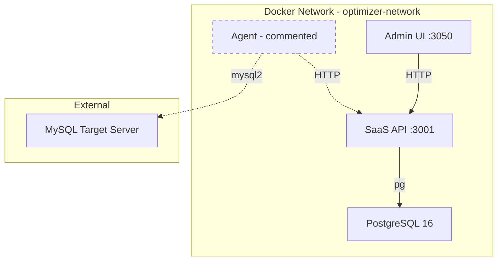

# Docker Compose Architecture Plan
## MySQL Production Optimizer

**วันที่**: 2026-02-04  
**Status**: Draft for Review

---

## 1. Executive Summary

Plan นี้ออกแบบ Docker Compose setup สำหรับ MySQL Production Optimizer ประกอบด้วย:
- **PostgreSQL** - Database หลักสำหรับเก็บข้อมูลระบบ
- **SaaS API** - Express.js API server (port 3001)
- **Admin UI** - Next.js web application (port 3050)
- **Agent** - Node.js agent สำหรับ scanning MySQL (commented ไว้)

---

## 2. Architecture Overview



### Services Summary

| Service | Port | Image Base | Database |
|---------|------|------------|----------|
| postgres | 5432 | postgres:16-alpine | - |
| saas-api | 3001 | node:20-alpine | PostgreSQL |
| admin-ui | 3050 | node:20-alpine | - |
| agent | - | node:20-alpine | MySQL target |

---

## 3. Design Decisions

### 3.1 PostgreSQL แทน MongoDB
- **เหตุผล**: database_schema.sql ออกแบบมาสำหรับ PostgreSQL
- **ผลกระทบ**: ต้อง migrate saas-api จาก MongoDB ไป PostgreSQL
- **ข้อดี**: JSONB support, UUID native, ACID compliance

### 3.2 Multi-stage Docker Builds
- **Stage 1 - Builder**: Install dependencies + compile TypeScript
- **Stage 2 - Runner**: Production image with compiled code only
- **ข้อดี**: Image size เล็กลง, security ดีขึ้น

### 3.3 Development Hot Reload
- ใช้ docker-compose.override.yml สำหรับ development
- Volume mount source code เพื่อ hot reload
- ใช้ nodemon/ts-node สำหรับ API
- ใช้ next dev สำหรับ Admin UI

### 3.4 Agent Service Commented
- Agent ต้องเชื่อมต่อกับ MySQL target server ภายนอก
- Configuration แยกต่างหาก
- จะ uncomment เมื่อพร้อม deploy

---

## 4. File Structure

```
/home/admins/works/test1/
├── docker-compose.yml          # Main compose file
├── docker-compose.override.yml # Development overrides
├── .env.docker                 # Docker environment variables
├── .env.docker.example         # Template
├── README-DOCKER.md            # Docker usage documentation
├── saas-api/
│   ├── Dockerfile              # Multi-stage build
│   └── .dockerignore
├── admin-ui/
│   ├── Dockerfile              # Multi-stage build
│   └── .dockerignore
└── agent/
    ├── Dockerfile              # Already exists - update needed
    └── .dockerignore           # New
```

---

## 5. Specifications

### 5.1 docker-compose.yml

```yaml
version: '3.9'

services:
  # PostgreSQL Database
  postgres:
    image: postgres:16-alpine
    container_name: optimizer-postgres
    restart: unless-stopped
    environment:
      POSTGRES_DB: ${POSTGRES_DB:-mysql_optimizer}
      POSTGRES_USER: ${POSTGRES_USER:-optimizer_user}
      POSTGRES_PASSWORD: ${POSTGRES_PASSWORD:-optimizer_password}
    volumes:
      - postgres_data:/var/lib/postgresql/data
      - ./database_schema.sql:/docker-entrypoint-initdb.d/01-schema.sql:ro
    ports:
      - "${POSTGRES_PORT:-5432}:5432"
    healthcheck:
      test: ["CMD-SHELL", "pg_isready -U ${POSTGRES_USER:-optimizer_user} -d ${POSTGRES_DB:-mysql_optimizer}"]
      interval: 10s
      timeout: 5s
      retries: 5
      start_period: 30s
    networks:
      - optimizer-network

  # SaaS API Service
  saas-api:
    build:
      context: ./saas-api
      dockerfile: Dockerfile
      target: production
    container_name: optimizer-saas-api
    restart: unless-stopped
    environment:
      NODE_ENV: production
      PORT: 3001
      DATABASE_URL: postgres://${POSTGRES_USER:-optimizer_user}:${POSTGRES_PASSWORD:-optimizer_password}@postgres:5432/${POSTGRES_DB:-mysql_optimizer}
      JWT_SECRET: ${JWT_SECRET}
      API_SECRET: ${API_SECRET}
    ports:
      - "${API_PORT:-3001}:3001"
    depends_on:
      postgres:
        condition: service_healthy
    healthcheck:
      test: ["CMD", "wget", "--no-verbose", "--tries=1", "--spider", "http://localhost:3001/health"]
      interval: 30s
      timeout: 10s
      retries: 3
      start_period: 40s
    networks:
      - optimizer-network

  # Admin UI Service
  admin-ui:
    build:
      context: ./admin-ui
      dockerfile: Dockerfile
      target: production
    container_name: optimizer-admin-ui
    restart: unless-stopped
    environment:
      NODE_ENV: production
      PORT: 3050
      NEXT_PUBLIC_API_BASE_URL: http://saas-api:3001
      API_SECRET: ${API_SECRET}
      ADMIN_USERNAME: ${ADMIN_USERNAME:-admin}
      ADMIN_PASSWORD: ${ADMIN_PASSWORD}
    ports:
      - "${UI_PORT:-3050}:3050"
    depends_on:
      saas-api:
        condition: service_healthy
    healthcheck:
      test: ["CMD", "wget", "--no-verbose", "--tries=1", "--spider", "http://localhost:3050"]
      interval: 30s
      timeout: 10s
      retries: 3
      start_period: 60s
    networks:
      - optimizer-network

  # Agent Service (commented - requires separate MySQL target configuration)
  # agent:
  #   build:
  #     context: ./agent
  #     dockerfile: Dockerfile
  #   container_name: optimizer-agent
  #   restart: unless-stopped
  #   environment:
  #     NODE_ENV: production
  #     API_URL: http://saas-api:3001
  #     API_KEY: ${AGENT_API_KEY}
  #     # MySQL Target - configure per deployment
  #     DB_HOST: ${MYSQL_TARGET_HOST}
  #     DB_PORT: ${MYSQL_TARGET_PORT:-3306}
  #     DB_USER: ${MYSQL_TARGET_USER}
  #     DB_PASSWORD: ${MYSQL_TARGET_PASSWORD}
  #     DB_DATABASE: ${MYSQL_TARGET_DATABASE}
  #   depends_on:
  #     saas-api:
  #       condition: service_healthy
  #   networks:
  #     - optimizer-network

volumes:
  postgres_data:
    driver: local

networks:
  optimizer-network:
    driver: bridge
    name: optimizer-network
```

### 5.2 docker-compose.override.yml (Development)

```yaml
version: '3.9'

services:
  saas-api:
    build:
      target: development
    volumes:
      - ./saas-api/src:/app/src:ro
      - ./saas-api/package.json:/app/package.json:ro
    environment:
      NODE_ENV: development
    command: npm run dev

  admin-ui:
    build:
      target: development
    volumes:
      - ./admin-ui/src:/app/src:ro
      - ./admin-ui/public:/app/public:ro
      - ./admin-ui/package.json:/app/package.json:ro
    environment:
      NODE_ENV: development
      NEXT_PUBLIC_API_BASE_URL: http://localhost:3001
    command: npm run dev

  postgres:
    ports:
      - "5432:5432"
```

### 5.3 saas-api/Dockerfile

```dockerfile
# ============================================
# Stage 1: Dependencies
# ============================================
FROM node:20-alpine AS deps
WORKDIR /app

# Install build dependencies for native modules
RUN apk add --no-cache python3 make g++

# Copy package files
COPY package*.json ./

# Install all dependencies
RUN npm ci

# ============================================
# Stage 2: Builder
# ============================================
FROM node:20-alpine AS builder
WORKDIR /app

# Copy dependencies
COPY --from=deps /app/node_modules ./node_modules
COPY . .

# Build TypeScript
RUN npm run build

# Prune dev dependencies
RUN npm prune --production

# ============================================
# Stage 3: Development
# ============================================
FROM node:20-alpine AS development
WORKDIR /app

# Install dependencies for development
RUN apk add --no-cache python3 make g++

COPY package*.json ./
RUN npm ci

COPY . .

# Create non-root user
RUN addgroup -g 1001 -S nodejs && \
    adduser -S apiuser -u 1001 -G nodejs

USER apiuser

EXPOSE 3001

CMD ["npm", "run", "dev"]

# ============================================
# Stage 4: Production
# ============================================
FROM node:20-alpine AS production
WORKDIR /app

# Install wget for healthcheck
RUN apk add --no-cache wget

# Copy production dependencies and built files
COPY --from=builder /app/node_modules ./node_modules
COPY --from=builder /app/dist ./dist
COPY --from=builder /app/package.json ./

# Create non-root user
RUN addgroup -g 1001 -S nodejs && \
    adduser -S apiuser -u 1001 -G nodejs && \
    chown -R apiuser:nodejs /app

USER apiuser

EXPOSE 3001

ENV NODE_ENV=production

CMD ["node", "dist/index.js"]
```

### 5.4 admin-ui/Dockerfile

```dockerfile
# ============================================
# Stage 1: Dependencies
# ============================================
FROM node:20-alpine AS deps
WORKDIR /app

# Install build dependencies
RUN apk add --no-cache libc6-compat

# Copy package files
COPY package*.json ./

# Install dependencies
RUN npm ci

# ============================================
# Stage 2: Builder
# ============================================
FROM node:20-alpine AS builder
WORKDIR /app

# Copy dependencies
COPY --from=deps /app/node_modules ./node_modules
COPY . .

# Disable telemetry
ENV NEXT_TELEMETRY_DISABLED=1

# Build Next.js application
RUN npm run build

# ============================================
# Stage 3: Development
# ============================================
FROM node:20-alpine AS development
WORKDIR /app

RUN apk add --no-cache libc6-compat

COPY package*.json ./
RUN npm ci

COPY . .

# Create non-root user
RUN addgroup -g 1001 -S nodejs && \
    adduser -S nextjs -u 1001 -G nodejs

USER nextjs

EXPOSE 3050

ENV PORT=3050
ENV NEXT_TELEMETRY_DISABLED=1

CMD ["npm", "run", "dev"]

# ============================================
# Stage 4: Production
# ============================================
FROM node:20-alpine AS production
WORKDIR /app

# Install wget for healthcheck
RUN apk add --no-cache wget libc6-compat

ENV NODE_ENV=production
ENV NEXT_TELEMETRY_DISABLED=1

# Create non-root user
RUN addgroup -g 1001 -S nodejs && \
    adduser -S nextjs -u 1001 -G nodejs

# Copy built application
COPY --from=builder /app/public ./public
COPY --from=builder --chown=nextjs:nodejs /app/.next/standalone ./
COPY --from=builder --chown=nextjs:nodejs /app/.next/static ./.next/static

USER nextjs

EXPOSE 3050

ENV PORT=3050
ENV HOSTNAME="0.0.0.0"

CMD ["node", "server.js"]
```

**หมายเหตุ**: ต้องอัพเดท next.config.js เพื่อเปิด standalone output:

```javascript
/** @type {import('next').NextConfig} */
const nextConfig = {
  output: 'standalone',
}

module.exports = nextConfig
```

### 5.5 .dockerignore Files

**saas-api/.dockerignore**
```
# Dependencies
node_modules

# Build output
dist

# Environment files
.env
.env.*
!.env.example

# IDE
.vscode
.idea
*.swp
*.swo

# Git
.git
.gitignore

# Tests
**/*.test.ts
**/*.spec.ts
coverage
jest.config.*

# Documentation
*.md
!README.md

# Docker
Dockerfile*
docker-compose*
.docker*
```

**admin-ui/.dockerignore**
```
# Dependencies
node_modules

# Build output
.next
out

# Environment files
.env
.env.*
!.env.example

# IDE
.vscode
.idea
*.swp
*.swo

# Git
.git
.gitignore

# Tests
**/*.test.ts
**/*.test.tsx
**/*.spec.ts
coverage
jest.config.*
cypress
playwright

# Documentation
*.md
!README.md
docs/

# Docker
Dockerfile*
docker-compose*
.docker*

# Misc
.DS_Store
*.log
```

**agent/.dockerignore**
```
# Dependencies
node_modules

# Build output
dist

# Environment files
.env
.env.*
!.env.example

# IDE
.vscode
.idea
*.swp
*.swo

# Git
.git
.gitignore

# Tests
**/*.test.ts
**/*.spec.ts
coverage

# Documentation
*.md
!README.md

# Docker
Dockerfile*
.docker*
```

### 5.6 .env.docker.example

```bash
# ============================================
# PostgreSQL Database
# ============================================
POSTGRES_DB=mysql_optimizer
POSTGRES_USER=optimizer_user
POSTGRES_PASSWORD=change_me_in_production
POSTGRES_PORT=5432

# ============================================
# SaaS API
# ============================================
API_PORT=3001
JWT_SECRET=change_me_jwt_secret_min_32_chars
API_SECRET=change_me_api_secret_min_32_chars

# ============================================
# Admin UI
# ============================================
UI_PORT=3050
ADMIN_USERNAME=admin
ADMIN_PASSWORD=change_me_admin_password

# ============================================
# Agent (Uncomment when ready)
# ============================================
# AGENT_API_KEY=agent_api_key
# MYSQL_TARGET_HOST=your-mysql-server.example.com
# MYSQL_TARGET_PORT=3306
# MYSQL_TARGET_USER=optimizer_readonly
# MYSQL_TARGET_PASSWORD=readonly_password
# MYSQL_TARGET_DATABASE=your_database
```

---

## 6. README-DOCKER.md Content

```markdown
# Docker Setup Guide

## Prerequisites

- Docker 24.0+
- Docker Compose 2.20+

## Quick Start

### 1. Create environment file

\```bash
cp .env.docker.example .env.docker
\```

Edit `.env.docker` and set secure passwords.

### 2. Start services (Production)

\```bash
docker compose -f docker-compose.yml --env-file .env.docker up -d
\```

### 3. Start services (Development)

\```bash
docker compose --env-file .env.docker up -d
\```

Development mode includes:
- Hot reload for code changes
- Source code mounted as volumes
- PostgreSQL accessible on localhost:5432

## Service URLs

| Service | URL |
|---------|-----|
| Admin UI | http://localhost:3050 |
| SaaS API | http://localhost:3001 |
| PostgreSQL | localhost:5432 |

## Commands

### View logs

\```bash
docker compose logs -f saas-api
docker compose logs -f admin-ui
docker compose logs -f postgres
\```

### Restart service

\```bash
docker compose restart saas-api
\```

### Rebuild after code changes

\```bash
docker compose up -d --build saas-api
\```

### Stop all services

\```bash
docker compose down
\```

### Stop and remove volumes (CAUTION: deletes data)

\```bash
docker compose down -v
\```

## Health Checks

All services have health checks configured:

\```bash
# Check service health
docker compose ps

# Manual health check
curl http://localhost:3001/health
curl http://localhost:3050
\```

## Database Management

### Connect to PostgreSQL

\```bash
docker compose exec postgres psql -U optimizer_user -d mysql_optimizer
\```

### Run migrations

\```bash
docker compose exec postgres psql -U optimizer_user -d mysql_optimizer -f /path/to/migration.sql
\```

### Backup database

\```bash
docker compose exec postgres pg_dump -U optimizer_user mysql_optimizer > backup.sql
\```

## Troubleshooting

### Service won't start

1. Check logs: `docker compose logs <service-name>`
2. Check health: `docker compose ps`
3. Verify environment variables in `.env.docker`

### Database connection failed

1. Wait for PostgreSQL health check: ~30 seconds
2. Verify credentials in `.env.docker`
3. Check network: `docker network ls`

### Hot reload not working

1. Verify volume mounts in `docker-compose.override.yml`
2. Check file permissions
3. Restart the service

## Security Notes

1. Never commit `.env.docker` to version control
2. Use strong passwords in production
3. Change default ports if exposed publicly
4. Admin UI should not be publicly accessible
```

---

## 7. Migration Requirements

### saas-api MongoDB to PostgreSQL Migration

เนื่องจาก saas-api ปัจจุบันใช้ MongoDB จะต้องทำการ migrate ไปใช้ PostgreSQL:

#### ไฟล์ที่ต้องแก้ไข:

1. **saas-api/package.json** - เปลี่ยน dependencies
   - ลบ: `fastify-mongodb`, MongoDB client
   - เพิ่ม: `pg`, `@types/pg` หรือ ORM เช่น `drizzle-orm`

2. **saas-api/src/database.ts** - เปลี่ยน connection logic
   ```typescript
   // จาก MongoDB
   import { MongoClient } from 'mongodb';
   
   // เป็น PostgreSQL
   import { Pool } from 'pg';
   ```

3. **saas-api/src/models/*.ts** - แก้ไข data access layer
   - เปลี่ยนจาก MongoDB queries เป็น SQL

4. **admin-ui/next.config.js** - เพิ่ม standalone output
   ```javascript
   const nextConfig = {
     output: 'standalone',
   }
   ```

---

## 8. Implementation Checklist

### Phase 1: Infrastructure Files
- [ ] สร้าง docker-compose.yml
- [ ] สร้าง docker-compose.override.yml
- [ ] สร้าง .env.docker.example
- [ ] สร้าง README-DOCKER.md

### Phase 2: Dockerfiles
- [ ] สร้าง saas-api/Dockerfile
- [ ] สร้าง admin-ui/Dockerfile
- [ ] อัพเดท agent/Dockerfile (add build stage)
- [ ] สร้าง .dockerignore files

### Phase 3: Configuration Updates
- [ ] อัพเดท admin-ui/next.config.js (add standalone)
- [ ] เพิ่ม /health endpoint ใน saas-api (ถ้ายังไม่มี)

### Phase 4: Database Migration (แยก task)
- [ ] Migrate saas-api จาก MongoDB ไป PostgreSQL
- [ ] Test database connection
- [ ] Verify schema compatibility

---

## 9. Risk Assessment

| Risk | Impact | Mitigation |
|------|--------|------------|
| MongoDB to PostgreSQL migration complexity | High | Plan migration separately, test thoroughly |
| Hot reload performance in Docker | Medium | Use proper volume mounts, consider bind mounts |
| Database data loss | High | Always backup before operations, use named volumes |
| Port conflicts | Low | Configurable ports via .env |

---

## 10. Next Steps

1. **Review** - ตรวจสอบ plan นี้
2. **Approve** - ยืนยันว่าเข้าใจและเห็นด้วย
3. **Implement** - สลับไป Code mode เพื่อสร้างไฟล์จริง
4. **Test** - ทดสอบ Docker setup
5. **Migrate** - ทำ MongoDB to PostgreSQL migration (task แยก)

---

**คำถามหรือข้อเสนอแนะ?** กรุณาแจ้งก่อนดำเนินการต่อ
