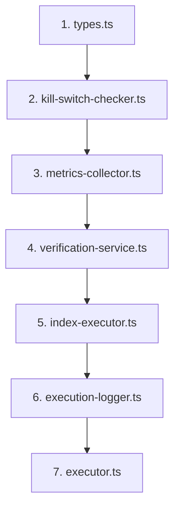
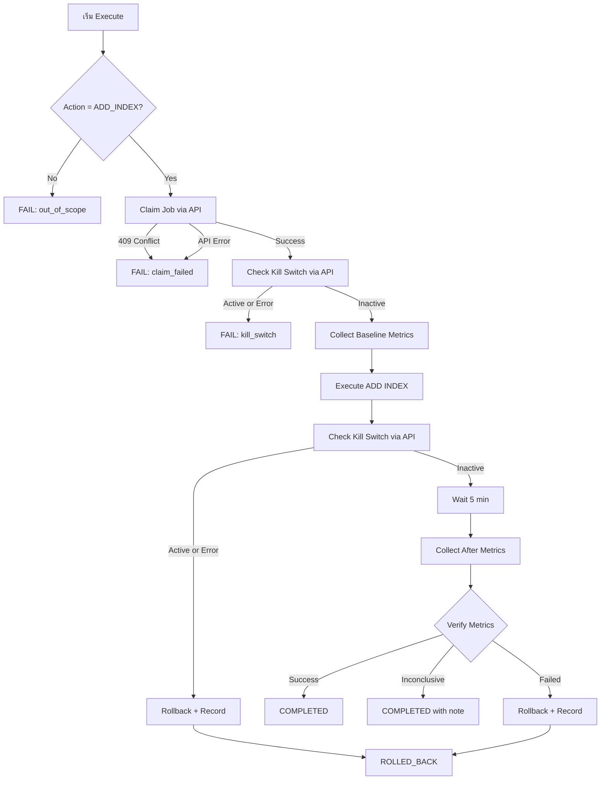

# แผนการแก้ไข Executor v1 ตามข้อกำหนด

## สรุปภาพรวม

แผนนี้อธิบายการแก้ไขไฟล์ทั้ง 7 ไฟล์ใน Executor v1 เพื่อให้ตรงตามข้อกำหนดที่ระบุ

---

## ลำดับการแก้ไข



---

## 1. แก้ไข `types.ts`

### สิ่งที่ต้องทำ
- เปลี่ยน action type จาก union type เป็น ADD_INDEX เท่านั้น
- เพิ่ม interface สำหรับ verification result, metrics, rollback record
- เพิ่ม execution status ที่ชัดเจน

### โค้ดใหม่
```typescript
// Execution action type - ปัจจุบันรองรับเฉพาะ ADD_INDEX เท่านั้น
export type ExecutionAction = 'ADD_INDEX';

// Execution run status
export type ExecutionStatus = 'scheduled' | 'running' | 'completed' | 'failed' | 'rolled_back';

// Verification status
export type VerificationStatus = 'success' | 'failed' | 'inconclusive';

export interface ExecutionRun {
  id: string;
  connection_id: string;
  action: ExecutionAction;
  table_name: string;
  index_name: string;
  columns: string[];
  query_digests: string[];  // query digests ที่ recommendation ระบุ
  status: ExecutionStatus;
  created_at: Date;
  updated_at: Date;
  started_at?: Date;
  completed_at?: Date;
  error_message?: string;
  fail_reason?: 'out_of_scope' | 'kill_switch' | 'claim_failed' | 'execution_error' | 'verification_failed';
}

export interface QueryMetrics {
  digest: string;
  digest_text: string;
  count_star: number;
  avg_latency_ms: number;
  rows_examined: number;
  full_scan_count: number;
  sample_count: number;
}

export interface BaselineMetrics {
  timestamp: string;
  table_name: string;
  query_metrics: QueryMetrics[];
}

export interface AfterMetrics extends BaselineMetrics {
  window_minutes: 5 | 30;
}

export interface VerificationResult {
  status: VerificationStatus;
  message: string;
  metrics_comparison?: {
    avg_latency_change_percent: number;
    rows_examined_change_percent: number;
    full_scan_increased: boolean;
  };
  sample_count?: number;
}

export interface RollbackRecord {
  execution_run_id: string;
  rollback_type: 'auto' | 'manual';
  trigger_reason: string;
  rollback_sql: string;
  status: 'pending' | 'completed' | 'failed';
  created_at: Date;
}

export interface AuditLogEntry {
  execution_run_id: string;
  action: string;
  old_status?: ExecutionStatus;
  new_status?: ExecutionStatus;
  details: Record<string, any>;
  timestamp: Date;
}
```

---

## 2. แก้ไข `kill-switch-checker.ts`

### สิ่งที่ต้องลบ
- การ import MysqlConnector
- การ query kill_switch table จาก MySQL ของลูกค้า
- FAIL-OPEN behavior เดิม - return false เมื่อ error

### สิ่งที่ต้องเพิ่ม
- เรียก SaaS API: GET /api/kill-switch?connection_id=xxx
- FAIL-CLOSED behavior: ถ้า API error → return true คือ kill switch active
- รองรับทั้ง global และ per-connection kill switch

### โค้ดใหม่
```typescript
import { Config } from '../config';
import { Logger } from '../logger';

interface KillSwitchResponse {
  global_active: boolean;
  connection_active: boolean;
  reason?: string;
}

export class KillSwitchChecker {
  private logger: Logger;
  private saasApiBaseUrl: string;

  constructor() {
    const config = new Config();
    this.logger = new Logger();
    this.saasApiBaseUrl = config.get('SAAS_API_URL') || 'http://localhost:3000';
  }

  async isKillSwitchActive(connectionId: string): Promise<boolean> {
    try {
      const response = await fetch(
        `${this.saasApiBaseUrl}/api/kill-switch?connection_id=${encodeURIComponent(connectionId)}`,
        {
          method: 'GET',
          headers: {
            'Content-Type': 'application/json'
          },
          signal: AbortSignal.timeout(5000) // 5 second timeout
        }
      );

      if (!response.ok) {
        this.logger.error(`Kill switch API returned status ${response.status}`);
        // FAIL-CLOSED: ถ้า API error → assume kill switch is active
        return true;
      }

      const data: KillSwitchResponse = await response.json();
      
      // Return true if either global or per-connection kill switch is active
      const isActive = data.global_active || data.connection_active;
      
      if (isActive) {
        this.logger.info(`Kill switch is active for connection ${connectionId}`, {
          global: data.global_active,
          connection: data.connection_active,
          reason: data.reason
        });
      }
      
      return isActive;

    } catch (error) {
      this.logger.error('Error calling kill switch API', error);
      // FAIL-CLOSED: ถ้าเรียก API ไม่ได้ → assume kill switch is active
      return true;
    }
  }
}
```

---

## 3. แก้ไข `metrics-collector.ts`

### สิ่งที่ต้องลบ
- การดึง metrics ทุก table และทุก index
- getTableInfo, getIndexInfo แบบเดิมที่ดึงทุก table
- getQueryDigest ที่ดึงทุก query

### สิ่งที่ต้องเพิ่ม
- รับ parameter: tableName, queryDigests[]
- เก็บเฉพาะ metrics ของ table และ query ที่เกี่ยวข้องกับ recommendation
- รองรับ baseline และ after metrics ตาม window 5 min, 30 min

### โค้ดใหม่
```typescript
import { MysqlConnector } from '../mysql-connector';
import { Config } from '../config';
import { Logger } from '../logger';
import { BaselineMetrics, AfterMetrics, QueryMetrics } from '../types';

export class MetricsCollector {
  private connector: MysqlConnector;
  private logger: Logger;

  constructor() {
    const config = new Config();
    this.logger = new Logger();
    this.connector = new MysqlConnector(config, this.logger);
  }

  async collectBaselineMetrics(
    tableName: string,
    queryDigests: string[]
  ): Promise<BaselineMetrics> {
    try {
      await this.connector.connect();
      
      const queryMetrics = await this.getQueryMetricsForDigests(queryDigests);
      
      await this.connector.disconnect();
      
      return {
        timestamp: new Date().toISOString(),
        table_name: tableName,
        query_metrics: queryMetrics
      };
    } catch (error) {
      this.logger.error('Error collecting baseline metrics', error);
      try {
        await this.connector.disconnect();
      } catch {}
      throw error;
    }
  }

  async collectAfterMetrics(
    tableName: string,
    queryDigests: string[],
    windowMinutes: 5 | 30
  ): Promise<AfterMetrics> {
    try {
      await this.connector.connect();
      
      const queryMetrics = await this.getQueryMetricsForDigests(queryDigests);
      
      await this.connector.disconnect();
      
      return {
        timestamp: new Date().toISOString(),
        table_name: tableName,
        query_metrics: queryMetrics,
        window_minutes: windowMinutes
      };
    } catch (error) {
      this.logger.error('Error collecting after metrics', error);
      try {
        await this.connector.disconnect();
      } catch {}
      throw error;
    }
  }

  private async getQueryMetricsForDigests(digests: string[]): Promise<QueryMetrics[]> {
    if (digests.length === 0) {
      return [];
    }

    const placeholders = digests.map(() => '?').join(',');
    const query = `
      SELECT 
        DIGEST as digest,
        DIGEST_TEXT as digest_text,
        COUNT_STAR as count_star,
        ROUND(AVG_TIMER_WAIT / 1000000000, 2) as avg_latency_ms,
        SUM_ROWS_EXAMINED as rows_examined,
        SUM(CASE WHEN ROWS_EXAMINED > ROWS_SENT * 100 THEN 1 ELSE 0 END) as full_scan_count,
        COUNT_STAR as sample_count
      FROM performance_schema.events_statements_summary_by_digest 
      WHERE DIGEST IN (${placeholders})
    `;
    
    const results = await this.connector.executeQuery(query, digests);
    
    return results.map((row: any) => ({
      digest: row.digest,
      digest_text: row.digest_text,
      count_star: row.count_star || 0,
      avg_latency_ms: row.avg_latency_ms || 0,
      rows_examined: row.rows_examined || 0,
      full_scan_count: row.full_scan_count || 0,
      sample_count: row.sample_count || 0
    }));
  }
}
```

---

## 4. แก้ไข `verification-service.ts`

### สิ่งที่ต้องลบ
- calculatePerformanceImprovement ที่ใช้ Math.random
- การ verify แบบเดิมที่ไม่ได้เปรียบเทียบ metrics จริง

### สิ่งที่ต้องเพิ่ม
- เปรียบเทียบ avg_latency: ต้องไม่แย่กว่า baseline เกิน 10%
- เปรียบเทียบ rows_examined: ต้องไม่แย่กว่า baseline เกิน 20%
- ตรวจสอบ full_scan: ต้องไม่เพิ่ม
- ถ้า sample_count < 10 → return status = inconclusive
- บันทึก rollback record ผ่าน SaaS API: POST /api/rollbacks

### โค้ดใหม่
```typescript
import { ExecutionRun, BaselineMetrics, AfterMetrics, VerificationResult, RollbackRecord } from '../types';
import { MysqlConnector } from '../mysql-connector';
import { Config } from '../config';
import { Logger } from '../logger';

export class VerificationService {
  private connector: MysqlConnector;
  private logger: Logger;
  private saasApiBaseUrl: string;

  // Thresholds สำหรับ verification
  private readonly LATENCY_DEGRADATION_THRESHOLD = 0.10; // 10%
  private readonly ROWS_EXAMINED_DEGRADATION_THRESHOLD = 0.20; // 20%
  private readonly MIN_SAMPLE_COUNT = 10;

  constructor() {
    const config = new Config();
    this.logger = new Logger();
    this.connector = new MysqlConnector(config, this.logger);
    this.saasApiBaseUrl = config.get('SAAS_API_URL') || 'http://localhost:3000';
  }

  async verify(
    executionRun: ExecutionRun,
    baselineMetrics: BaselineMetrics,
    afterMetrics: AfterMetrics
  ): Promise<VerificationResult> {
    try {
      await this.connector.connect();
      
      // ตรวจสอบว่า index ถูกสร้างจริงหรือไม่
      const indexExists = await this.checkIndexExists(
        executionRun.table_name, 
        executionRun.index_name
      );
      
      if (!indexExists) {
        await this.connector.disconnect();
        return {
          status: 'failed',
          message: `Index ${executionRun.index_name} does not exist in table ${executionRun.table_name}`
        };
      }

      // คำนวณ total sample count
      const totalSampleCount = afterMetrics.query_metrics.reduce(
        (sum, m) => sum + m.sample_count, 0
      );

      // ถ้า sample count ต่ำเกินไป → inconclusive
      if (totalSampleCount < this.MIN_SAMPLE_COUNT) {
        await this.connector.disconnect();
        return {
          status: 'inconclusive',
          message: `Insufficient samples: ${totalSampleCount} < ${this.MIN_SAMPLE_COUNT}. Cannot determine impact.`,
          sample_count: totalSampleCount
        };
      }

      // เปรียบเทียบ metrics
      const comparison = this.compareMetrics(baselineMetrics, afterMetrics);

      await this.connector.disconnect();

      // ตรวจสอบ thresholds
      if (comparison.full_scan_increased) {
        return {
          status: 'failed',
          message: 'Full scan count increased after index addition',
          metrics_comparison: comparison,
          sample_count: totalSampleCount
        };
      }

      if (comparison.avg_latency_change_percent > this.LATENCY_DEGRADATION_THRESHOLD * 100) {
        return {
          status: 'failed',
          message: `Latency degraded by ${comparison.avg_latency_change_percent.toFixed(1)}% which exceeds threshold of ${this.LATENCY_DEGRADATION_THRESHOLD * 100}%`,
          metrics_comparison: comparison,
          sample_count: totalSampleCount
        };
      }

      if (comparison.rows_examined_change_percent > this.ROWS_EXAMINED_DEGRADATION_THRESHOLD * 100) {
        return {
          status: 'failed',
          message: `Rows examined increased by ${comparison.rows_examined_change_percent.toFixed(1)}% which exceeds threshold of ${this.ROWS_EXAMINED_DEGRADATION_THRESHOLD * 100}%`,
          metrics_comparison: comparison,
          sample_count: totalSampleCount
        };
      }

      return {
        status: 'success',
        message: `Index verification passed. Latency change: ${comparison.avg_latency_change_percent.toFixed(1)}%, Rows examined change: ${comparison.rows_examined_change_percent.toFixed(1)}%`,
        metrics_comparison: comparison,
        sample_count: totalSampleCount
      };
      
    } catch (error) {
      this.logger.error('Error during verification', error);
      try {
        await this.connector.disconnect();
      } catch {}
      
      return {
        status: 'failed',
        message: `Verification error: ${error.message}`
      };
    }
  }

  private compareMetrics(
    baseline: BaselineMetrics,
    after: AfterMetrics
  ): { avg_latency_change_percent: number; rows_examined_change_percent: number; full_scan_increased: boolean } {
    let baselineLatencySum = 0;
    let afterLatencySum = 0;
    let baselineRowsSum = 0;
    let afterRowsSum = 0;
    let baselineFullScans = 0;
    let afterFullScans = 0;

    // Aggregate baseline metrics
    for (const m of baseline.query_metrics) {
      baselineLatencySum += m.avg_latency_ms * m.count_star;
      baselineRowsSum += m.rows_examined;
      baselineFullScans += m.full_scan_count;
    }

    // Aggregate after metrics
    for (const m of after.query_metrics) {
      afterLatencySum += m.avg_latency_ms * m.count_star;
      afterRowsSum += m.rows_examined;
      afterFullScans += m.full_scan_count;
    }

    // Calculate percentage changes - positive = degradation
    const latencyChange = baselineLatencySum > 0 
      ? ((afterLatencySum - baselineLatencySum) / baselineLatencySum) * 100 
      : 0;
    
    const rowsChange = baselineRowsSum > 0 
      ? ((afterRowsSum - baselineRowsSum) / baselineRowsSum) * 100 
      : 0;

    return {
      avg_latency_change_percent: latencyChange,
      rows_examined_change_percent: rowsChange,
      full_scan_increased: afterFullScans > baselineFullScans
    };
  }

  async rollback(
    executionRun: ExecutionRun,
    triggerReason: string
  ): Promise<void> {
    try {
      await this.connector.connect();
      
      const rollbackSql = `ALTER TABLE \`${executionRun.table_name}\` DROP INDEX \`${executionRun.index_name}\``;
      
      this.logger.info(`Executing rollback: ${rollbackSql}`);
      
      // Execute DROP INDEX
      await this.connector.executeQuery(rollbackSql);
      
      this.logger.info(`Successfully rolled back index ${executionRun.index_name}`);
      
      await this.connector.disconnect();

      // บันทึก rollback record ผ่าน SaaS API
      await this.recordRollback({
        execution_run_id: executionRun.id,
        rollback_type: 'auto',
        trigger_reason: triggerReason,
        rollback_sql: rollbackSql,
        status: 'completed',
        created_at: new Date()
      });
      
    } catch (error) {
      this.logger.error('Error during rollback', error);
      try {
        await this.connector.disconnect();
      } catch {}
      
      // บันทึก failed rollback
      try {
        await this.recordRollback({
          execution_run_id: executionRun.id,
          rollback_type: 'auto',
          trigger_reason: triggerReason,
          rollback_sql: `ALTER TABLE \`${executionRun.table_name}\` DROP INDEX \`${executionRun.index_name}\``,
          status: 'failed',
          created_at: new Date()
        });
      } catch {}
      
      throw error;
    }
  }

  private async recordRollback(record: RollbackRecord): Promise<void> {
    try {
      const response = await fetch(`${this.saasApiBaseUrl}/api/rollbacks`, {
        method: 'POST',
        headers: {
          'Content-Type': 'application/json'
        },
        body: JSON.stringify(record)
      });

      if (!response.ok) {
        this.logger.error(`Failed to record rollback: ${response.status}`);
      }
    } catch (error) {
      this.logger.error('Error recording rollback to SaaS API', error);
    }
  }

  private async checkIndexExists(tableName: string, indexName: string): Promise<boolean> {
    const query = `
      SELECT COUNT(*) as count
      FROM information_schema.STATISTICS 
      WHERE TABLE_SCHEMA = DATABASE()
        AND TABLE_NAME = ?
        AND INDEX_NAME = ?
    `;
    
    try {
      const results = await this.connector.executeQuery(query, [tableName, indexName]);
      return results[0]?.count > 0;
    } catch (error) {
      this.logger.error('Error checking index existence', error);
      return false;
    }
  }
}
```

---

## 5. แก้ไข `index-executor.ts`

### สิ่งที่ต้องเพิ่ม
- บันทึก index name ที่สร้างไว้สำหรับ rollback
- Return ข้อมูล index ที่สร้างสำเร็จ

### โค้ดใหม่
```typescript
import { MysqlConnector } from '../mysql-connector';
import { Config } from '../config';
import { Logger } from '../logger';
import { ExecutionRun } from '../types';

export interface IndexExecutionResult {
  success: boolean;
  index_name: string;
  table_name: string;
  executed_sql: string;
}

export class IndexExecutor {
  private connector: MysqlConnector;
  private logger: Logger;

  constructor() {
    const config = new Config();
    this.logger = new Logger();
    this.connector = new MysqlConnector(config, this.logger);
  }

  async executeAddIndex(executionRun: ExecutionRun): Promise<IndexExecutionResult> {
    const tableName = executionRun.table_name;
    const indexName = executionRun.index_name;
    const columns = executionRun.columns.join(', ');
    
    const sql = `
      ALTER TABLE \`${tableName}\` 
      ADD INDEX \`${indexName}\` (${columns})
      ALGORITHM=INPLACE, LOCK=NONE
    `.trim();

    try {
      await this.connector.connect();
      
      this.logger.info(`Executing ADD INDEX statement: ${sql}`);
      
      await this.connector.executeQuery(sql);
      
      this.logger.info(`Successfully added index ${indexName} to table ${tableName}`);
      
      await this.connector.disconnect();
      
      return {
        success: true,
        index_name: indexName,
        table_name: tableName,
        executed_sql: sql
      };
      
    } catch (error) {
      this.logger.error('Error executing ADD INDEX', error);
      try {
        await this.connector.disconnect();
      } catch {}
      
      throw error;
    }
  }
}
```

---

## 6. แก้ไข `execution-logger.ts`

### สิ่งที่ต้องเพิ่ม
- State transition logging ที่ชัดเจน
- Audit ผ่าน SaaS API: POST /api/audit สำหรับทุก status change
- Log methods สำหรับ state ใหม่

### โค้ดใหม่
```typescript
import { ExecutionRun, ExecutionStatus, AuditLogEntry, VerificationResult } from '../types';
import { Logger } from '../logger';
import { Config } from '../config';

export class ExecutionLogger {
  private logger: Logger;
  private saasApiBaseUrl: string;

  constructor() {
    this.logger = new Logger();
    const config = new Config();
    this.saasApiBaseUrl = config.get('SAAS_API_URL') || 'http://localhost:3000';
  }

  async logStatusChange(
    executionRun: ExecutionRun,
    oldStatus: ExecutionStatus,
    newStatus: ExecutionStatus,
    details: Record<string, any> = {}
  ): Promise<void> {
    this.logger.info(`Status change: ${oldStatus} -> ${newStatus}`, {
      execution_run_id: executionRun.id,
      old_status: oldStatus,
      new_status: newStatus,
      ...details
    });

    // Audit ผ่าน SaaS API
    await this.sendAuditLog({
      execution_run_id: executionRun.id,
      action: 'status_change',
      old_status: oldStatus,
      new_status: newStatus,
      details,
      timestamp: new Date()
    });
  }

  async logExecutionStart(executionRun: ExecutionRun): Promise<void> {
    await this.logStatusChange(executionRun, 'scheduled', 'running', {
      action: executionRun.action,
      table_name: executionRun.table_name,
      index_name: executionRun.index_name
    });
  }

  async logBaselineMetricsCollected(executionRun: ExecutionRun, metrics: any): Promise<void> {
    this.logger.info('Baseline metrics collected', {
      execution_run_id: executionRun.id,
      metrics_count: metrics.query_metrics?.length || 0
    });

    await this.sendAuditLog({
      execution_run_id: executionRun.id,
      action: 'baseline_metrics_collected',
      details: { metrics_count: metrics.query_metrics?.length || 0 },
      timestamp: new Date()
    });
  }

  async logIndexAdded(executionRun: ExecutionRun, indexName: string, sql: string): Promise<void> {
    this.logger.info('Index added successfully', {
      execution_run_id: executionRun.id,
      table_name: executionRun.table_name,
      index_name: indexName
    });

    await this.sendAuditLog({
      execution_run_id: executionRun.id,
      action: 'index_added',
      details: {
        table_name: executionRun.table_name,
        index_name: indexName,
        sql
      },
      timestamp: new Date()
    });
  }

  async logAfterMetricsCollected(executionRun: ExecutionRun, metrics: any): Promise<void> {
    this.logger.info('After metrics collected', {
      execution_run_id: executionRun.id,
      metrics_count: metrics.query_metrics?.length || 0,
      window_minutes: metrics.window_minutes
    });

    await this.sendAuditLog({
      execution_run_id: executionRun.id,
      action: 'after_metrics_collected',
      details: {
        metrics_count: metrics.query_metrics?.length || 0,
        window_minutes: metrics.window_minutes
      },
      timestamp: new Date()
    });
  }

  async logVerificationResult(executionRun: ExecutionRun, result: VerificationResult): Promise<void> {
    this.logger.info('Verification completed', {
      execution_run_id: executionRun.id,
      status: result.status,
      message: result.message
    });

    await this.sendAuditLog({
      execution_run_id: executionRun.id,
      action: 'verification_completed',
      details: {
        status: result.status,
        message: result.message,
        metrics_comparison: result.metrics_comparison,
        sample_count: result.sample_count
      },
      timestamp: new Date()
    });
  }

  async logRollback(executionRun: ExecutionRun, reason: string): Promise<void> {
    await this.logStatusChange(executionRun, 'running', 'rolled_back', {
      reason,
      table_name: executionRun.table_name,
      index_name: executionRun.index_name
    });
  }

  async logExecutionCompleted(executionRun: ExecutionRun): Promise<void> {
    await this.logStatusChange(executionRun, 'running', 'completed', {
      action: executionRun.action,
      table_name: executionRun.table_name,
      index_name: executionRun.index_name
    });
  }

  async logExecutionFailed(
    executionRun: ExecutionRun,
    error: any,
    failReason: string
  ): Promise<void> {
    this.logger.error('Execution failed', {
      execution_run_id: executionRun.id,
      action: executionRun.action,
      error: error?.message || error,
      fail_reason: failReason,
      stack: error?.stack
    });

    await this.logStatusChange(executionRun, 'running', 'failed', {
      error: error?.message || String(error),
      fail_reason: failReason
    });
  }

  async logScopeViolation(executionRun: ExecutionRun): Promise<void> {
    this.logger.error('Scope violation: action not allowed', {
      execution_run_id: executionRun.id,
      action: executionRun.action
    });

    await this.logStatusChange(executionRun, 'scheduled', 'failed', {
      fail_reason: 'out_of_scope',
      action: executionRun.action
    });
  }

  async logClaimFailed(executionRun: ExecutionRun, reason: string): Promise<void> {
    this.logger.error('Failed to claim execution', {
      execution_run_id: executionRun.id,
      reason
    });

    await this.sendAuditLog({
      execution_run_id: executionRun.id,
      action: 'claim_failed',
      details: { reason },
      timestamp: new Date()
    });
  }

  private async sendAuditLog(entry: AuditLogEntry): Promise<void> {
    try {
      const response = await fetch(`${this.saasApiBaseUrl}/api/audit`, {
        method: 'POST',
        headers: {
          'Content-Type': 'application/json'
        },
        body: JSON.stringify(entry)
      });

      if (!response.ok) {
        this.logger.error(`Failed to send audit log: ${response.status}`);
      }
    } catch (error) {
      this.logger.error('Error sending audit log to SaaS API', error);
    }
  }
}
```

---

## 7. แก้ไข `executor.ts`

### สิ่งที่ต้องลบ
- ไม่ต้องลบอะไร แต่ต้อง refactor เยอะ

### สิ่งที่ต้องเพิ่ม
- Scope validation: reject action ที่ไม่ใช่ ADD_INDEX
- Job claim ผ่าน SaaS API: POST /api/executions/:id/claim
- Handle 409 Conflict → abort
- Handle API error → abort
- ส่ง connection_id ไปยัง kill switch checker
- ใช้ metrics collector แบบใหม่ที่รับ tableName และ queryDigests
- Handle verification result ที่เป็น inconclusive - ห้าม auto-rollback

### โค้ดใหม่
```typescript
import { ExecutionRun, VerificationResult } from '../types';
import { KillSwitchChecker } from './kill-switch-checker';
import { MetricsCollector } from './metrics-collector';
import { IndexExecutor } from './index-executor';
import { VerificationService } from './verification-service';
import { ExecutionLogger } from './execution-logger';
import { Config } from '../config';
import { Logger } from '../logger';

export class Executor {
  private killSwitchChecker: KillSwitchChecker;
  private metricsCollector: MetricsCollector;
  private indexExecutor: IndexExecutor;
  private verificationService: VerificationService;
  private executionLogger: ExecutionLogger;
  private saasApiBaseUrl: string;
  private logger: Logger;

  constructor() {
    this.killSwitchChecker = new KillSwitchChecker();
    this.metricsCollector = new MetricsCollector();
    this.indexExecutor = new IndexExecutor();
    this.verificationService = new VerificationService();
    this.executionLogger = new ExecutionLogger();
    const config = new Config();
    this.saasApiBaseUrl = config.get('SAAS_API_URL') || 'http://localhost:3000';
    this.logger = new Logger();
  }

  async execute(executionRun: ExecutionRun): Promise<void> {
    try {
      // 1. Scope Validation - reject action ที่ไม่ใช่ ADD_INDEX
      if (executionRun.action !== 'ADD_INDEX') {
        await this.executionLogger.logScopeViolation(executionRun);
        await this.updateExecutionStatus(executionRun.id, 'failed', 'out_of_scope');
        throw new Error(`Action '${executionRun.action}' is out of scope. Only ADD_INDEX is supported.`);
      }

      // 2. Atomic Job Claim - ต้อง claim ก่อนทำงาน
      const claimed = await this.claimExecution(executionRun.id);
      if (!claimed) {
        await this.executionLogger.logClaimFailed(executionRun, 'Claim rejected or API error');
        throw new Error('Failed to claim execution. Aborting.');
      }

      // 3. Log execution start
      await this.executionLogger.logExecutionStart(executionRun);

      // 4. Check kill switch before execution
      if (await this.killSwitchChecker.isKillSwitchActive(executionRun.connection_id)) {
        await this.executionLogger.logExecutionFailed(executionRun, new Error('Kill switch is active'), 'kill_switch');
        await this.updateExecutionStatus(executionRun.id, 'failed', 'kill_switch');
        throw new Error('Kill switch is active, execution cancelled');
      }

      // 5. Collect baseline metrics - เฉพาะ table และ query ที่เกี่ยวข้อง
      const baselineMetrics = await this.metricsCollector.collectBaselineMetrics(
        executionRun.table_name,
        executionRun.query_digests
      );
      await this.executionLogger.logBaselineMetricsCollected(executionRun, baselineMetrics);

      // 6. Execute ADD INDEX
      const indexResult = await this.indexExecutor.executeAddIndex(executionRun);
      await this.executionLogger.logIndexAdded(executionRun, indexResult.index_name, indexResult.executed_sql);

      // 7. Check kill switch after execution
      if (await this.killSwitchChecker.isKillSwitchActive(executionRun.connection_id)) {
        await this.verificationService.rollback(executionRun, 'Kill switch activated during execution');
        await this.executionLogger.logRollback(executionRun, 'Kill switch activated');
        await this.updateExecutionStatus(executionRun.id, 'rolled_back', 'kill_switch');
        throw new Error('Kill switch became active during execution, rolled back');
      }

      // 8. Wait for metrics window and collect after metrics
      // ในสถานการณ์จริงควรรอ 5 นาทีก่อนเก็บ after metrics
      await this.wait(5 * 60 * 1000); // 5 minutes
      
      const afterMetrics = await this.metricsCollector.collectAfterMetrics(
        executionRun.table_name,
        executionRun.query_digests,
        5 // 5 minute window
      );
      await this.executionLogger.logAfterMetricsCollected(executionRun, afterMetrics);

      // 9. Verify execution
      const verificationResult = await this.verificationService.verify(
        executionRun,
        baselineMetrics,
        afterMetrics
      );
      await this.executionLogger.logVerificationResult(executionRun, verificationResult);

      // 10. Handle verification result
      await this.handleVerificationResult(executionRun, verificationResult);
      
    } catch (error) {
      // ถ้า error ไม่ได้ถูก handle ไว้แล้ว ให้ log และ update status
      if (!error.message.includes('out of scope') && 
          !error.message.includes('Failed to claim') &&
          !error.message.includes('Kill switch')) {
        await this.executionLogger.logExecutionFailed(executionRun, error, 'execution_error');
        await this.updateExecutionStatus(executionRun.id, 'failed', 'execution_error');
      }
      throw error;
    }
  }

  private async handleVerificationResult(
    executionRun: ExecutionRun,
    result: VerificationResult
  ): Promise<void> {
    switch (result.status) {
      case 'success':
        await this.executionLogger.logExecutionCompleted(executionRun);
        await this.updateExecutionStatus(executionRun.id, 'completed');
        break;

      case 'inconclusive':
        // ห้าม auto-rollback เมื่อ inconclusive
        this.logger.warn('Verification inconclusive - no auto-rollback will be performed', {
          execution_run_id: executionRun.id,
          message: result.message,
          sample_count: result.sample_count
        });
        await this.executionLogger.logExecutionCompleted(executionRun);
        await this.updateExecutionStatus(executionRun.id, 'completed', undefined, result.message);
        break;

      case 'failed':
        // Auto-rollback เมื่อ verification failed
        await this.verificationService.rollback(executionRun, result.message);
        await this.executionLogger.logRollback(executionRun, result.message);
        await this.updateExecutionStatus(executionRun.id, 'rolled_back', 'verification_failed');
        throw new Error(`Verification failed: ${result.message}`);
    }
  }

  private async claimExecution(executionId: string): Promise<boolean> {
    try {
      const response = await fetch(
        `${this.saasApiBaseUrl}/api/executions/${executionId}/claim`,
        {
          method: 'POST',
          headers: {
            'Content-Type': 'application/json'
          },
          signal: AbortSignal.timeout(5000)
        }
      );

      if (response.status === 409) {
        // Conflict - already claimed by another executor
        this.logger.warn('Execution already claimed by another executor', { executionId });
        return false;
      }

      if (!response.ok) {
        this.logger.error(`Claim API returned status ${response.status}`);
        return false;
      }

      return true;

    } catch (error) {
      this.logger.error('Error claiming execution', error);
      return false;
    }
  }

  private async updateExecutionStatus(
    executionId: string,
    status: string,
    failReason?: string,
    message?: string
  ): Promise<void> {
    try {
      const response = await fetch(
        `${this.saasApiBaseUrl}/api/executions/${executionId}/status`,
        {
          method: 'PATCH',
          headers: {
            'Content-Type': 'application/json'
          },
          body: JSON.stringify({
            status,
            fail_reason: failReason,
            message
          })
        }
      );

      if (!response.ok) {
        this.logger.error(`Failed to update execution status: ${response.status}`);
      }
    } catch (error) {
      this.logger.error('Error updating execution status', error);
    }
  }

  private wait(ms: number): Promise<void> {
    return new Promise(resolve => setTimeout(resolve, ms));
  }
}
```

---

## สรุป API ที่ต้องเพิ่มใน SaaS API

1. `GET /api/kill-switch?connection_id=xxx` - ตรวจสอบ kill switch
2. `POST /api/executions/:id/claim` - Claim execution job
3. `PATCH /api/executions/:id/status` - Update execution status
4. `POST /api/rollbacks` - บันทึก rollback record
5. `POST /api/audit` - บันทึก audit log

---

## Diagram การทำงานของ Executor ใหม่



---

## ข้อควรระวัง

1. **FAIL-CLOSED**: Kill switch checker ต้อง return true เมื่อ API error
2. **ห้าม Auto-rollback เมื่อ inconclusive**: Sample count ต่ำไม่ควร trigger rollback
3. **Atomic Claim**: ต้อง claim ก่อนทำงานเพื่อป้องกัน race condition
4. **Rollback เฉพาะ index ที่สร้างเอง**: ใช้ชื่อ index ที่บันทึกไว้จาก index-executor
5. **Audit ทุก step**: ทุก status change ต้อง log ผ่าน SaaS API
